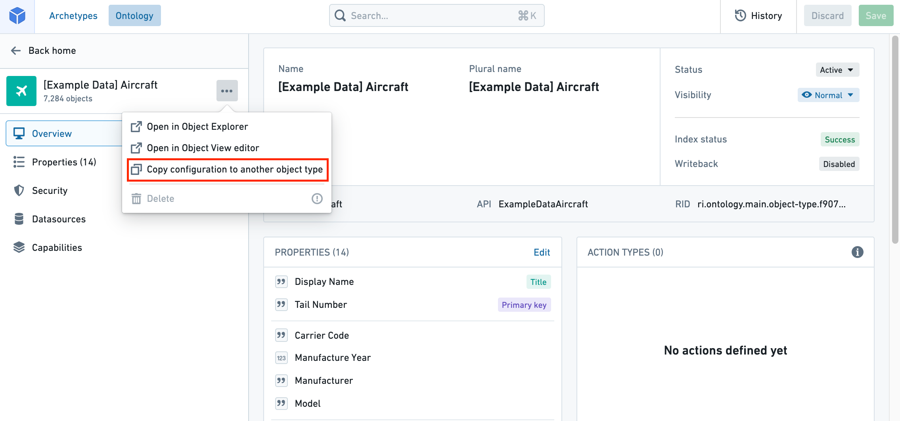

Object types can sometimes have similar schema. For example, the schema for `Car` and `Truck` may be very similar, with only a few differing properties. To reduce the time you spend setting up the `Truck` object type, you can copy over the configuration from the `Car` object type.对象类型有时会有类似的模式。例如，Car and Truck 的模式可能非常相似，只有少数性质不同。为了减少设置卡车对象类型的时间，你可以从汽车对象类型复制配置。

## Select the object type to copy选择要复制的对象类型

You can copy the configuration of an object type with the following steps:您可以通过以下步骤复制对象类型的配置：

1. Select the three dots at the top right side of the object type view sidebar.选择对象类型视图侧边栏右上角的三个点。
2. Select the **Copy configuration to another object type** option from the dropdown. This will open the **Copy object type configuration** dialog.从下拉菜单中选择 “复制配置到其他对象类型 ”选项。这会打开 “复制对象类型配置 ”对话框。

## Copy object type configuration复制对象类型配置

The **Copy object type configuration** dialog will give you the option to either:复制对象类型配置对话框会给你以下选项：

- Select an existing object type as a destination for the copied object type configuration, or选择一个现有对象类型作为复制对象类型配置的目标，或者
- Create and name a new object type with the copied object type configuration.创建并命名一个新的对象类型，使用复制的对象类型配置。

Selecting **Confirm** will copy all of the starting object type’s properties and its metadata (such as statuses, render hints, and so on).选择确认会复制起始对象类型的所有属性及其元数据（如状态、渲染提示等）。

Warning警告If the existing object type selected as a copy destination already has existing properties, the following may occur:如果被选为复制目的地的现有对象类型已经具备已有属性，可能发生以下情况：

- Existing properties on the existing object type will be overwritten by the properties copied over from the starting object type.现有对象类型的现有属性会被从起始对象类型复制过来的属性覆盖。
- Copied properties will automatically be mapped to the existing object type’s backing datasource if a column matches the name of a copied property.如果复制的属性列与复制属性的名称匹配，则自动映射到现有对象类型的支持数据源。

Therefore, when selecting an existing object type as a copy destination, ensure that the destination object type has the same schema as the object type you are copying.因此，选择现有对象类型作为复制目的地时，确保目标对象类型与你复制的对象类型具有相同的模式。

