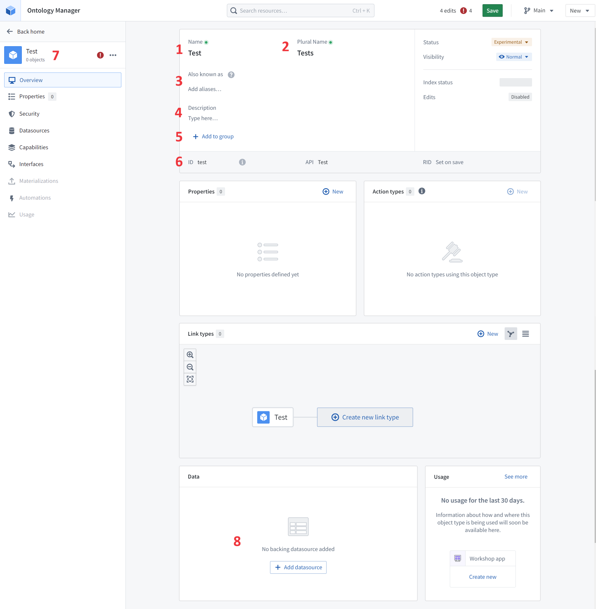
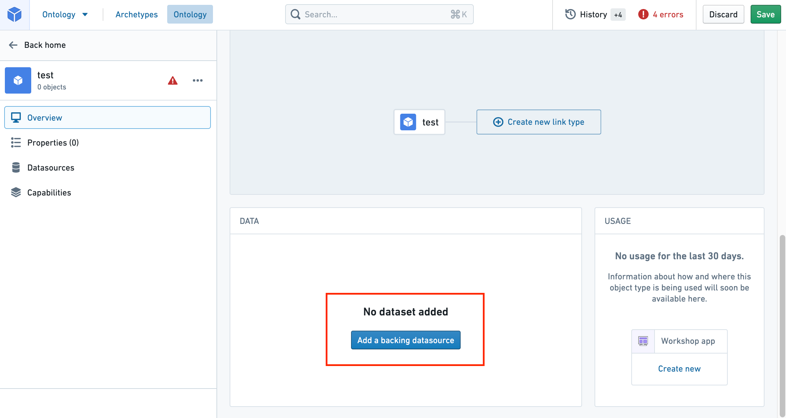
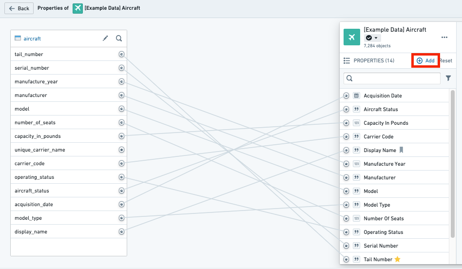
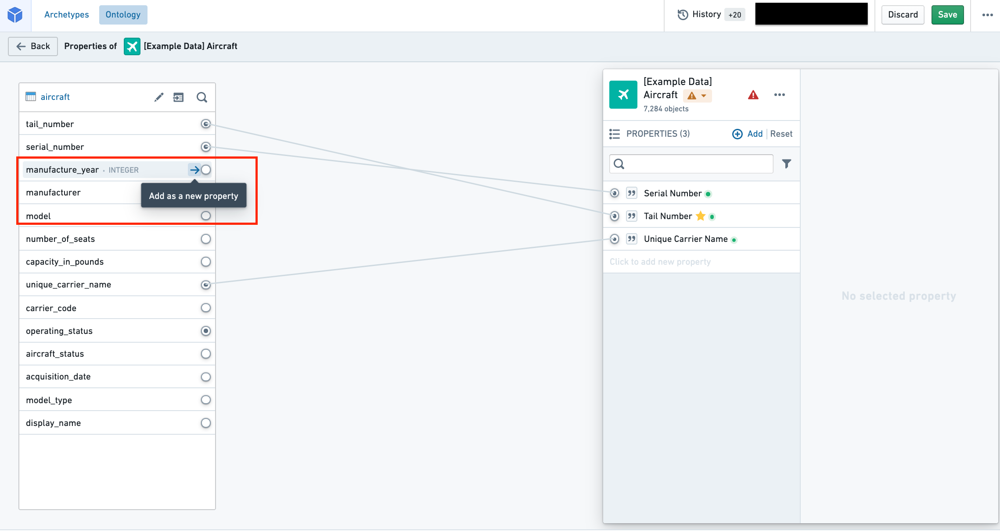
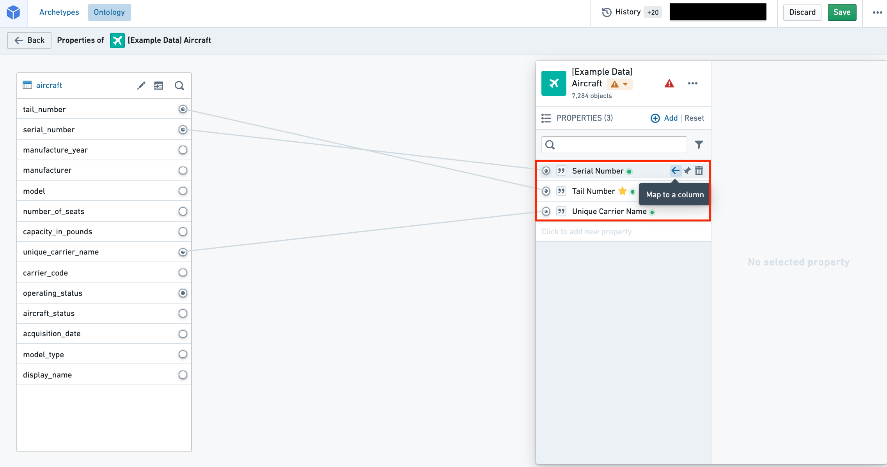
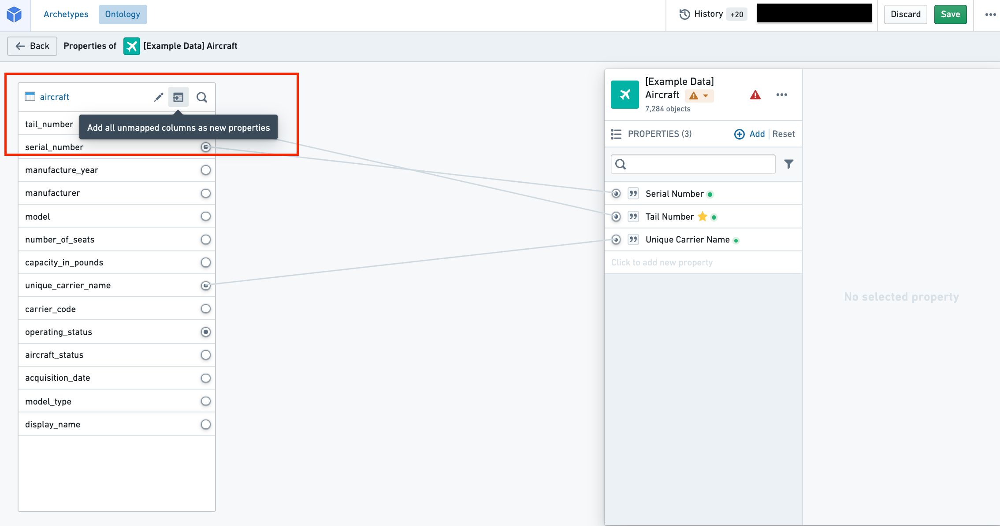

# Create an object type创建对象类型

The primary way to create and configure a new object type is with a [**guided step-by-step helper**](#create-a-new-object-type-with-the-helper). The guided helper is the recommended method, but if you exit the helper before completing the object creation process, you can also [**manually**](#create-a-new-object-type-manually) complete the process by specifying the metadata, backing datasource, property mappings, and keys (primary and title) for the new object type.创建和配置新对象类型的主要方法是使用引导的逐步辅助工具 。推荐使用引导助手，但如果你在完成对象创建过程前退出助手，你也可以手动完成该过程，指定元数据、支持数据源、属性映射以及新对象类型的键（主键和标题键）。

After creating a new object type, you can [change the API name](#configure-api-names) from the assigned default.创建新对象类型后，你可以将 API 名称从默认状态更改。

This page also contains [troubleshooting](#troubleshooting) information on the new object type creation process.本页还包含关于新对象类型创建过程的故障排除信息。

## Create a new object type with the helper用助手创建新的对象类型

- [Create a new object type创建一个新的对象类型](#create-a-new-object-type)
- [Choose a backing datasource选择一个支持的数据源](#choosing-a-backing-datasource)
- [Object type metadata对象类型元数据](#object-type-metadata)
- [Create properties for the object type为对象类型创建属性](#create-properties-for-the-object-type)
- [Configure the primary key and title key配置主键和标题键](#configure-the-primary-key-and-title-key)
- [Generate actions生成动作](#generate-actions)
- [Save location保存位置](#save-location)
- [Save change to ontology向本体的保存更改](#save-change-to-ontology)

### Create a new object type创建一个新的对象类型

To create a new object type, select the **Create your first object type** option from the Ontology Manager homepage or choose **New > Create object type** located on top right on the same page.要创建新对象类型，请从 Ontology Manager 主页选择 “创建你的第一个对象类型 ”选项，或在同一页面右上角选择 “新 > 创建对象类型 ”。

The **Create new object type** helper will appear.会显示“ 创建新对象类型辅助工具”。

### Choosing a backing datasource选择支持数据源

If you have an existing datasource in Foundry containing data to back the object type then you can select it. This will automatically populate the object type's metadata. It will also map every column of the backing datasource to a property, but you can discard added properties in the **Properties** step.如果你在 Foundry 里已有包含支持该对象类型的数据源，你可以选择它。这样会自动填充对象类型的元数据。它还会将支持数据源的每一列映射到一个属性，但你可以在属性步骤中丢弃新增的属性。

Warning警告A backing datasource for an object type may not contain `MapType` or `StructType` columns.对象类型的后备数据源可能不包含 MapType 或 StructType 列。

If you do not have an existing datasource containing data for the object type, you can choose to continue without an existing datasource and select a location to generate a dataset for permissions. This option is not available if you are using Object Storage v1. As permissions of the objects of a type are determined by the location of their backing datasources, you will be prompted to choose a location to which you want to save an empty dataset.如果你没有包含该对象类型数据的现有数据源，你可以选择在没有现有数据源的情况下继续运行，并选择一个位置生成一个权限所需的数据集。如果你使用对象存储 v1，则无法使用这个选项。由于某一类型对象的权限由其后台数据源的位置决定，系统会提示你选择一个想保存空白数据集的位置。

### Object type metadata对象类型元数据

In this step, provide the following information regarding your new object type:在这一步中，提供关于你新对象类型的以下信息：

- **Icon:** Select the default icon to customize the icon and color of the object type; this icon and color will be displayed in user applications when a user views an object of this type.图标： 选择默认图标以自定义对象类型的图标和颜色;当用户查看此类对象时，该图标和颜色会在用户应用中显示。
- **Name:** The name shown to anyone accessing an object of this type in user applications.姓名： 用户应用中访问此类对象时会显示的名称。
- **Plural name:** The name shown to anyone accessing multiple objects of this type in user applications.复数名称： 该名称显示给访问用户应用程序中多个此类对象的人。
- **Description:** Explanatory text for anyone accessing the objects of this type in user applications. For example, users searching in Object Explorer will view the description of the object type in their search results.描述： 为访问用户应用程序中此类对象的任何人提供说明性文本。例如，用户在对象浏览器中搜索时，会在搜索结果中看到对象类型的描述。
- **Groups:** Choose whether this object type will be part of any groups. This is a mechanism for organizing your ontology, making it easier to filter for the object types you want to work with later.团体： 选择该对象类型是否属于任何组。这是一种组织本体论的机制，方便你筛选以后想处理的对象类型。

### Create properties for the object type为对象类型创建属性

In the third step of the dialog you can customize which properties the object type will have. If you have chosen an existing Foundry datasource, any columns will be mapped automatically, but can be discarded during this step.在对话框的第三步，你可以自定义对象类型将拥有哪些属性。如果您选择了已有的 Foundry 数据源，任何列将被自动映射，但在此过程中可以丢弃。

Every object type requires at least one property. This is because object types need a primary key to uniquely identify them. The wizard allows you to add any other desired properties.每个对象类型至少需要一个属性。这是因为对象类型需要一个主键来唯一标识它们。向导允许你添加其他想要的属性。

Note that property types that require advanced configuration, such as media, cannot be generated as part of the bootstrapping wizard and must be added after you have exited it.注意，需要高级配置的属性类型，如媒体，不能作为引导向导的一部分生成，必须在退出后添加。

### Configure the primary key and title key配置主键和标题键

As part of the **Properties** step you need to choose a primary key and title key:作为属性步骤的一部分，你需要选择主键和标题键：

- **Title key:** The property that acts as a display name for objects of this type.
标题说明： 作为此类对象显示名的属性。- For example, selecting the `full name` property as the title key of the `Employee` object type would use the values of that property, such as “Melissa Chang”, “Akriti Patel”, or “Diego Rodriguez” as the display names for each respective notional `Employee` object.例如，选择全名属性作为员工对象类型的标题键，将使用该属性的值，如“Melissa Chang”、“Akriti Patel”或“Diego Rodriguez”作为每个名义员工对象的显示名。
  - For example, selecting the `full name` property as the title key of the `Employee` object type would use the values of that property, such as “Melissa Chang”, “Akriti Patel”, or “Diego Rodriguez” as the display names for each respective notional `Employee` object.例如，选择全名属性作为员工对象类型的标题键，将使用该属性的值，如“Melissa Chang”、“Akriti Patel”或“Diego Rodriguez”作为每个名义员工对象的显示名。
  
  - **Primary key:** The property that acts as a unique identifier for each instance of an object type. Each row in the backing datasource must have a different value for this property.
主键： 该属性作为每个对象类型实例的唯一标识符。支持数据源的每一行必须对该属性有不同的值。- For example, the value of the `employee ID` property will be used to identify “Melissa Chang” as a unique employee within the organization.例如，员工身份证属性的价值将用于识别“Melissa Chang”作为组织内独一无二的员工。
  - For example, the value of the `employee ID` property will be used to identify “Melissa Chang” as a unique employee within the organization.例如，员工身份证属性的价值将用于识别“Melissa Chang”作为组织内独一无二的员工。
  
  

A list of supported property types can be found in the [object type properties documentation](/docs/foundry/object-link-types/properties-overview/#supported-property-types).支持的属性类型列表可在对象类型属性文档中找到。

Be sure to check your backing datasources for duplicates before assigning a primary key. The primary key you select must be unique for every record in the datasource. If your ontology is using [Object Storage v2](/docs/foundry/object-backend/overview/), a duplicate primary key will cause [Funnel batch pipeline](/docs/foundry/object-indexing/funnel-batch-pipelines/) errors leading to a build failure. If you are using Object Storage v1 (Phonograph), an update will appear as successful; however, the duplicate primary keys can cause unexpected changes to your ontology.在分配主键前，务必检查你的备份数据源是否有重复。你选择的主键必须对数据源中的每条记录都是唯一的。如果你的本体使用对象存储 v2，重复的主键会导致漏斗批处理流水线错误，导致构建失败。如果你使用的是对象存储 v1（留声机），更新会显示为成功;然而，重复的主键可能会对你的本体论造成意想不到的变化。

Primary keys should be deterministic. If the primary key is non-deterministic and changes on build, edits can be lost and links may disappear. Edits can be lost because ontology edits are associated with the primary key of the object. Links between objects can disappear if builds are not coordinated to update link IDs. To ensure deterministic primary keys, you should define pipeline logic such that the primary key is the function of either a single column or multiple columns. Avoid using numbered row or random key generation, since these can cause primary keys to change between build runs.主键应该是确定性的。如果主键是非确定性的，且在构建过程中有更改，编辑内容可能会丢失，链接也可能消失。编辑可能会丢失，因为本体编辑与对象的主键关联。如果构建没有协调更新链接 ID，对象之间的链接可能会消失。为了确保主键是确定性，你应定义管道逻辑，使主键可以是单个列或多个列的功能。避免使用编号行或随机密钥生成，因为这些会导致主密钥在构建运行间发生变化。

### Generate actions生成动作

You can optionally generate a standard set of actions to edit objects of this type and assign a specific user or group that can run them.你可以选择生成一套标准动作来编辑此类对象，并指定特定用户或组来运行这些对象。

Note that you can still make edits to these actions or create new additional actions even if you have finalized the object type and exited the helper.注意，即使你已经确定了对象类型并退出了助手，你仍然可以对这些动作进行编辑或创建新的额外动作。

This step is not available if you are using Object Storage v1.如果你使用对象存储 v1，这一步不可用。

### Save location保存位置

In the final step, choose a project to save this object type to. Then, select **Create**. Selecting **Create** will only stage your changes and **will not save** them.最后一步，选择一个项目保存该对象类型。然后，选择创建 。选择创建只会分阶段你的更改， 不会保存 。

### Save change to ontology向本体的保存更改

Back in Ontology Manager, select **Save** in the upper right corner to [make the change to your ontology](/docs/foundry/ontology-manager/save-changes/).回到本体管理器，选择右上角的 “保存 ”以更改你的本体。

## Create a new object type manually手动创建一个新的对象类型

When creating a new object type with the helper, it is possible to select **Create** before completing all the steps in the [**Create a new object type** helper instructions](#create-a-new-object-type-with-the-helper) above. Selecting **Create** before the process is complete will exit the helper and bring you to the **Overview** page.在使用辅助工具创建新对象类型时，可以在完成上述“ 创建新对象类型辅助工具”步骤前选择创建 。在流程完成前选择创建 ，会退出助手并进入概览页面。

At this point, the object type is unsaved and cannot be saved until all the steps below have been completed. The steps for completing the creation process manually (outside the **Create a new object type** helper) are described below:此时，对象类型未保存，且在完成以下所有步骤后才能保存。手动完成创建过程的步骤（除 “创建新对象类型辅助工具”之外）如下所述：

- [Add metadata for a new object type添加新对象类型的元数据](#add-metadata-for-a-new-object-type)
- [Add a backing datasource to a new object type为新对象类型添加备份数据源](#add-a-backing-datasource-to-a-new-object-type)
- [Add a new property添加一个新属性](#add-a-new-property)
- [Map a single property to data将单个属性映射到数据](#map-a-single-property-to-data)
- [Map all unmapped columns as new properties将所有未映射的列映射为新属性](#map-all-unmapped-columns-as-new-properties)
- [Configure the primary key and title key配置主键和标题键](#configure-the-primary-key-and-title-key)

### Add metadata for a new object type添加新对象类型的元数据

On the **Overview** page’s metadata section, you can edit the object type’s display name, plural display name, description, and ID:在概览页面的元数据部分，你可以编辑对象类型的显示名称、复数显示名称、描述和 ID：

1. **Display name:** The name shown to anyone accessing an object of this type in user applications.显示名称： 用户应用中访问此类对象时会显示的名称。
2. **Plural display name:** The name shown to anyone accessing multiple objects of this type in user applications.复数显示名称： 该名称显示给访问用户应用程序中多个此类对象的人。
3. **Aliases:** Additional terms that will find this object type when users search for them.别名： 用户搜索时会找到该对象类型的额外词汇。
4. **Description:** Explanatory text for anyone accessing the objects of this type in user applications. For example, users searching in Object Explorer will view the description of the object type in their search results.描述： 为访问用户应用程序中此类对象的任何人提供说明性文本。例如，用户在对象浏览器中搜索时，会在搜索结果中看到对象类型的描述。
5. **Groups:** One or more labels that help categorize the object type.团体： 一个或多个标签帮助分类对象类型。
6. **ID:** A unique identifier of the object type, primarily used to reference objects of this type when configuring a user application.
ID： 对象类型的唯一标识符，主要用于在配置用户应用程序时引用此类对象。- An ID can contain lowercase letters, numbers, and dashes.ID 可以包含小写字母、数字和破折号。
- The first character of an ID **must** be a lowercase letter.ID 的第一个字符必须是小写字母。
- Once a property’s ID is saved and the property is referenced in user applications, **any** change to the property ID will break the application.一旦属性的 ID 被保存并在用户应用中引用该属性， 任何对属性 ID 的更改都会使应用崩溃。
  - An ID can contain lowercase letters, numbers, and dashes.ID 可以包含小写字母、数字和破折号。
  - The first character of an ID **must** be a lowercase letter.ID 的第一个字符必须是小写字母。
  - Once a property’s ID is saved and the property is referenced in user applications, **any** change to the property ID will break the application.一旦属性的 ID 被保存并在用户应用中引用该属性， 任何对属性 ID 的更改都会使应用崩溃。
  
  7. **Icon:** Select the default icon from the object type view’s sidebar to customize the icon and color of the object type; this icon and color will be displayed in user applications when a user views an object of this type.图标： 从对象类型视图的侧边栏选择默认图标，以自定义对象类型的图标和颜色;当用户查看此类对象时，该图标和颜色会在用户应用中显示。
8. **Backing datasource:** The source of the data used as property values for objects of this type.支持数据来源： 作为该类型对象属性值的数据来源。

---

### Add a group to an object type向对象类型添加一个组

[Groups](/docs/foundry/object-link-types/type-groups/) are labels that help categorize object types. From the object type metadata widget, you can:组是帮助分类对象类型的标签。通过对象类型元数据组件，你可以：

- Add a group from a list of existing groups.从现有组列表中添加一个组。
- Create a new group by typing the name of that group.通过输入该组名称创建该组。
- Remove a group from your object type.从你的对象类型中移除一个组。

Groups are searchable in the [Ontology Manager's **Search** bar and **Search** bar dialog](/docs/foundry/ontology-manager/navigation/#header-search-bar). The table of object types in the Ontology Manager supports displaying and filtering by group. Groups are also displayed on the [Object Explorer home page](/docs/foundry/object-explorer/getting-started/#group-exploration-b-c-d).组可以在本体管理器的搜索栏和搜索栏对话框中搜索。本体管理器中的对象类型表支持按组显示和过滤。分组也会显示在对象浏览器主页上。

Warning警告Groups as labels in object type metadata replace the previous method of adding `oe_home_page_object_type_group` type class to the primary key property; this previous method is no longer available.在对象类型元数据中，作为标签的组取代了之前在主键属性中添加 oe_home_page_object_type_group 类型类的方法;此前的方法现已无法使用。

---

### Add a backing datasource to a new object type为新对象类型添加备份数据源

In order to populate property values for objects of this type with data, you must add a backing datasource. You can do this by:为了为此类对象填充属性值，必须添加一个支持数据源。你可以通过以下方式实现：

- Navigating into the Property editor by selecting **Create new** from the **Properties** section of the **Overview** page, or by selecting the **Edit property mapping** button from the **Properties** page of the object type view’s sidebar.通过概览页面的属性部分选择“ 创建新建”，或在对象类型视图侧边栏的属性页面选择 “编辑属性映射 ”按钮进入属性编辑器。
- Then, select the **Add a backing datasource** button as shown in the image below. This will allow you to select any of the available datasources in Foundry as a backing datasource.
然后，选择如下图所示的 “添加备份数据源 ”按钮。这样你就可以选择 Foundry 中任何可用的数据源作为后备数据源。- Note that a single datasource can only be used to back one object type.注意，单个数据源只能支持一种对象类型。
  - Note that a single datasource can only be used to back one object type.注意，单个数据源只能支持一种对象类型。
  
  

### Add a new property添加一个新属性

From within the property editor, select **Add** in the **Properties** pane on the right side of the screen. This will add a new property to the object type.在属性编辑器中，选择屏幕右侧的属性面板“ 添加 ”。这会为对象类型添加一个新属性。

### Map a single property to data将单个属性映射到数据

It is possible to map properties to columns in a backing datasource in any of the following ways:可以通过以下任一方式将属性映射到支持数据源中的列：

- [Map a column to a new property将一列映射到新属性](#map-a-column-to-a-new-property)
- [Map a column to an existing property将一列映射到已有的房产](#map-a-column-to-an-existing-property)
- [Map a property to a column将属性映射到列](#map-a-property-to-a-column)

#### Map a column to a new property将一列映射到新属性

In the datasource pane on the left side of the screen (see image below), you can see all of the columns of the datasource. Hover over the column you want to map and select the **Add as a new property** button to create a new property mapped to this column. The property ID, display name, and base type will be inferred from the name of the column.在屏幕左侧的数据源面板（见下图），你可以看到数据源的所有列。将鼠标悬停在你想映射的列上，选择 “添加为新属性 ”按钮，创建映射到该列的新属性。属性 ID、显示名称和基类型将从列名推断出来。

#### Map a column to an existing property将一列映射到已有的房产

In the datasource pane on the left side of the screen, you can see all of the columns of the datasource. Hover over an unmapped column and select the **Add as a new property** button. If a property already exists with a property ID that matches the column name, the column will be mapped to the existing property.在屏幕左侧的数据源面板中，你可以看到数据源的所有列。将鼠标悬停在未映射的列上，选择 “添加为新属性 ”按钮。如果已有属性的属性 ID 与列名匹配，该列将映射到现有属性。

#### Map a property to a column将属性映射到列

In the properties pane on the right side of the screen, hover over the property you want to map to a column and select **Map to a column**. This will open a dropdown from which you can select the column you want to map to your property.在屏幕右侧的属性面板中，将鼠标悬停在你想映射到某一列的属性上，然后选择 “映射到某列 ”。这会打开一个下拉菜单，你可以选择想要映射到你的房产的列。

### Map all unmapped columns as new properties将所有未映射的列映射为新属性

Next to the datasource name in the datasource pane, you will find an **Add all unmapped columns as new properties** button. Selecting the button will create properties for all the unmapped columns in the datasource. The IDs, display names, and base types of the properties will be inferred from the corresponding columns in the datasource.在数据源面板中，在数据源名称旁边，你会看到“ 添加所有未映射列作为新属性 ”按钮。点击按钮后，将为数据源中所有未映射的列创建属性。属性的 ID、显示名称和基类型将从数据源对应的列推断而来。

- Once a property’s ID is saved and the property is referenced in user applications, **any** change to the property ID will break the application.一旦属性的 ID 被保存并在用户应用中引用该属性， 任何对属性 ID 的更改都会使应用崩溃。

### Configure the primary key and title key配置主键和标题键

Now that you've created your new object type, added a backing datasource, and mapped it to new properties, you still need to configure the primary key and title key before being able to save your object type. You can navigate to the property metadata pane in the property editor (see image below) to set a property as the primary key and title key:现在你已经创建了新的对象类型，添加了后备数据源，并将其映射到新的属性，你仍然需要配置主键和标题键，才能保存你的对象类型。你可以在属性编辑器中进入属性元数据窗格（见下图），将一个属性设置为主键和标题键：

- **Primary key:** The property that acts as a unique identifier for each instance of an object type. Each row in the backing datasource must have a different value for this property.
主键： 该属性作为每个对象类型实例的唯一标识符。支持数据源的每一行必须对该属性有不同的值。- For example, the value of the `employee ID` property will be used to identify “Melissa Chang“ as a unique (notional) employee within the organization.例如，员工身份证属性的价值将用于将“Melissa Chang”识别为组织内的唯一（名义）员工。
- To configure the primary key, select the property you want to assign to the primary key in the properties pane of the property editor and check the **Primary key** option.要配置主键，请在属性编辑器的属性面板中选择你想分配给主键的属性，并勾选主键选项。
- Edits are permanently attached to the primary key value you made them for. Any time you change the primary key of an object type, you will be prompted to delete all existing edits.编辑会永久绑定在你创建编辑的主键值上。每当你更改某个对象类型的主键时，系统都会提示你删除所有现有的编辑。
  - For example, the value of the `employee ID` property will be used to identify “Melissa Chang“ as a unique (notional) employee within the organization.例如，员工身份证属性的价值将用于将“Melissa Chang”识别为组织内的唯一（名义）员工。
  - To configure the primary key, select the property you want to assign to the primary key in the properties pane of the property editor and check the **Primary key** option.要配置主键，请在属性编辑器的属性面板中选择你想分配给主键的属性，并勾选主键选项。
  - Edits are permanently attached to the primary key value you made them for. Any time you change the primary key of an object type, you will be prompted to delete all existing edits.编辑会永久绑定在你创建编辑的主键值上。每当你更改某个对象类型的主键时，系统都会提示你删除所有现有的编辑。
  
  - **Title key:** The property that acts as a display name for objects of this type.
标题说明： 作为此类对象显示名的属性。- For example, selecting the `full name` property as the title key of the `Employee` object type will use the values of that property, such as “Melissa Chang”, “Akriti Patel”, or “Diego Rodriguez” as the display names for each respective notional `Employee` object.例如，选择全名属性作为员工对象类型的标题键，将使用该属性的值，如“Melissa Chang”、“Akriti Patel”或“Diego Rodriguez”作为每个名义员工对象的显示名称。
- To configure the title key, select the property you want to assign to the title key in the properties pane of the property editor and check the **Title key** option.
Note that until this point, your changes have been staged but **have not yet been saved**. To save your new object type to the Ontology, follow the instructions on [how to save changes to the Ontology](/docs/foundry/ontology-manager/save-changes/).要配置标题键，请在属性编辑器的属性面板中选择你想分配给标题键的属性，并勾选标题键选项。请注意，到目前为止，你的更改是暂时准备的，但尚未保存 。要将新对象类型保存到本体中，请按照如何保存本体变更的说明。
  - For example, selecting the `full name` property as the title key of the `Employee` object type will use the values of that property, such as “Melissa Chang”, “Akriti Patel”, or “Diego Rodriguez” as the display names for each respective notional `Employee` object.例如，选择全名属性作为员工对象类型的标题键，将使用该属性的值，如“Melissa Chang”、“Akriti Patel”或“Diego Rodriguez”作为每个名义员工对象的显示名称。
  - To configure the title key, select the property you want to assign to the title key in the properties pane of the property editor and check the **Title key** option.
  Note that until this point, your changes have been staged but **have not yet been saved**. To save your new object type to the Ontology, follow the instructions on [how to save changes to the Ontology](/docs/foundry/ontology-manager/save-changes/).要配置标题键，请在属性编辑器的属性面板中选择你想分配给标题键的属性，并勾选标题键选项。请注意，到目前为止，你的更改是暂时准备的，但尚未保存 。要将新对象类型保存到本体中，请按照如何保存本体变更的说明。
  
  

Be sure to check your backing datasources for duplicates before assigning a primary key. The primary key you select must be unique for every record in the datasource. If your Ontology is using [Object Storage V2](/docs/foundry/object-backend/overview/), a duplicate primary key will cause [Funnel batch pipeline](/docs/foundry/object-indexing/funnel-batch-pipelines/) errors leading to a build failure. If you are using Object Storage V1 (also known as Phonograph), an update will appear as successful; however, the duplicate primary keys can cause unexpected changes to your Ontology.在分配主键前，务必检查你的备份数据源是否有重复。你选择的主键必须对数据源中的每条记录都是唯一的。如果你的本体论使用对象存储 V2，重复的主键会导致漏斗批处理流水线错误，导致构建失败。如果您使用对象存储 V1（也称为留声机），更新将显示为成功;然而，重复的主键可能会导致本体发生意外变化。

## Configure API names配置 API 名称

An API name is the name used when referring to an object type or a property programmatically in code. All new object types and properties are automatically assigned API names that are inferred from their display names. [Learn more about API names.](/docs/foundry/functions/api-objects-links/)API 名称是指在代码中以程序方式指代对象类型或属性时所使用的名称。所有新的对象类型和属性都会自动分配 API 名称，这些名称是从显示名推断出来的。 了解更多关于 API 名称的信息。

You can change the automatically assigned API names as follows:你可以更改自动分配的 API 名称如下：

- An object type’s API name can be edited in the object type’s **Overview** page.对象类型的 API 名称可以在该对象类型的概览页面中编辑。
- A property’s API name can be edited in the properties pane of the property editor.属性的 API 名称可以在属性编辑器的属性面板中编辑。

### Naming guidelines命名指南

Object type API names follow functional coding standards. An object type’s API name must:对象类型 API 名称遵循功能编码标准。对象类型的 API 名称必须：

- Begin with an uppercase character and consist of only alphanumeric characters.以大写字符开头，仅包含字母数字字符。
- Be written in PascalCase (also known as UpperCamelCase, in which the first letter of each word in a compound word is capitalized; for instance, “ThisExampleName”).用 PascalCase（也称为 UpperCamelCase，其中复合词中每个单词的首字母大写;例如“ThisExampleName”）。
- Be unique across all object types.在所有对象类型中保持独特。

A property’s API name must:属性的 API 名称必须：

- Begin with a lowercase character and consist of only alphanumeric characters.以小写字符开头，仅包含字母数字字符。
- Be written in camelCase (in which the first letter of each word after the first word in a compound word is capitalized; for instance, “thisExampleName”).用骆驼大写（即复合词中第一个单词后的第一个字母大写，例如“thisExampleName”）。
- Be unique across all properties belonging to the same object type.在同一对象类型的所有属性中保持唯一。

## Troubleshooting故障 排除

### Mandatory object type fields必填对象类型字段

To save a new object type, the following object type fields must not be empty:要保存新的对象类型，以下对象类型字段不得为空：

- ID身份证
- Display name显示名称
- Plural display name复数显示名称
- Backing datasource支持数据源
- API nameAPI 名称

Additionally, the following property fields must not be empty:此外，以下属性字段不得为空：

- Property ID物业识别
- Property display name属性显示名称
- Backing column支撑柱
- Property API name属性 API 名称
- Title key标题说明
- Primary key主密钥

### Valid ID checklist有效身份清单

#### Object type ID对象类型 ID

Object type IDs:对象类型 ID：

- Can be made up of lowercase letters, numbers, and dashes.可以由小写字母、数字和破折号组成。
- Should start with a letter.应该先写一封信。
- Must be unique across all object types.必须在所有对象类型中都是唯一的。

#### Property type ID属性类型 ID

Property type IDs:物业类型 ID：

- Can be made up of lowercase or uppercase letters, numbers, dashes, and underscores.可以由小写或大写字母、数字、划线和下划线组成。
- Should start with a letter.应该先写一封信。
- Must be unique across all properties that belong to the same object type.必须在属于同一对象类型的所有属性中唯一。

#### API nameAPI 名称

In line with functional coding standards, an object type’s API name must:根据函数式编码标准，对象类型的 API 名称必须：

- Consist of only alphanumeric characters and underscores.仅由字母数字字符和下划线组成。
- Be unique across all object types.在所有对象类型中保持独特。

A property’s API name must:属性的 API 名称必须：

- Be valid Unicode.要用有效的 Unicode。
- Be unique across all properties belonging to the same object type.在同一对象类型的所有属性中保持唯一。

Note that there are a number of reserved keywords that cannot be used for API names. They are: `ontology`, `object`, `property`, `link`, `relation`, `rid`, `primaryKey`, `typeId`, and `ontologyObject`.请注意，有许多保留的关键词不能用于 API 名称。它们分别是： 本体 、 对象 、 属性 、 链接 、 关系 、rid、primaryKey、typeId 和本体对象 。

### Errors错误

#### Error: `Phonograph2:DatasetAndBranchAlreadyRegistered`错误： Phonograph2:DatasetAndBranchAlreadyRegistered

If you receive the error `Phonograph2:DatasetAndBranchAlreadyRegistered`, the datasource backing the object type you are trying to save is already backing a different object type in the Ontology and cannot be used again.如果你收到错误 Phonograph2:DatasetAndBranchAlreadyRegistered ，支持你试图保存的对象类型的数据源已经支持本体中另一个对象类型，无法再次使用。

