# [](#create-ontology-objects-from-gaia)Create Ontology objects from Gaia从 Gaia 创建本体对象


Similar to how you can [add data from the Ontology to a Gaia map](/docs/foundry/geospatial/add-ontology-data-to-gaia/), you can also create Ontology objects from a shape you draw, a point you drop, or a tactical graphic you configure on a map by tagging the object within a [type-mapped object type](/docs/foundry/object-link-types/enable-gotham-integration/) which implements the Gaia Geoshape Creatable, Geopoint Creatable, or Milsym Creatable [interface](/docs/foundry/interfaces/interface-overview/).类似于你可以将本体数据添加到 Gaia 地图上 ，你也可以通过在类型映射对象类型类型中标记该对象，创建本体对象，创建你绘制的形状、放置的点或在地图上配置的战术图形，该类型实现了 Gaia Geoshape Creatable、Geopoint Creatable 或 Milsym Creatable 接口 。


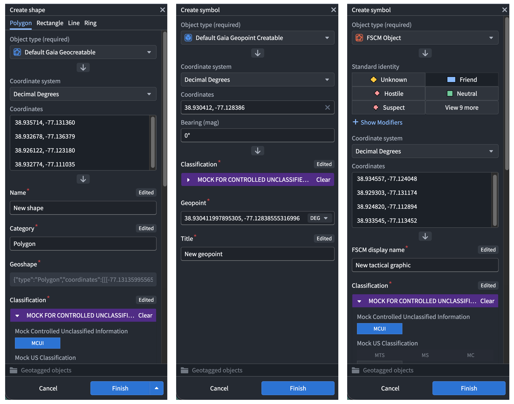


To create Ontology objects from a Gaia map, your enrollment must use both Foundry and Gotham.要从盖亚地图创建本体对象，你的注册必须同时使用 Foundry 和 Gotham。


The sections below outline the end-to-end process to integrate Gaia shapes, points, and tactical graphics with the Ontology:以下章节概述了将盖亚形状、点和战术图形与本体整合的端到端流程：


- [Install all necessary Marketplace products](#install-prerequisite-marketplace-products).安装所有必要的市场产品 。
- [Implement the Gaia Geoshape Creatable interface on a supported object type backed by a restricted view](#create-an-object-type-that-implements-the-gaia-geoshape-creatable-interface).在支持的对象类型上实现 Gaia Geoshape Creatable 接口，并支持受限视图 。
- [Implement the Gaia Geopoint Creatable interface on a supported object type backed by a restricted view](#create-an-object-type-that-implements-the-gaia-geopoint-creatable-interface).在支持的对象类型上实现 Gaia Geopoint Creatable 接口，并支持受限视图 。
- [Implement the Gaia Milsym Creatable interface on a supported object type backed by a restricted view](#create-an-object-type-that-implements-the-gaia-milsym-creatable-interface).在支持的对象类型上实现 Gaia Milsym Creatable 接口，并支持受限视图 。
- [Register your Ontology and search for your object types in Gaia](#register-your-ontology-and-its-types).注册你的本体论，并在 Gaia 中搜索你的对象类型 。
- [Draw a new shape on your map and tag it within your object type](#draw-a-new-shape-on-your-gaia-map-and-tag-it-to-an-object-type).在地图上画一个新形状，并在你的对象类型中标记它 。
- [Drop a new point on your map and tag it within your object type](#drop-a-new-point-on-your-gaia-map-and-tag-it-to-an-object-type).在地图上新增一个点，并在你的对象类型中标记它 。
- [Configure a tactical graphic from a shape drawn on your map and tag it within your object type](#configure-a-tactical-graphic-on-your-gaia-map-and-tag-it-to-an-object-type).根据地图上绘制的形状配置战术图形，并在你的对象类型中标记它 。


## [](#install-prerequisite-marketplace-products)Install prerequisite Marketplace products安装先入必备的市场产品


[Marketplace](/docs/foundry/marketplace/overview/) is Foundry's storefront for published data products or collections of platform resources made available for user installation. You can access Marketplace through the **Search...** bar or the **Applications** portal on your home screen.Marketplace 是 Foundry 用于发布数据产品或平台资源集合的商店，供用户安装。您可以通过搜索栏或主屏幕的应用门户访问市场。


Once you launch Marketplace, install the following products:一旦你启动市场，请安装以下产品：


- [Core Property Types from the Core Ontology Store](#core-property-types-from-the-core-ontology-store), which contains core shared property types, such as an object's classification and geoshape, that can be used on multiple object types in your Ontology.核心属性类型来自核心本体商店 ，其中包含核心共享属性类型，如对象的分类和几何形状，可用于本体中的多种对象类型。
- [Gaia Geoshape Creatable interface from the Gaia App Store](#gaia-geoshape-creatable-interface-from-the-gaia-app-store), which describes the shape of a geospatial object type to enable consistent modeling of and interaction with other object types of the same shape.Gaia Geoshape 可创建界面，来自 Gaia 应用商店 ，描述地理空间对象类型的形状，以便实现对同形状其他对象类型的一致建模和交互。
- [Gaia Geopoint Creatable interface from the Gaia App Store](#gaia-geopoint-creatable-interface-from-the-gaia-app-store), which describes the position of a single point object type.Gaia 应用商店的 Gaia Geopoint Creatable 界面 ，描述单个点对象类型的位置。
- [Gaia Milsym Creatable interface from the Gaia App Store](#gaia-milsym-creatable-interface-from-the-gaia-app-store), which describes the shape of a tactical symbol.Gaia Milsym 创意界面，来自 Gaia 应用商店 ，描述战术符号的形状。


### [](#core-property-types-from-the-core-ontology-store)Core Property Types from the Core Ontology Store核心本体商店的核心属性类型


Contact Palantir Support to install the Core Ontology on your Foundry enrollment as a [Foundry product](/docs/foundry/marketplace/foundry-products/) if the Core Ontology Store, which contains the Core Property Types product, is not available in Marketplace.如果包含核心属性类型产品的核心本体商店在市场上无法提供，请联系 Palantir 支持，以便在你的 Foundry 注册中安装核心本体，作为 Foundry 产品 。


### [](#gaia-geoshape-creatable-interface-from-the-gaia-app-store)Gaia Geoshape Creatable interface from the Gaia App StoreGaia Geoshape Creatable 界面，来自 Gaia 应用商店


In Foundry, [interfaces](/docs/foundry/interfaces/interface-overview/) exist within your Ontology to describe an object type's shape as well as its capabilities, enabling consistent modeling and interaction between object types of a common shape. You can implement an interface on multiple object types, and interfaces may extend any number of other interfaces. Once implemented on an object type, the Gaia Geoshape Creatable interface enables you to create objects in your Ontology from shapes drawn on a Gaia map.在 Foundry 中，本体中存在接口 ，用于描述对象类型的形状及其功能，从而实现共同形状对象类型之间的一致建模和交互。你可以在多种对象类型上实现一个接口，接口还可以扩展任意数量的其他接口。一旦在对象类型上实现，Gaia Geoshape Creatable 界面允许你从在 Gaia 地图上绘制的形状创建本体中的对象。


The Gaia Geoshape Creatable interface supersedes the deprecated Gaia Geocreatable interface. Contact Palantir Support if you are unable to access the Gaia Geoshape Creatable interface in Marketplace.Gaia Geoshape Creatable 界面取代了已废弃的 Gaia Geocreatable 界面。如果您无法访问市场中的 Gaia Geoshape Creatable 界面，请联系 Palantir 客服。


To install the Gaia Geoshape Creatable interface from Marketplace:要安装 Marketplace 中的 Gaia Geoshape Creatable 界面：


1. Navigate back to Marketplace and search for the `Gaia App Store` in **Search stores...**.返回市场，在搜索商店中搜索 Gaia 应用商店 ......
2. Choose the `Gaia Geoshape Creatable` product.选择 Gaia Geoshape Creatable 产品。
3. Select the blue **Install** button on the right side of your screen to launch a draft installation. You can optionally add a descriptive suffix to your installation.点击屏幕右侧的蓝色 “安装 ”按钮，启动草稿安装。你可以选择在安装中添加描述性后缀。
4. Identify a **Namespace** where your installation will save. Marketplace will automatically create a new **Project** within the chosen **Namespace**.确定一个命名空间 ，让你的安装能够保存。市场会自动在所选命名空间内创建新项目 。
5. Configure the product's classification and access controls under **Permissions**. The classification you select under **Classification based access control (CBAC)** defines the *maximum* classification for the installation.在权限设置产品分类和访问控制。你在基于分类的访问控制（CBAC）下选择的分类定义了该安装的最大分类。
6. Select  to launch the installation window's **Inputs** page.选择 “下一步 ”以启动安装窗口的输入页面。
7. Select the **Shared properties** tab under **Inputs** in the left panel to map the `Geoshape` shared property from your Ontology to your new interface.在左侧面板的输入下选择 “共享属性 ”标签，将 Geoshape 共享属性从你的本体映射到你的新界面。
8. Select  to launch the installation window's **Content** page.选择 “下一步 ”以启动安装窗口的内容页面。


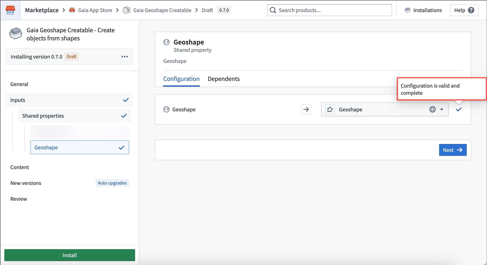


1. Optionally toggle on **Prefix Ontology entities** and insert a valid prefix. Note that your prefix may not contain certain special characters, such as parentheses or brackets.可选地切换前缀本体实体并插入有效的前缀。请注意，您的前缀可能不包含某些特殊字符，如括号或括号。
2. Choose which **Ontology schema migrations** to enable on the right side of your screen. You can reference additional schema management information within the existing [object edits and materializations documentation](/docs/foundry/object-edits/schema-migrations/).选择在屏幕右侧启用哪些本体模式迁移 。你可以在现有的对象编辑和实体化文档中引用额外的模式管理信息。
3. Update the automatic configurations in **New versions** as necessary for your use case before you select . Marketplace pre-configures certain products to upgrade automatically.在选择 “下一步 ”之前，根据你的使用场景更新新版本中的自动配置。市场会自动预先配置某些产品升级。
4. Review your interface's configurations and select **Install**.检查你的界面配置，选择安装 。


### [](#gaia-geopoint-creatable-interface-from-the-gaia-app-store)Gaia Geopoint Creatable interface from the Gaia App StoreGaia 应用商店的 Gaia Geopoint 可创作界面


To install the Gaia Geopoint Creatable interface from Marketplace's Gaia App Store, select the `Gaia Geopoint Creatable` product from the store menu. Marketplace's interface installation workflows are common across different interfaces, so you can follow the same steps outlined in the [Geoshape Creatable interface installation instructions](#gaia-geoshape-creatable-interface-from-the-gaia-app-store) above with the following distinctions:要从市场的 Gaia 应用商店安装 Gaia Geopoint 创作界面，请从商店菜单中选择 Gaia Geopoint 创作产品。Marketplace 的界面安装流程在不同界面中是通用的，因此你可以按照上面 Geoshape Creatable 界面安装说明中列出的相同步骤，但有以下区别：


- In the **Shared properties** section of the **Inputs** window, map the `Geopoint` shared property from your Ontology to the Gaia Geopoint Creatable interface.在输入窗口的共享属性部分， 将你的本体中的 Geopoint 共享属性映射到 Gaia Geopoint Creatable 界面。


### [](#gaia-milsym-creatable-interface-from-the-gaia-app-store)Gaia Milsym Creatable interface from the Gaia App StoreGaia Milsym 创建界面，来自 Gaia 应用商店


Contact Palantir Support to install the Gaia Milsym Creatable interface on your Foundry enrollment if it is not currently available.如果目前 Foundry 注册中还没有 Gaia Milsym Creatable 界面，请联系 Palantir 客服，安装该界面。


## [](#create-an-object-type-that-implements-the-gaia-geoshape-creatable-interface)Create an object type that implements the Gaia Geoshape Creatable interface创建一个实现 Gaia Geoshape Creatable 接口的对象类型


Gaia can discover object types backed by a [dataset](/docs/foundry/data-integration/datasets/) or [restricted view](/docs/foundry/security/restricted-views/) in your Ontology after they implement the Gaia Geoshape Creatable interface. In the following sections, you will:Gaia 在实现 Gaia Geoshape Creatable 界面后，可以在你的本体中发现由数据集或受限视图支持的对象类型。在接下来的章节中，你将：


- [Create an object type-backing dataset or restricted view](#create-an-object-type-backing-dataset-or-restricted-view).创建一个对象类型支持数据集或受限视图 。
- [Create an object type and enable its integration with Gotham through type mapping](#create-and-type-map-an-object-type).创建一个对象类型，并通过类型映射实现与 Gotham 的集成 。
- [Configure an action type to enable object creation in Gaia](#create-and-configure-an-action-type-to-enable-object-creation-in-gaia).配置一个动作类型以启用 Gaia 中的对象创建 。
- [Implement the Gaia Geoshape Creatable interface](#implement-the-gaia-geoshape-creatable-interface).实现 Gaia Geoshape 的可创造界面 。


### [](#create-an-object-type-backing-dataset-or-restricted-view)Create an object type-backing dataset or restricted view创建一个对象类型支持数据集或受限视图


You should create a restricted view if you plan to secure objects based on a user's classification or by applying [markings](/docs/foundry/security/markings/) to control file access. If your use case does not require the additional object security provided by classification-based access or markings, then you should create a dataset to back to your object type.如果你计划根据用户分类或通过标记控制文件访问来保护对象，应该创建一个受限视图。如果你的用例不需要基于分类的访问或标记所提供的额外对象安全，那么你应该创建一个数据集来回溯到你的对象类型。


To create an object type that can integrate with Gaia, you will first need to create a dataset or restricted view that contains, at a minimum, the following columns:要创建可与 Gaia 集成的对象类型，首先需要创建一个至少包含以下列的数据集或受限视图：


- `Geoshape`, which you will set as a `string` for Gaia to automatically populate with your drawn object's shape.Geoshape，你会把它设置为字符串 ，让 Gaia 自动填充你绘制的物体形状。
- `Object ID`, which you will set as a `string` for Foundry to automatically populate with a unique ID for each Gaia shape you create as an object. This will serve as your object type's primary key.Object ID，你会设置成字符串 ，Foundry 会自动为你创建的每个 Gaia 形状添加唯一 ID。这将作为你对象类型的主键。
- `Classification`, which you will set as an `array` to capture your object's classification. A `Classification` column is *only* required if a restricted view backs your object type.分类 ，你将将其设置为数组 ，以捕捉你对象的分类。 只有当你的对象类型背后有受限视图时，才需要分类列 。


You can configure additional columns in your dataset or restricted view based on your specific use case, such as `Name`, `Category`, or `Notes` columns set as `strings` to capture user-entered descriptive information about the object.你可以根据具体用例在数据集或限制视图中配置额外列，比如名称列、 类别列或备注列，作为字符串以捕捉用户输入的对象描述性信息。


Select the **New** button in your Project to upload an existing file, such as a `.csv`, or use [Fusion](/docs/foundry/fusion/overview/) to create a standalone dataset or a dataset that backs your restricted view. If you use a dataset to back your object type, you can skip the restricted view creation instructions below and proceed to [create your object type](#create-and-type-map-an-object-type).在项目中选择 “新建 ”按钮上传已有文件，比如 .csv，或者用 Fusion 创建独立数据集，或者支持你受限视图的数据集。如果你用数据集来支持你的对象类型，可以跳过下面的受限视图创建说明，直接创建你的对象类型 。


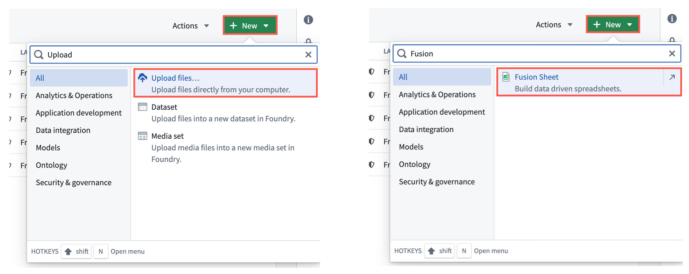


You can reference additional restricted view creation instructions in Foundry's [security](/docs/foundry/security/restricted-views/#create-restricted-views) and [object permissions](/docs/foundry/object-permissioning/configuring-rv-access-controls/) documentation.你可以参考 Foundry  的安全和对象权限文档中的更多受限视图创建说明。


Your restricted view should contain a [granular policy](/docs/foundry/security/restricted-views/#compose-a-granular-policy) that restricts user access to the data contained in the view based on their [classification access](/docs/foundry/security/classification-based-access-controls/). Compose the granular policy as the first step in the **Create '{restricted view}'** window.你的受限视图应包含一个细致的策略 ，根据用户的分类访问限制对视图中数据的访问。在创建“{restricted view}” 窗口的第一步，将细化策略组合完成。


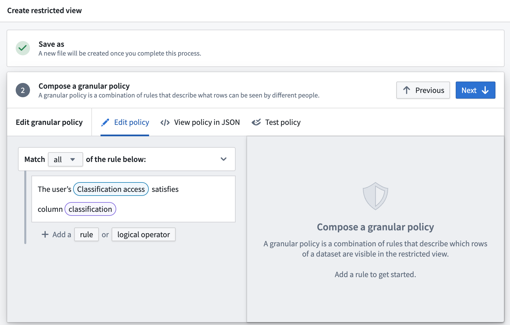


If an object contains a CBAC or mandatory marking property to restrict its access, then Foundry creates objects using the CBAC or mandatory markings it inherits from the Gaia map and will *not* apply group restrictions defined in the map's security and sharing settings.如果一个对象包含 CBAC 或强制标记属性以限制其访问，那么 Foundry 会使用从 Gaia 地图继承的 CBAC 或强制标记创建对象， 不会应用地图安全和共享设置中定义的组限制。


You can reference an example policy in JSON below.你可以在下面引用一个示例策略的 JSON 格式。


```
Copied!`1{
2  "condition": {
3    "and": {
4      "conditions": [
5        {
6          "markings": {
7            "value": {
8              "field": {
9                "fieldName": "classification"
10              },
11              "type": "field"
12            },
13            "filters": [
14              {
15                "markingTypes": {
16                  "markingTypes": [
17                    "CBAC"
18                  ]
19                },
20                "type": "markingTypes"
21              }
22            ]
23          },
24          "type": "markings"
25        }
26      ]
27    },
28    "type": "and"
29  }
30}`
```


### [](#create-and-type-map-an-object-type)Create and type-map an object type创建并类型映射对象类型


If your Foundry enrollment contains Map Rendering Service (MRS), then you will *not* need to complete the type mapping process to enable object type discovery or object creation in Gaia. Contact Palantir Support with questions about MRS installation or functionality.如果你的 Foundry 注册包含地图渲染服务（MRS），那么你无需完成类型映射过程即可在 Gaia 中启用对象类型发现或创建对象。如有关于 MRS 安装或功能的疑问，请联系 Palantir 客服。


Once you configure your restricted view, launch [Ontology Manager](/docs/foundry/ontology-manager/overview/) and follow the steps below to create your object type and type-map it to enable integration with Gotham:配置好受限视图后，启动 Ontology Manager，按照以下步骤创建对象类型并进行类型映射，以实现与 Gotham 的集成：


1. Select **New** > **Object type** from the top right of your screen.从屏幕右上角选择新的  >  对象类型 。
2. Select **Use existing datasource** and choose **Select datasource** to locate and **Select** your restricted view before choosing .选择 “使用现有数据源 ”，然后选择 “选择数据源 ”以定位并选择你的受限视图，然后选择 “下一步 ”。
3. Name your object type and optionally enter a **Description**.请指定你的对象类型，并可选地输入描述 。
4. Set `Object ID` as the **Primary Key** and `Name` as the **Title**.将对象 ID 设为主键，名称设为标题 。
5. Ensure `Classification`'s **Property** is an array of strings and `Geoshape`'s **Property** is geoshape. You will only need to validate the former if a restricted view backs your object type.确保 Classification 的 Property 是字符串数组，Geoshape 的 Property 是 geoshape。只有当受限视图支持你的对象类型时，你才需要验证前者。


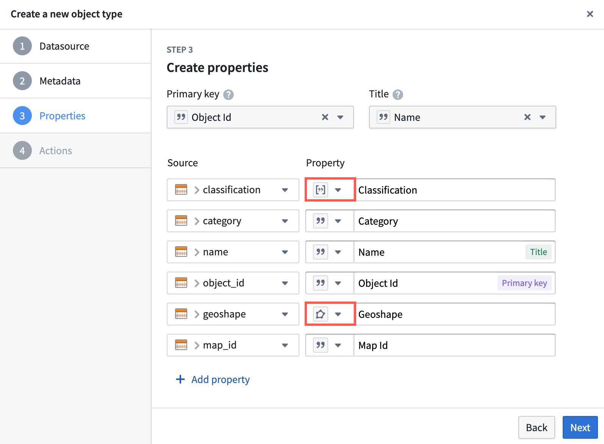


1. Select **Create**, as you will generate and configure action types *after* object type creation.选择创建 ，因为创建对象类型后你将生成和配置动作类型。


With your draft object type viewable in Ontology Manager, you will next select the `Classification` and `Geoshape` properties as shared property types in your Ontology. Select the **Properties** panel beneath **Overview** and follow the steps below to complete the shared property type selection process:当你的草稿对象类型可以在本体管理器中显示时，接下来你将在本体中选择分类和 Geoshape 属性作为共享属性类型。选择“ 概览 ”下方的房产面板，按照以下步骤完成共享房产类型的选择流程：


If you are using a dataset to back your object type that does *not* contain a `Classification` property, then you should complete steps 1 and 4 below for your `Geoshape` property.如果你使用的是不包含分类属性的对象类型数据集，那么你应该完成下面的第 1 和第 4 步来处理你的 Geoshape 属性。


1. Select `Classification` from your list of properties to launch the **Property editor** window on the right side of your screen.从你的房产列表中选择 “分类 ”，在屏幕右侧启动房产编辑器窗口。
2. Update the **Base type** dropdown menus to contain `Mandatory control` and `CBAC Marking`, respectively.更新基础类型下拉菜单，分别包含强制控制和 CBAC 标记 。
3. Configure the property's **Max Classification**.配置该物业的最大分类 。


Contact your Palantir Support if you are unable to select **Mandatory control** as the base type for `Classification`, as **Mandatory control** markings are not generally available across all Foundry enrollments.如果您无法选择强制控制作为分类的基础类型，请联系您的 Palantir 客服，因为强制控制标记通常并非所有 Foundry 注册都可用。


1. Scroll to the bottom of the window to the **Shared property** section and use the dropdown menu to assign `Classification` as a shared property.滚动到窗口底部的共享属性部分，使用下拉菜单将分类分配为共享属性。


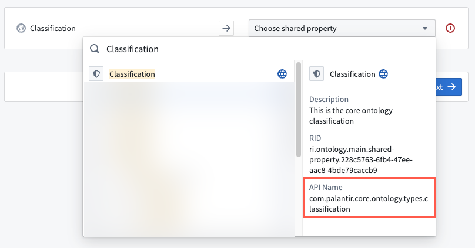


Repeat steps 1 and 4 above for your `Geoshape` property, as you will *not* need to configure its mandatory control markings or classification.请重复上述步骤 1 和 4，针对您的 Geoshape 属性，因为您无需配置其强制控制标记或分类。


Select the green **Save** button at the top of the screen to publish incremental changes to your Ontology before proceeding.在继续前，请点击屏幕顶部的绿色 “保存 ”按钮，发布对本体的增量修改。


Next, you will render objects within your object type as discoverable from Gotham applications by completing the [type mapping process](/docs/foundry/object-link-types/enable-gotham-integration/). Select the **Capabilities** panel beneath **Datasources** and follow the steps below to type-map your object type's properties:接下来，你将通过完成类型映射过程 ，渲染对象类型内的对象，从 Gotham 应用程序中可被发现。选择数据源下方的能力面板，并按照以下步骤进行类型映射你的对象类型属性：


1. Scroll down to and toggle on **Gotham Integration**.向下滚动，点击“ 哥谭整合 ”。
2. Select **Create new object type** under **Object type**.在 “对象类型” 下选择创建新对象类型 。
3. Choose the appropriate **Parent category** for your object type.选择适合你对象类型的父类别 。
4. Optionally clone your non-shared property types by selecting **Create a clone of the property in Gotham** to the right of each in the dropdown menu.可选地，在下拉菜单中选择“ 在哥谭创建该物业的克隆 ”，选择“创建该物业的克隆”，选择这些非共享物业类型。


By default, Ontology Manager *does not* type-map a property. Creating a property clone will configure an application-compatible duplicate of the selected property in Gotham.默认情况下，Ontology Manager  不对属性进行类型映射。创建属性克隆会在 Gotham 配置一个与所选属性兼容的复制品。


Ontology Manager automatically type-maps `Geoshape` and populates your other shared property types, such as `Classification`, in the **Property types** dropdown menu to the right of each property type.本体管理器会自动对 Geoshape 进行类型映射，并在每个属性类型右侧的 “属性类型 ”下拉菜单中填充你的其他共享属性类型，如分类 。


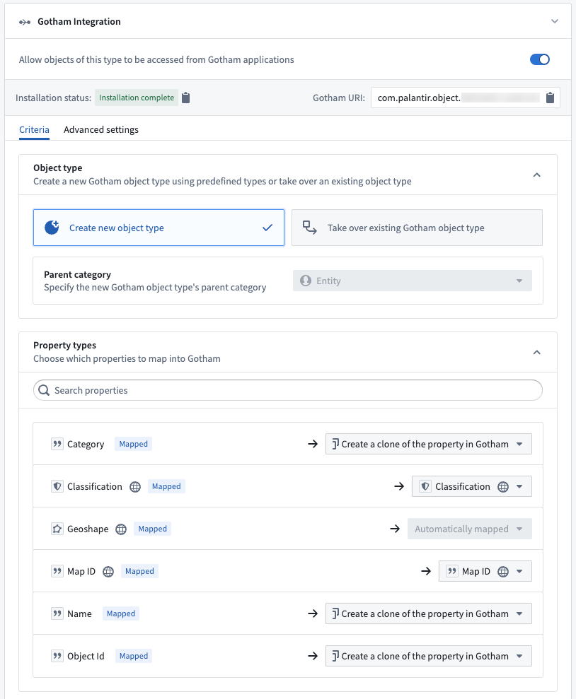


Additionally, Ontology Manager provides an optional interface to configure intrinsic values on Gotham objects derived from properties you type-map from your Ontology. Gotham's object model enables you to set property types in your Ontology that contain geotemporal data as metadata of an object in Gotham. As an example, if you create a `Vessel` object type in your Ontology whose object instances contain a `geopoint` property type that records the object's location, then you can set the `geopoint` property type as an object-level intrinsic in Gotham.此外，本体管理器还提供了一个可选接口，用于配置基于你本体类型映射属性的哥谭对象的内在值。Gotham 的对象模型允许你在本体中设置包含地时数据的属性类型，作为 Gotham 对象的元数据。举个例子，如果你在本体中创建了一个容器对象类型，其对象实例包含一个记录该对象位置的地理点属性类型，那么你可以将该地理点属性类型设为哥谭市的对象级内在属性。


Intrinsic values must be `timestamp`, `geopoint`, or `string` types.内在值必须是时间戳 、 地理点或字符串类型。


### [](#create-and-configure-an-action-type-to-enable-object-creation-in-gaia)Create and configure an action type to enable object creation in Gaia创建并配置动作类型以启用 Gaia 中的对象创建


Once the properties of your object type are configured to enable Gotham integration, you can navigate back to the **Overview** window in Ontology Manager. Here, you will create an [action type](/docs/foundry/action-types/overview/) that enables users to create and edit objects from shapes and configure their properties, such as `Name` and `Category`, from Gaia.一旦你的对象类型属性配置好以启用 Gotham 集成，你可以返回本体管理器的概览窗口。在这里，你将创建一个动作类型 ，允许用户从形状创建和编辑对象，并配置其属性，如 Gaia 中的名称和类别 。


Your Foundry enrollment must contain MRS to edit Ontology objects in Gaia, as this capability does not extend to objects added to Gaia through type mapping. Contact Palantir Support with questions about MRS installation or functionality.你的 Foundry 注册必须包含 MRS 才能编辑 Gaia 中的本体对象，因为该功能不适用于通过类型映射添加到 Gaia 的对象。如有关于 MRS 安装或功能的疑问，请联系 Palantir 客服。


Follow the steps below to configure your action type:请按照以下步骤配置您的行动类型：


1. Select **New** from the **Action types** section of your object type's **Overview** window to launch the **Create a new action type** pop-up window.在你对象类型的 “概览 ”窗口中，选择 “新动作类型 ”部分，以启动 “创建新动作类型 ”弹窗。


If you are unable to select the **New** button in **Action types**, then you can toggle on **Allow edits** on your object type in the **Datasources** window.如果你无法在动作类型中选择新按钮 ，可以在数据源窗口中切换“ 允许编辑 ”对象类型。


1. Select **Modify or create object** under **Object actions** before choosing .在选择 “下一步 ”之前，在对象动作下选择 “修改”或“创建对象 ”。
2. Select **Auto-generated primary key** from the **Or create a new object with** dropdown menu.选择自动生成主键 ，或者用下拉菜单创建新对象 。
3. Select **Add property** to add all your existing properties to the action type, then choose  to configure your action type's metadata.选择添加属性，将所有现有属性添加到动作类型中，然后选择 “下一步 ”配置动作类型的元数据。


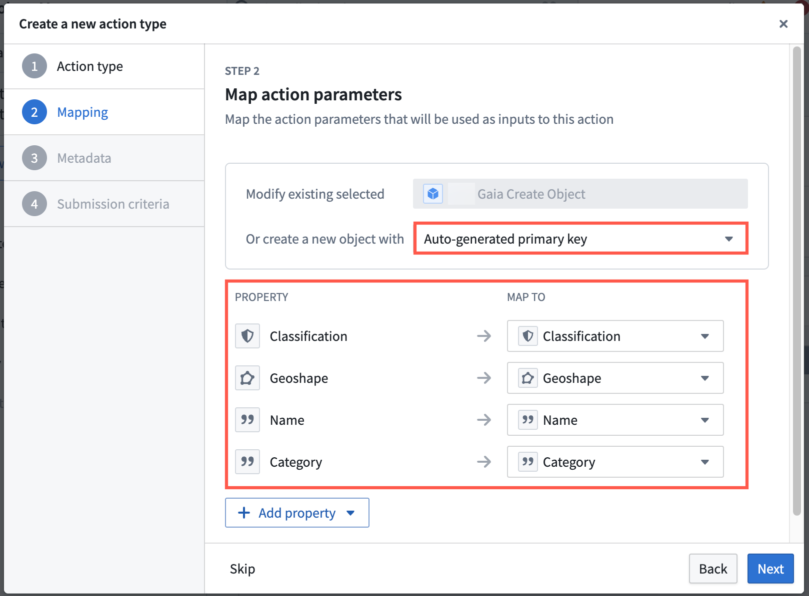


You will only need to map a `Classification` property if a restricted view backs your object type.只有当受限视图支持你的对象类型时，你才需要映射分类属性。


1. Name your action type, and optionally enter a description and update its default icon.给你的动作类型命名，并可选地输入描述并更新其默认图标。
2. Select an **Organization**, **Group**, or **User** who may execute the action, then select **Create**.选择一个组织、 组或用户 ，让他们可以执行该作，然后选择创建 。


Select the green **Save** button at the top of the screen to publish incremental changes to your Ontology before proceeding.在继续前，请点击屏幕顶部的绿色 “保存 ”按钮，发布对本体的增量修改。


Next, you will configure your action type's **Rules** and **Parameters** by following the steps below:接下来，你将按照以下步骤配置动作类型的规则和参数 ：


1. Select **Rules** from the left side of the screen.从屏幕左侧选择规则 。
2. Validate the `Geoshape` property's configurations by selecting the arrow icon next to **Configure parameter**.
通过选择配置参数旁边的箭头图标来验证 Geoshape 属性的配置。- Ensure the `Geoshape` property's type is either `Geoshape` or `String` from the **Type** dropdown menu on the right side of the screen.确保 Geoshape 属性的类型是 Geoshape 或 String，请在屏幕右侧的 Type 下拉菜单中选择。
- Ensure the **Disabled** option is selected in the **General** panel so a user cannot manually configure the location of a `Geoshape`.确保在通用面板中选择了禁用选项，这样用户就无法手动配置 Geoshape 的位置。
  - Ensure the `Geoshape` property's type is either `Geoshape` or `String` from the **Type** dropdown menu on the right side of the screen.确保 Geoshape 属性的类型是 Geoshape 或 String，请在屏幕右侧的 Type 下拉菜单中选择。
  - Ensure the **Disabled** option is selected in the **General** panel so a user cannot manually configure the location of a `Geoshape`.确保在通用面板中选择了禁用选项，这样用户就无法手动配置 Geoshape 的位置。
  
  

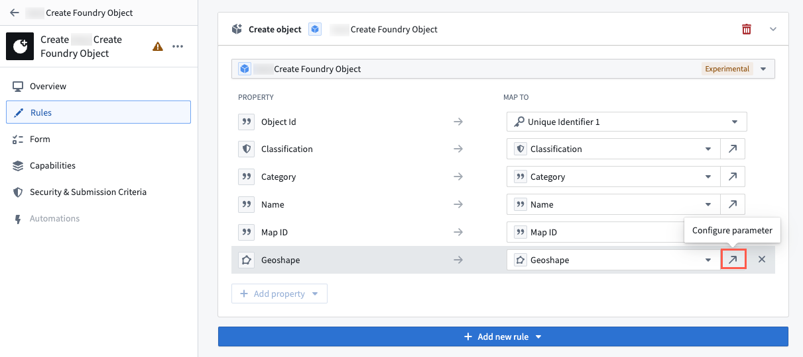


1. Select your `Classification` property from the **Form content** panel on the left side of your screen and verify that its **Type** is `Mandatory control`. You will only need to configure a `Classification` property if a restricted view backs your object type.在屏幕左侧的表单内容面板中选择你的分类属性，并验证其类型是否为强制控制 。只有当受限视图支持你的对象类型时，你才需要配置分类属性。
2. Select **Back to Form** and remove `Object Id` from **Form content** by selecting the **X** icon on the far right side of the **Object Id** panel. Foundry will automatically generate a unique ID for each object created from Gaia.选择返回表单 ，并通过在对象 ID 面板最右侧的 X 图标移除表单内容中的对象 ID。Foundry 会自动为 Gaia 创建的每个对象生成一个唯一的 ID。
3. Select the green **Save** button at the top of your screen to save your action type's configurations to the Ontology.点击屏幕顶部的绿色 “保存 ”按钮，将你的动作类型的配置保存到本体中。


### [](#implement-the-gaia-geoshape-creatable-interface)Implement the Gaia Geoshape Creatable interface实现 Gaia Geoshape Creatable 界面


The final step in creating and configuring your object type in Ontology Manager is to implement the Gaia Geoshape Creatable interface that you [previously installed from Marketplace](#gaia-geoshape-creatable-interface-from-the-gaia-app-store). Navigate back to your object type's **Overview** page and follow the steps below to implement the interface before saving changes to your Ontology:创建和配置对象类型的最后一步是实现你之前从市场安装的 Gaia Geoshape Creatable 界面。回到你对象类型的概览页面，按照以下步骤实现界面，然后再保存本体的更改：


1. Navigate to the **Interfaces** window beneath **Object Views** on the left side of your screen.导航到屏幕左侧“ 对象视图 ”下的界面窗口。
2. Select **Implement new interface** and search for `Gaia Geoshape Creatable` before choosing .选择 “实现新界面 ”，搜索 “Gaia Geoshape Creatable”后再选择 “下一步 ”。
3. Select **Choose an option** > **Replace existing** to map your Ontology's `Geoshape` shared property type to the object type implementing the interface.选择 % 3E  替换现有选项 ，将你的 Ontology 的 Geoshape 共享属性类型映射到实现接口的对象类型。
4. Select **Confirm** to close the **Implement an interface** window and **Save** the newly configured interface to your Ontology.选择确认关闭 “实现接口 ”窗口，并将新配置的接口保存到你的本体中。


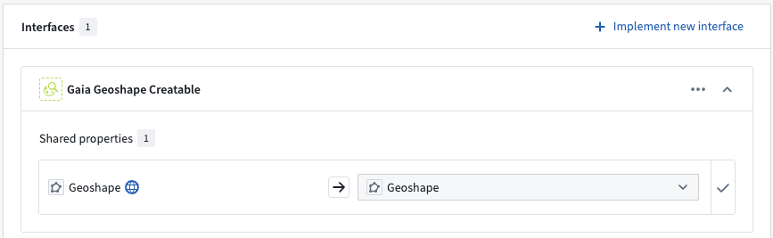


## [](#create-an-object-type-that-implements-the-gaia-geopoint-creatable-interface)Create an object type that implements the Gaia Geopoint Creatable interface创建一个实现 Gaia Geopoint Creatable 接口的对象类型


To create an object type that implements the Gaia Geopoint Creatable interface, you can follow the same steps outlined in the [object type creation instructions for the Gaia Geoshape Creatable interface above](#create-an-object-type-that-implements-the-gaia-geoshape-creatable-interface) with the following distinctions in each section:要创建实现 Gaia Geopoint Creatable 界面的对象类型，你可以按照上面 Gaia Geoshape Creatable 界面对象类型创建说明中描述的相同步骤，并在每个部分有以下区别：


- [Create an object type-backing restricted view](#create-an-object-type-backing-dataset-or-restricted-view).
创建一个对象类型支持的受限视图 。- Create a `Geopoint` instead of `Geoshape` column.创建一个 Geopoint 而不是 Geoshape 列。
  - Create a `Geopoint` instead of `Geoshape` column.创建一个 Geopoint 而不是 Geoshape 列。
  
  - [Create an object type and enable its integration with Gotham through type mapping](#create-and-type-map-an-object-type).
创建一个对象类型，并通过类型映射实现与 Gotham 的集成 。- In the object type creation window, ensure `Geopoint`'s **Property** is geopoint.在对象类型创建窗口中，确保 Geopoint 的属性是 geopoint。
- Map `Geopoint` instead of `Geoshape` in the **Property types** section of the **Gotham Integration** panel.在 Gotham Integration 面板的属性类型部分，用 Map Geopoint 代替 Geoshape。
  - In the object type creation window, ensure `Geopoint`'s **Property** is geopoint.在对象类型创建窗口中，确保 Geopoint 的属性是 geopoint。
  - Map `Geopoint` instead of `Geoshape` in the **Property types** section of the **Gotham Integration** panel.在 Gotham Integration 面板的属性类型部分，用 Map Geopoint 代替 Geoshape。
  
  - [Configure an action type to enable object creation in Gaia](#create-and-configure-an-action-type-to-enable-object-creation-in-gaia).
配置一个动作类型以启用 Gaia 中的对象创建 。- Ensure your `Geopoint` property's **Type** is `Geopoint` in your action type's **Parameters** window.确保你的 Geopoint 属性在动作类型的参数窗口中是 Geopoint。
  - Ensure your `Geopoint` property's **Type** is `Geopoint` in your action type's **Parameters** window.确保你的 Geopoint 属性在动作类型的参数窗口中是 Geopoint。
  
  - [Implement the Gaia Geoshape Creatable interface](#implement-the-gaia-geoshape-creatable-interface).
实现 Gaia Geoshape 的可创造界面 。- Search for the `Gaia Geopoint Creatable` instead of the `Gaia Geoshape Creatable` interface.搜索 Gaia Geopoint Creatable，而不是 Gaia Geoshape Creatable 界面。
- When mapping your Ontology's shared property types, select **Replace existing** for the `Geopoint` instead of the `Geoshape` property.在映射本体共享属性类型时，选择 “替换现有 ”来表示 Geopoint 属性，而不是 Geoshape 属性。
  - Search for the `Gaia Geopoint Creatable` instead of the `Gaia Geoshape Creatable` interface.搜索 Gaia Geopoint Creatable，而不是 Gaia Geoshape Creatable 界面。
  - When mapping your Ontology's shared property types, select **Replace existing** for the `Geopoint` instead of the `Geoshape` property.在映射本体共享属性类型时，选择 “替换现有 ”来表示 Geopoint 属性，而不是 Geoshape 属性。
  
  

## [](#create-an-object-type-that-implements-the-gaia-milsym-creatable-interface)Create an object type that implements the Gaia Milsym Creatable interface创建一个实现 Gaia Milsym Creatable 接口的对象类型


Unlike the Gaia Geoshape Creatable and Gaia Geopoint Creatable interfaces, you **must** use a restricted view to back an object type that implements the Gaia Milsym Creatable interface.与 Gaia Geoshape Creatable 和 Gaia Geopoint Creatable 界面不同，你必须使用受限视图来支持实现 Gaia Milsym Creatable 界面的对象类型。


To create an object type that implements the Gaia Milsym Creatable interface, you can follow the same steps outlined in the [object type creation instructions for the Gaia Geoshape Creatable interface above](#create-an-object-type-that-implements-the-gaia-geoshape-creatable-interface) with the following distinctions in each section:要创建实现 Gaia Milsym Creatable 界面的对象类型，你可以按照上面 Gaia Geoshape Creatable 界面的对象类型创建说明中描述的步骤作，但每个部分有以下区别：


- [Create an object type-backing restricted view](#create-an-object-type-backing-dataset-or-restricted-view).
创建一个对象类型支持的受限视图 。- You will *only* need to create `Object ID`, `Classification`, and `Title` columns.你只需要创建对象 ID、 分类和标题列。
  - You will *only* need to create `Object ID`, `Classification`, and `Title` columns.你只需要创建对象 ID、 分类和标题列。
  
  - [Create an object type and enable its integration with Gotham through type mapping](#create-and-type-map-an-object-type).
创建一个对象类型，并通过类型映射实现与 Gotham 的集成 。- In the object type creation window, set `Object ID` as the **Primary key** and `Title` as the **Title**.在对象类型创建窗口中，将对象 ID 设为主键 ，将标题设为标题 。
- Select **Create a clone of the property in Gotham** for the `Object ID` property type in the **Property types** section of the **Gotham Integration** panel. Foundry automatically maps all the object type's shared property types.在 Gotham 集成面板的属性类型部分，选择在 Gotham 创建该属性的克隆 ，以匹配对象 ID 属性类型。Foundry 会自动映射该对象类型的所有共享属性类型。
  - In the object type creation window, set `Object ID` as the **Primary key** and `Title` as the **Title**.在对象类型创建窗口中，将对象 ID 设为主键 ，将标题设为标题 。
  - Select **Create a clone of the property in Gotham** for the `Object ID` property type in the **Property types** section of the **Gotham Integration** panel. Foundry automatically maps all the object type's shared property types.在 Gotham 集成面板的属性类型部分，选择在 Gotham 创建该属性的克隆 ，以匹配对象 ID 属性类型。Foundry 会自动映射该对象类型的所有共享属性类型。
  
  

When [configuring an action type to enable object creation](#create-and-configure-an-action-type-to-enable-object-creation-in-gaia), ensure you map *at least* the `Classification`, `MIL2525 Symbol Anchor Points`, and `SIDC` properties in the **Create a new action type** window before you select .在配置动作类型以启用对象创建时，确保在选择 “下一步 ”前 ，至少在 “ 创建新动作类型 ”窗口中映射分类、MIL2525 符号锚点和 SIDC 属性。


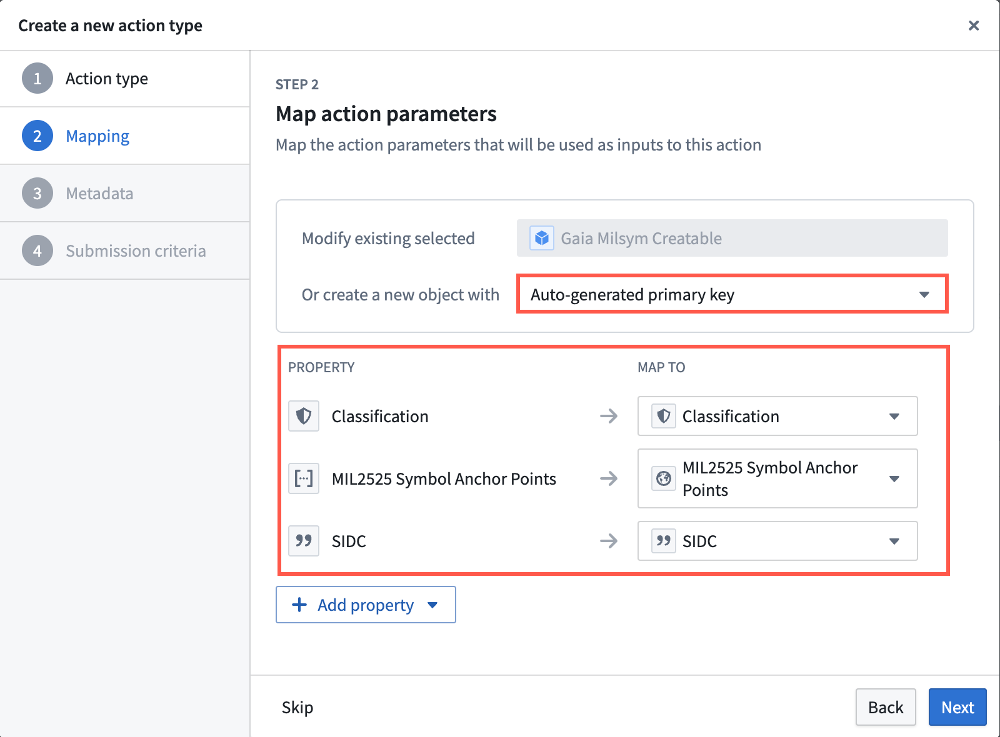


Select the green **Save** button at the top of the screen to publish incremental changes to your Ontology before proceeding.在继续前，请点击屏幕顶部的绿色 “保存 ”按钮，发布对本体的增量修改。


Next, you will configure your action type's **Rules** and **Parameters** by following the steps below:接下来，你将按照以下步骤配置动作类型的规则和参数 ：


1. Select **Rules** from the left side of the screen.从屏幕左侧选择规则 。
2. Select the arrow icon to the right of your `Classification` property to **Configure parameter**.选择分类属性右侧的箭头图标以配置参数 。


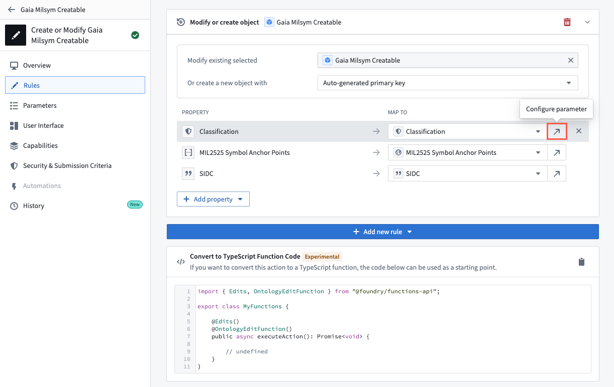


1. Toggle on **Disabled** in the **General** section to ensure the object created inherits its classification markings from your Gaia map.在 “通用 ”部分切换为禁用 ，确保创建的对象继承了你的盖亚地图上的分类标记。
2. Select **Add** under **Set a parameter max classification** to ensure the action type's maximum classification matches the object type's maximum classification.选择 “添加 ” 设置参数最大分类 “，以确保动作类型的最大分类与对象类型的最大分类匹配。


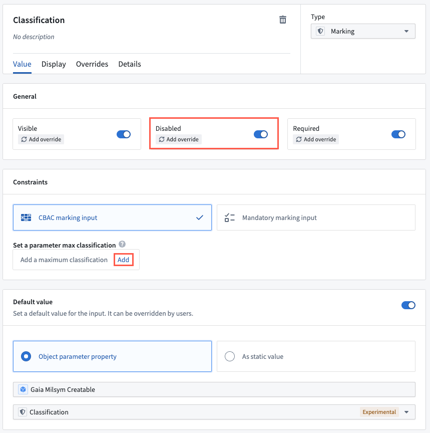


1. Select the green **Save** button at the top of the screen to publish the action type to your Ontology.点击屏幕顶部的绿色 “保存 ”按钮，将动作类型发布到你的本体中。


Since the [use of struct properties in actions is not currently supported](/docs/foundry/object-link-types/structs-overview/#current-levels-of-support), you will not be able to configure the `Speed Modifier (Z)` or `Altitude/Depth Modifier (X)` properties as action type parameters.由于目前不支持在动作中使用结构属性 ，你无法将速度修改器（Z）或高度/深度修正符（X） 属性配置为动作类型参数。


- [Implement the Gaia Geoshape Creatable interface](#implement-the-gaia-geoshape-creatable-interface).
实现 Gaia Geoshape 的可创造界面 。- Search for the `Gaia Milsym Creatable` instead of the `Gaia Geoshape Creatable` interface.搜索 Gaia Milsym Creatable，而不是 Gaia Geoshape Creatable 界面。
- When mapping your Ontology's shared property types, select **Replace existing** for your `Classification` property and **Create edit-only property** for the others.在映射本体的共享属性类型时，选择“ 替换现有 ”来表示分类属性 ，并为其他属性创建仅编辑属性。
  - Search for the `Gaia Milsym Creatable` instead of the `Gaia Geoshape Creatable` interface.搜索 Gaia Milsym Creatable，而不是 Gaia Geoshape Creatable 界面。
  - When mapping your Ontology's shared property types, select **Replace existing** for your `Classification` property and **Create edit-only property** for the others.在映射本体的共享属性类型时，选择“ 替换现有 ”来表示分类属性 ，并为其他属性创建仅编辑属性。
  
  

## [](#register-your-ontology-and-its-types)Register your Ontology and its types注册你的本体及其类型


Now, you have object types that implement the Gaia Geoshape Creatable, Gaia Geopoint Creatable, and Gaia Milsym Creatable interfaces and contain accompanying action types that enable a user to configure objects they create from shapes drawn, points dropped, and tactical graphics configured on a Gaia map. Next, you will register your Ontology, object types, and action types either in Gaia's admin application or [Control Panel](/docs/foundry/administration/control-panel/) extension, depending on your enrollment.现在，你有实现 Gaia Geoshape Creatable、Gaia Geopoint Creatable 和 Gaia Milsym Creatable 接口的对象类型，并包含相应的动作类型，允许用户配置他们从绘制的形状、丢弃的点和在 Gaia 地图上配置的战术图形创建的对象。接下来，你需要根据注册情况，在 Gaia 的管理应用或控制面板扩展中注册你的本体、对象类型和动作类型。


To access Gaia's admin application, you must be a platform administrator. To access Gaia's Control Panel extension, you must be granted the **Organization administrator** role. 要访问 Gaia 的管理员应用程序，您必须是平台管理员。要访问盖亚的控制面板扩展，必须获得组织管理员角色。


Contact Palantir Support with questions about access to the admin application or Control Panel extension if you are unable to access either.如果无法访问管理员应用或控制面板扩展，请联系 Palantir 客服。


To register your Ontology, object types, and action types, launch Gaia's admin application or Control Panel extension and follow the steps below:要注册你的本体论、对象类型和动作类型，请启动 Gaia 的管理应用或控制面板扩展，并按照以下步骤作：


1. Locate the **Ontology Config** (admin application)/**Ontology** (Control Panel extension) panel and verify your Ontology's configuration. If your Ontology is not configured, select the toggle on the left side of the panel to set **Ontology Config**/**Ontology** to `overridden` (admin application)/`Override` (Control Panel extension).找到 Ontology 配置 （管理员应用）/ 本体（ 控制面板扩展）面板，验证你的 Ontology 配置。如果你的本体没有配置好，选择面板左侧的开关，将 Ontology 配置 / 本体设置为覆盖 （管理应用）/ 覆盖 （控制面板扩展）。
2. Enter your Ontology's RID and API name into the **Ontology RID** and **API Name** text boxes.在 Ontology RID 和 API Name 文本框中输入你的 Raid 和 API 名称 。


To locate and copy your Ontology's RID and API name, navigate to Ontology Manager and choose **Ontology configuration** from the bottom of its left panel to launch the **Ontology metadata** window.要查找并复制你的本体的 RID 和 API 名称，请进入本体管理器，从左侧面板底部选择本体配置 ，以启动本体元数据窗口。


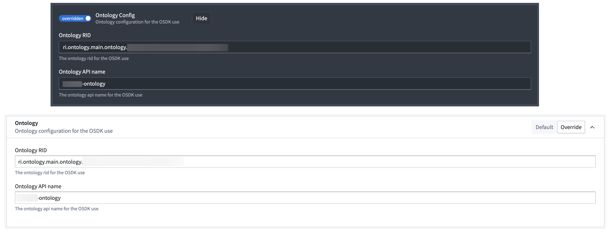


1. Locate the **Foundry Object Creation Config** panel and select **Show** (admin application)/**Override** (Control Panel extension).找到 Foundry 对象创建配置面板，选择显示 （管理员应用程序）/ 覆盖 （控制面板扩展）。
2. Select **Add** at the bottom of your enrollment's existing object and action type list.在你注册的现有对象和动作类型列表底部选择添加 。
3. Copy and paste the RIDs for all three object types and their supporting action types into three separate **Object type rid** and **Action type rid** text boxes, respectively.将三种对象类型及其支持动作类型的 RID 复制粘贴到三个独立的对象类型 rid 和动作类型 rid 文本框中。
4. Select **Preview and save** in the top right ribbon (admin application)/**Save for {Organization}** in the bottom right corner (Control Panel extension).选择预览并保存 ，位于右上角的服务区（管理员应用程序）/在右下角（控制面板扩展）的“ 保存为{组织}。


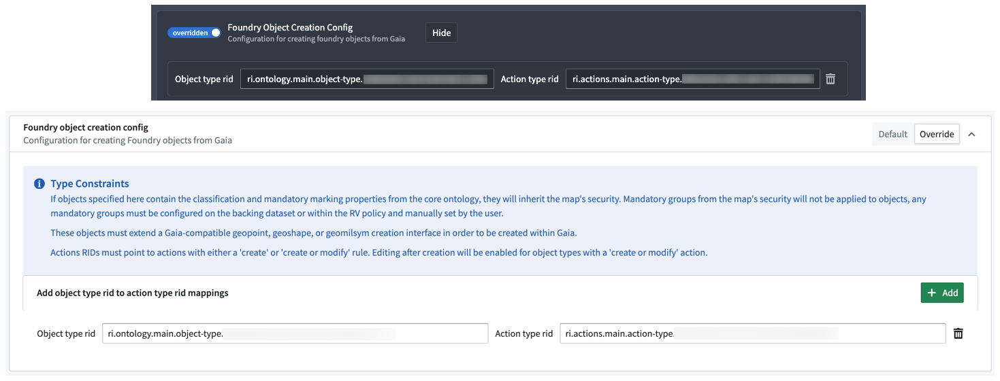


You can access your object type's RID from the **Overview** window in Ontology Manager. Select the clipboard icon to copy the RID. Additionally, you can access your action type's RID by selecting **Create {object type name}** in the **Action types** section of the **Overview** window. The action type's RID can also be copied through the clipboard icon.你可以从本体管理器的概览窗口访问你对象类型的 RID。选择剪贴板图标复制 RID。此外，你可以通过在概览窗口的动作类型部分选择创建{对象类型名称} 来访问你的动作类型的 RID。动作类型的 RID 也可以通过剪贴板图标复制。


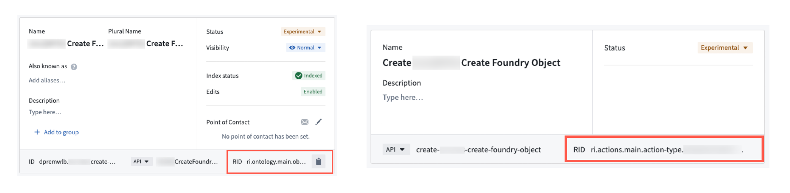


Next, you will launch Gotham's Gaia application to create objects from shapes you draw, points you drop, and tactical graphics you configure on a map using its **Add to map** menu.接下来，你将启动 Gotham 的 Gaia 应用，根据地图上的添加菜单，根据你绘制的形状、放置的点和战术图形创建对象。


### [](#draw-a-new-shape-on-your-gaia-map-and-tag-it-to-an-object-type)Draw a new shape on your Gaia map and tag it to an object type在你的 Gaia 地图上画一个新形状，并标记到一个对象类型


Current limitations around the International Date Line国际换日线的当前限制While you can create map annotations that cross the 180th meridian, or antimeridian, on a Gaia map, you cannot draw shapes tagged as Foundry objects that do so. 虽然你可以在盖亚地图上创建跨越 180 度子午线或反子午线的地图注释，但你不能绘制标记为 Foundry 对象的形状。

 Contact Palantir Support with questions about annotation creation, rendering, or Gaia's additional documentation present in Gotham.如有关于注释创建、渲染或《哥谭》中 Gaia 额外文档的问题，请联系 Palantir 客服。


With your Gaia map open, select the object icon from the menu in the top left region of your map to switch from **Draw annotation** to **Create object** mode.打开你的 Gaia 地图后，从地图左上角菜单中选择对象图标，从绘制注释切换到创建对象模式。


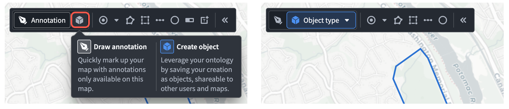


Next, select a shape to draw from the right side of the same menu. When you finish drawing your shape, the **Create shape** window will appear in Gaia's left panel. Follow the steps below to configure your shape and save it to your Ontology as an object:接着，在同一菜单右侧选择一个形状来绘制。当你完成图形绘制后，“创建形状 ”窗口会出现在盖亚的左侧面板中。请按照以下步骤配置你的形状，并将其作为对象保存到你的本体中：


1. Search for and select your object from the **Object type** dropdown menu. If you selected an object type from the tool bar's dropdown menu on your map canvas, then Gaia will automatically populate the **Create shape**'s dropdown menu with that value.在 “对象类型 ”下拉菜单中搜索并选择你的对象。如果你从地图画布工具栏的下拉菜单中选择了某个对象类型，Gaia 会自动在创建形状的下拉菜单中填充该值。
2. Complete the required fields in the action form, such as `Category` and `Name`, for your object before you select **Finish**.在选择完成前 ，请在动作表单中填写物品的必填字段，如类别和名称 。


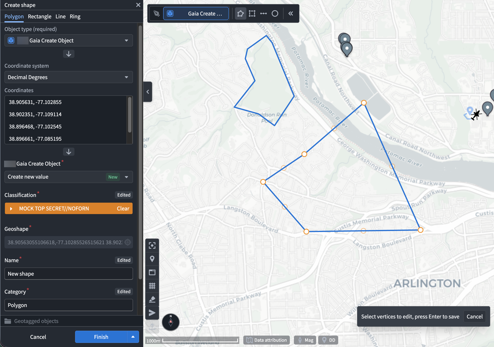


Once you save your shape as an object, it will render as one of the **Layers** in Gaia's left panel. You can select the object's name to launch the **Selection** panel on the right side of your screen, where you can view its properties and customize its appearance.一旦你把形状保存为一个对象，它会被渲染成盖亚左面板中的某个图层 。你可以选择对象名称，在屏幕右侧启动 “选择面板”，在那里查看其属性并自定义外观。


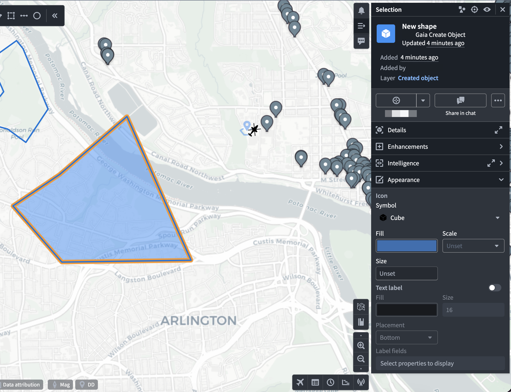


You can also view your object in Foundry's [Object Explorer](/docs/foundry/object-explorer/overview/).你也可以在 Foundry 的对象浏览器中查看你的对象。


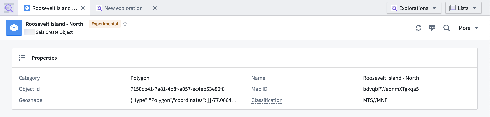


#### [](#edit-an-existing-shape-object)Edit an existing shape object编辑现有的形状对象


To edit an existing shape object, hover your cursor over the object in the left panel and choose **Edit selection** to launch the **Edit shape** window, which you can also access by double-clicking the object on your map.要编辑现有形状对象，将光标悬停在左侧面板的物体上，选择 “编辑选择 ”以启动 “编辑形状窗口，你也可以通过双击地图上的物体进入该窗口。


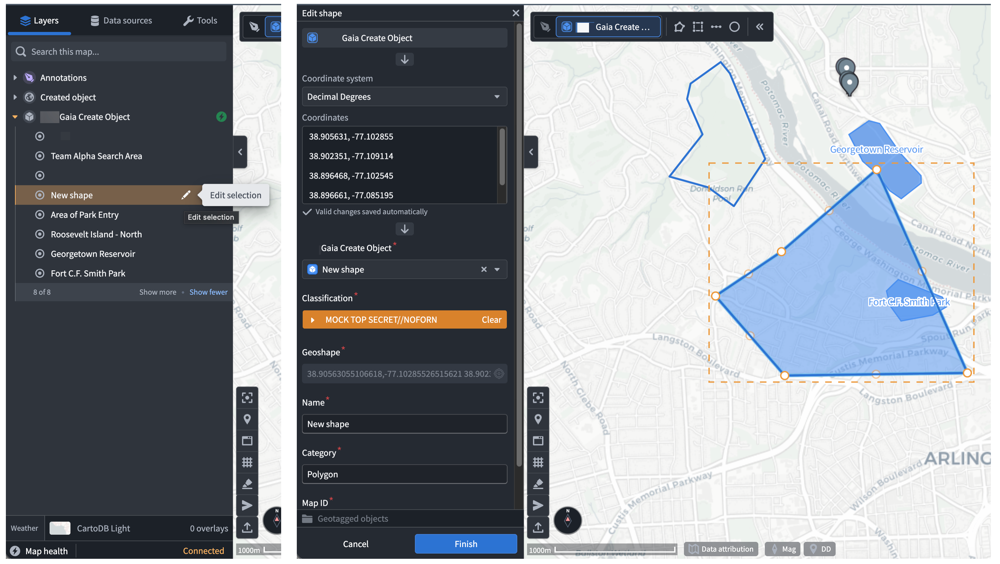


Select and drag any vertex to adjust the shape, or select a point within the shape's boundary to drag the shape to another location on your map. When you are finished making changes, choose **Finish** at the bottom of the **Edit shape** window.选择并拖动任意顶点以调整形状，或者选择形状边界内的一点，将形状拖曳到地图上的另一个位置。完成修改后，在编辑形状窗口底部选择 “完成 ”。


### [](#drop-a-new-point-on-your-gaia-map-and-tag-it-to-an-object-type)Drop a new point on your Gaia map and tag it to an object type在你的盖亚地图上新增一个点，并标记为一个对象类型


With your Gaia map open, select the down arrow to render the symbol **Search** menu, where you can choose an available symbol to drop anywhere on your map. If you select one of the available **Tactical Graphics** symbols, then you will only be able to create an object within an object type that implements the [Gaia Milsym Creatable Interface](#create-an-object-type-that-implements-the-gaia-milsym-creatable-interface). Gaia will automatically populate the **Coordinates** input box based on your map's coordinate system preference.打开你的盖亚地图后，选择向下箭头以渲染符号搜索菜单，你可以选择一个可用的符号，放置在地图上的任意位置。如果你选择可用的战术图形符号之一，那么你只能在实现 Gaia Milsym Creatable Interface 的对象类型内创建对象。Gaia 会根据你地图的坐标系统偏好自动填充坐标输入框。


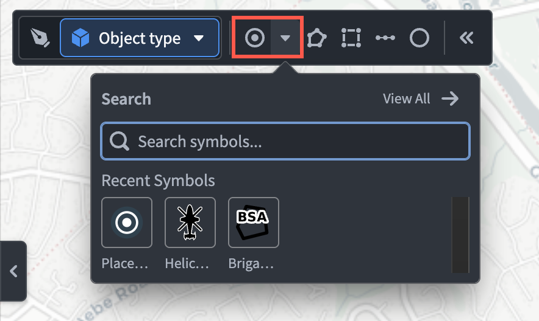


Select **File** > **Preferences** > **Coordinate system** from Gaia's top ribbon to update the default coordinate system.从盖亚顶部的色带中选择文件  >  偏好  >  坐标系以更新默认坐标系。


The **Create symbol** window will appear in Gaia's left panel, where you can search for and select your object type that implements the Gaia Geopoint Creatable interface. Next, optionally adjust the **Bearing (mag)** of your geopoint before entering a **Title** for your object. Choose **Finish** to save the dropped symbol to your Ontology as an object.创建符号窗口会出现在盖亚左侧面板，你可以搜索并选择实现盖亚地理点可创建界面的对象类型。接下来，在输入物体标题前，可以选择性地调整地理点的方位（磁力）。 选择完成 ，将被丢弃的符号保存到你的本体中作为对象。


Once you save your geopoint as an object, you can interact with the new map layer and view the object in Foundry's Object Explorer [in the same manner you can for a shape drawn on your map](#draw-a-new-shape-on-your-gaia-map-and-tag-it-to-an-object-type).一旦你将地理点保存为对象，就可以与新的地图图层交互，并在 Foundry 的对象探索器中以类似方式查看地图上绘制的形状 。


#### [](#edit-an-existing-geopoint-object)Edit an existing geopoint object编辑现有的地理点对象


You can edit an existing geopoint object [in the same manner you can for a shape drawn on your map](#edit-an-existing-shape-object).你可以像编辑地图上绘制的形状一样编辑已有的地理点对象。


### [](#configure-a-tactical-graphic-on-your-gaia-map-and-tag-it-to-an-object-type)Configure a tactical graphic on your Gaia map and tag it to an object type在你的 Gaia 地图上配置战术图形，并标记为对象类型


Your Foundry enrollment must contain MRS to tag a tactical graphic to an object type. Contact Palantir Support with questions about MRS installation or functionality.你的 Foundry 注册必须包含 MRS，才能将战术图形标记到对象类型。如有关于 MRS 安装或功能的疑问，请联系 Palantir 客服。


[Similar to adding a new geopoint to tag as an object](#drop-a-new-point-on-your-gaia-map-and-tag-it-to-an-object-type), select the down arrow to render the symbol **Search** menu, where you can choose an available tactical graphic to drop anywhere on your map. Type the name of your desired tactical graphic in the **Search symbols...** input box, such as `Brigade Support Area`.类似于添加新的地理点标记为对象 ，选择向下箭头渲染符号搜索菜单，你可以选择一个可用的战术图形，放置在地图上的任意位置。在搜索符号输入框中输入你想要的战术图形名称，比如旅支援区 。


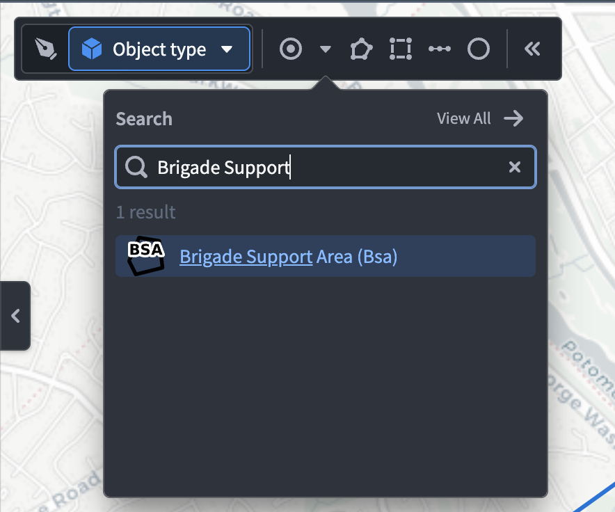


The **Create symbol** window will appear in Gaia's left panel, and you can follow the same [shape creation instructions](#draw-a-new-shape-on-your-gaia-map-and-tag-it-to-an-object-type) above to add your tactical graphic to the map and tag it to an object type.创建符号窗口会出现在盖亚左侧面板，你可以按照上述形状创建步骤 ，将你的战术图形添加到地图并标记为对象类型。


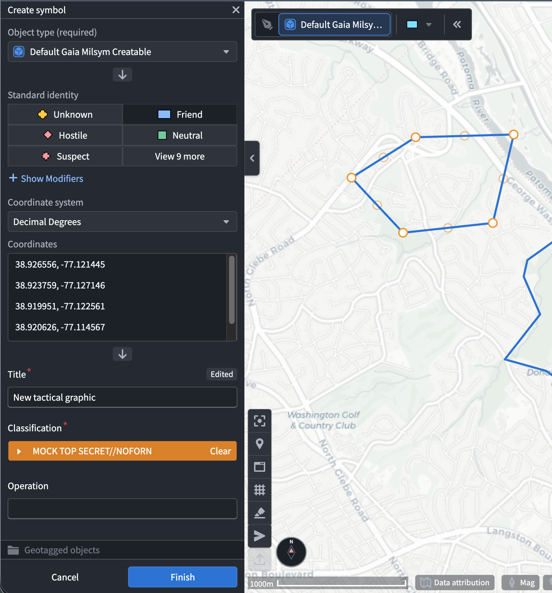


#### [](#edit-an-existing-tactical-graphic-object)Edit an existing tactical graphic object编辑现有的战术图形对象


You can edit an existing tactical graphic object by following the [shape object editing instructions above](#edit-an-existing-shape-object).你可以按照上面的形状对象编辑说明编辑现有的战术图形对象。


### [](#promote-an-annotation-to-an-object)Promote an annotation to an object将注释提升到对象


In Gaia, an *annotation* is a shape, point, or symbol that is local to your current map. You can promote annotations on your map to objects in your Ontology for use on other maps created by other users who can access their object type.在盖亚中， 注释是你当前地图局部的形状、点或符号。你可以将地图上的注释提升到本体中对象，以便其他用户创建的其他地图使用，这些用户可以访问他们的对象类型。


To tag an existing annotation as an object, double-click the annotation on your map or hover your cursor over the annotation's pencil icon in the **Layers** tab of the left panel to launch the shape, point, or symbol edit window. Next, select **Promote to object**, choose your object type from the **Object type** dropdown menu, and complete the action form in the shape, point, or symbol edit window.要将现有注释标记为对象，只需双击地图上的注释，或将光标悬停在左侧面板图层标签中的铅笔图标上，启动形状、点或符号编辑窗口。接下来，选择 “晋升到对象 ”，从 “对象类型 ”下拉菜单中选择你的对象类型，然后在形状、点或符号编辑窗口中完成动作表单。


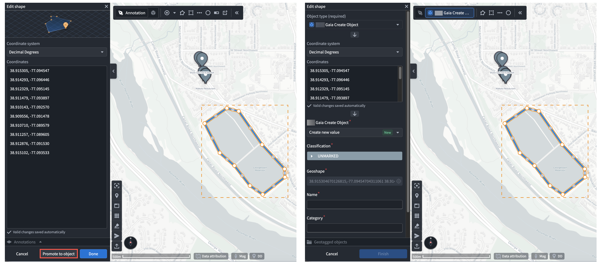


To learn more about the various methods you can use to add data *from* your Ontology *to* Gotham, review the existing [geospatial data integration documentation](/docs/foundry/geospatial/add-ontology-data-to-gaia/).想了解更多关于将本体数据添加到哥谭的各种方法，请查阅现有的地理空间数据集成文档 。

