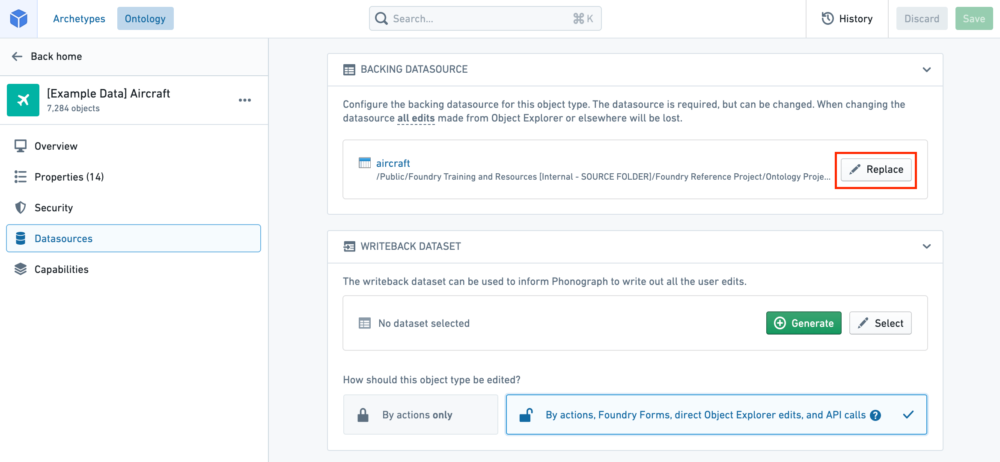
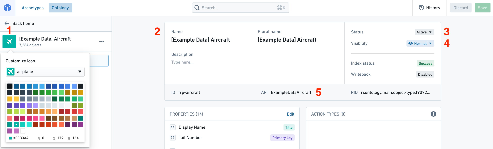

# Edit object types编辑对象类型

Warning警告Editing an object type and its properties can have **application-breaking consequences that can disrupt user workflows**. Read the section below on [potential breaking changes](#potential-breaking-changes) **before** proceeding with any object type or property edits.编辑对象类型及其属性可能会带来应用程序崩溃后果，扰乱用户的工作流程 。在进行任何对象类型或属性编辑之前 ，请阅读下面关于可能破坏性变更的部分。

## Potential breaking changes潜在的突破性变更

### Object type without writeback无写回的对象类型

Changes that require Object Storage V1 (Phonograph) to unregister and reregister the backing datasources of an object type will make the objects of that type **unavailable** in user applications during that reindex time; these changes are described below.需要对象存储 V1（留声机）取消并重新注册某对象类型后备数据源的更改，会使该类型的对象在重新索引期间无法在用户应用中使用;这些变化将在下文描述。

The following changes will unregister and reregister (or delete) the backing datasources of an object type when saved:以下更改将在保存对象类型后，取消并重新注册（或删除）该对象类型的备份数据源：

- Changing an object type’s backing datasource.更改对象类型的后备数据源。
- Changing the primary key of an object type.更改对象类型的主键。
- Deleting an object type.删除一个对象类型。

When you try to save any of these changes, you will be warned about the potential impact on user applications.当你尝试保存这些更改时，系统会提醒你可能对用户应用产生影响。

For example, if an object type is used in a Workshop application, that Workshop application will be broken until the reindex completes. You can track the progress of the reindex for an object type in the **Phonograph** pane of its **Datasources** page.例如，如果某个对象类型被用于 Workshop 应用，该 Workshop 应用将被破坏，直到重新索引完成。你可以在该对象类型的留声机页面数据源页面中跟踪重新索引的进度。

[Learn more about Object Storage V1 (Phonograph).了解更多关于对象存储 V1（留声机）的信息。](/docs/foundry/object-databases/object-storage-v1/)

### Object type with writeback带有写回的对象类型

If an object type has writeback enabled, extra precaution should be taken when making edits to that object type. The history of edits made to an object type are stored in Object Storage V1 (Phonograph). Every time a writeback dataset is built, the history of edits is reapplied to get the final state of edited objects in the writeback dataset. When the backing datasources of an object type are unregistered from Object Storage V1 (Phonograph), the history of edits in Object Storage V1 (Phonograph) is deleted and future builds of the writeback dataset will fail.如果某个对象类型启用了写回，编辑该对象类型时应格外小心。对对象类型的编辑历史会存储在对象存储 V1（留声机）中。每次构建写回数据集时，编辑历史会重新应用，以获得写回数据集中被编辑对象的最终状态。当对象类型的备份数据源从对象存储 V1（留声机）中取消注册时，对象存储 V1（留声机）中的编辑历史会被删除，写回数据集的后续构建将失败。

In addition to the changes that require unregistering that were listed in the [previous section](#object-type-without-writeback), unregistering is required for object types with writeback when schema changes are made to **any** property of an object type that has **ever** received edits, even if it does not currently receive edits. Schema changes include changes to the ID and base type of a property.除了前节列出的需要取消注册的更改外，当对曾经接受过编辑的对象类型中的任何属性进行模式变更时，也要求通过写回的对象类型取消注册，即使该对象当前未收到编辑。模式变更包括属性的 ID 和基类型。

The following changes ***do not*** require unregistering and therefore do not risk losing the edit history:以下更改无需取消注册，因此不会有丢失编辑历史的风险：

- Changing the display name, title key, render hints, type classes, and visibility of a property that has received edits will ***not*** require the object type to unregister.更改显示名、标题键、渲染提示、类型类以及已编辑属性的可见性， 都不需要该对象类型取消注册。
- Deleting fields or making schema changes to fields that have never received edits will ***not*** require the object type to unregister, and therefore will not erase or undo edits on other fields that are receiving edits.删除字段或对从未收到编辑的字段进行结构更改， 不会要求对象类型取消注册，因此不会删除或撤销其他正在接收编辑字段的编辑。

Warning警告Object Storage V1 (Phonograph) will **not** automatically unregister the backing datasources of an object type in response to one of these schema changes. Instead, the reindex will fail and will only succeed if the saved schema changes are undone, or if you manually unregister and reregister the backing datasources of the object type in the **Phonograph** pane of the object type’s **Datasource** page.对象存储 V1（留声机） 不会在这些模式变更后自动取消注册对象类型的后备数据源。相反，重新索引会失败，只有在撤销保存的模式更改，或者你手动取消并重新注册该对象类型的备份数据源时才会成功。

The properties pane in the property editor highlights whether a field has ever received edits.属性编辑器中的属性面板会突出显示字段是否曾被编辑过。

Furthermore, when you try to save any changes that risk erasing the edit history, you will be warned about the potential impact on edits.此外，当你尝试保存任何可能删除编辑历史的更改时，系统会提醒你可能对编辑产生影响。

Now that you understand the considerations in editing existing object types and properties, you can safely make your changes.现在你已经了解了编辑现有对象类型和属性时的考虑因素，就可以放心地进行修改了。

## Edit an existing object type编辑现有对象类型

- [Navigate to an existing object type导航到现有对象类型](#navigate-to-an-existing-object-type)
- [Delete an object type删除对象类型](#delete-an-object-type)
- [Change a backing datasource更改一个支持数据源](#change-a-backing-datasource)
- [Edit an object type’s metadata编辑对象类型的元数据](#edit-an-object-types-metadata)

### Navigate to an existing object type导航到现有对象类型

You can always change the object type you are working on by selecting the object type page from the home page sidebar and selecting a different object type from the list. You can also always search for a new object type in the search bar in the application header. [Read more about navigation.](/docs/foundry/ontology-manager/navigation/)你总可以通过在主页侧边栏选择对象类型页面，然后从列表中选择不同的对象类型来更改你正在处理的对象类型。你也可以在应用头部的搜索栏里搜索新的对象类型。 阅读更多关于导航的信息。

### Delete an object type删除对象类型

You can delete an object type by selecting the 

 (three dots) icon at the top right of the object type view sidebar (see image below) and then selecting the **Delete** option from the dropdown. A dialog will pop up to confirm you want to stage the object type and all of its associated link types for deletion.你可以通过点击对象类型侧边栏右上角  的（三个点）图标（见下图）来删除某个对象类型，然后从下拉菜单中选择删除选项。会弹出一个对话框确认你是否想暂停该对象类型及其所有关联链接类型进行删除。

- Note that the deletion of the object type only takes effect after you save your changes, and will break any views or applications referencing the object type.注意，删除对象类型只有在保存更改后才生效，并且会破坏任何引用该对象类型的视图或应用程序。
- Object types with an `active` status cannot be deleted. [Read more about statuses.](/docs/foundry/object-link-types/metadata-statuses/)具有活跃状态的对象类型无法删除。 阅读更多关于状态的信息。

### Change a backing datasource更改一个支持数据源

You can change a backing datasource with the following steps:您可以通过以下步骤更改备份数据源：

1. Navigate to the property editor by selecting **Edit property mapping** at the top of the **Properties** page of an object type.通过在对象类型的属性页面顶部选择 “编辑属性映射 ”，进入属性编辑器。
2. Select the 

 **Replace** button at the top of the **Datasources** pane. This will allow you to browse and select available datasources in Foundry.选择  数据来源面板顶部的替换按钮。这样你就可以在 Foundry 中浏览和选择可用的数据源。

Warning警告Changing the backing datasource of an object type will remove any connection between columns in the old datasource and the object type’s properties. Properties will be automatically remapped for you **only if** you change to a new datasource with the **same schema** as the old datasource. Otherwise, you will need to remap the object type’s properties to the new datasource.更改对象类型的后备数据源会移除旧数据源中列与该对象属性之间的任何关联。 只有当你切换到与旧数据源模式相同的新数据源时，属性才会自动重新映射。否则，你需要将对象类型的属性重新映射到新的数据源。

### Edit an object type’s metadata编辑对象类型的元数据

1. **Icon:** Select the default icon to customize the icon and color of the object type that will appear in user applications when a user views an object of this type.图标： 选择默认图标以自定义用户应用程序中显示的对象类型的图标和颜色，这些图标会在用户查看该类型对象时出现。
2. **Display names and description:** Select into the existing display names or description to edit the text.显示名称与描述： 选择现有的显示名称或描述来编辑文本。
3. **Status:** Select the existing status to open a dropdown of available statuses. Choose from the `deprecated`, `experimental`, and `active` statuses.
状态： 选择现有状态以打开可用状态的下拉菜单。 可以选择弃用 、 实验和活跃状态。- Read more about [statuses](/docs/foundry/object-link-types/metadata-statuses/).阅读更多关于状态的信息 。
  - Read more about [statuses](/docs/foundry/object-link-types/metadata-statuses/).阅读更多关于状态的信息 。
  
  4. **Visibility:** Select the existing visibility to open a dropdown of available visibilities. A `prominent` object type will lead applications to show this object type first to users. A `hidden` object type will not appear in user applications.能见度： 选择现有可见性，打开可用可见性下拉菜单。 显著的对象类型会促使应用程序首先向用户展示该对象类型。 隐藏对象类型不会出现在用户应用程序中。
5. **API name:** Select into the existing API name to change its value.
API 名称： 选择进入现有的 API 名称以更改其值。- Note that you cannot change the API name for object types with an `active` status.
请注意，对于处于活跃状态的对象类型，你不能更改 API 名称。- Read more about [statuses](/docs/foundry/object-link-types/metadata-statuses/).阅读更多关于状态的信息 。
- Read more about [valid API names](/docs/foundry/object-link-types/create-object-type/#api-name).阅读更多关于有效 API 名称的信息。
  - Read more about [statuses](/docs/foundry/object-link-types/metadata-statuses/).阅读更多关于状态的信息 。
  - Read more about [valid API names](/docs/foundry/object-link-types/create-object-type/#api-name).阅读更多关于有效 API 名称的信息。
  - Note that you cannot change the API name for object types with an `active` status.
  请注意，对于处于活跃状态的对象类型，你不能更改 API 名称。- Read more about [statuses](/docs/foundry/object-link-types/metadata-statuses/).阅读更多关于状态的信息 。
  - Read more about [valid API names](/docs/foundry/object-link-types/create-object-type/#api-name).阅读更多关于有效 API 名称的信息。
    - Read more about [statuses](/docs/foundry/object-link-types/metadata-statuses/).阅读更多关于状态的信息 。
    - Read more about [valid API names](/docs/foundry/object-link-types/create-object-type/#api-name).阅读更多关于有效 API 名称的信息。
    
    
  

The object ID of an object type cannot be edited after the initial object type creation process.在初始创建对象类型过程中，对象类型的对象 ID 无法被编辑。

## Troubleshooting故障 排除

#### Error: `Phonograph2:FoundryColumnNameNotFound`错误： Phonograph2:FoundryColumnNameNotFound

If you receive the error `Phonograph2:FoundryColumnNameNotFound`, a column has been removed from the datasource backing the object type you are trying to save and a property is left unmapped. The property needs to either be mapped or deleted.如果你收到错误 Phonograph2:FoundryColumnNameNotFound ，数据源中支持你想保存的对象类型的一列被移除，且某个属性未映射。该属性需要被映射或删除。

#### Error: `Phonograph2:InvalidColumnRemoval`错误： Phonograph2:InvalidColumnRemoval

If you receive the error `Phonograph2:InvalidColumnRemoval`, a column has been removed that was backing a property that has received edits. Either the column needs to be added back to the datasource, or the object type needs to be unregistered and reregistered.如果你收到错误 Phonograph2:InvalidColumnRemoval ，表示一列支持已编辑的属性已被删除。要么该列需要重新添加到数据源，要么该对象类型需要卸载再重新注册。

See the section above on [potential breaking changes](#potential-breaking-changes) to learn more.请参见上方关于潜在重大变更的部分以了解更多信息。

#### Error: `Phonograph2:InvalidColumnFieldSchemaChange`错误： Phonograph2:InvalidColumnFieldSchemaChange

If you receive the error `Phonograph2:InvalidColumnFieldSchemaChange`, a property that has received edits has had its ID or key changed. Either the change needs to be reverted, or the object type needs to be unregistered and reregistered.如果你收到错误 Phonograph2:InvalidColumnFieldSchemaChange ，该已编辑的属性的 ID 或密钥已被更改。要么需要恢复该更改，要么将对象类型取消注册再重新注册。

See the section above on [potential breaking changes](#potential-breaking-changes) to learn more.请参见上方关于潜在重大变更的部分以了解更多信息。

#### Error: `OntologyMetadata:IncompatibleFoundryFieldSchemaForPropertyType`错误： OntologyMetadata:IncompatibleFoundryFieldSchemaForPropertyType

If you receive the error `OntologyMetadata:IncompatibleFoundryFieldSchemaForPropertyType`, you are trying to save a property with a base type that is incompatible with the column type that is backing it. For example, the type of column X may been changed to “string”, but is mapped to property X of base type “integer”.如果你收到错误 OntologyMetadata:IncompatibleFoundryFieldSchemaForPropertyType ，你是在尝试保存一个属性，其基础类型与支持它的列类型不兼容。例如，列 X 的类型可能被改为“字符串”，但映射到基类型为“整数”的属性 X。

#### Error: `Phonograph2:SchemaMismatch`错误： 留声机 2：模式不匹配

If you receive the error `Phonograph2:SchemaMismatch`, you likely made an intentional change to the schema that backs the object but have have not yet updated the object's property types in Ontology Manager. Modify the Ontology by editing the property's data type to accept the new type. Publish the changes and rebuild the dataset, then initiate a re-index of the object.如果你收到 Phonograph2：SchemaMismatch 错误，说明你很可能有意更改了支持该对象的模式，但还没有在 Ontology Manager 中更新该对象的属性类型。通过编辑属性的数据类型来修改本体，以接受新的类型。发布更改并重建数据集，然后启动对象的重新索引。

#### Error: `FieldTypeIncompatibleWithOntologyPropertyType`错误： FieldTypeIncompatibleWithOntologyPropertyType

If you receive the error `FieldTypeIncompatibleWithOntologyPropertyType` or receive the message "Failed to Update Object Type in Phonograph", there is a mismatch between the data types in the dataset that backs your object and the data types that the ontology expects. You must ensure that any schema updates are reflected in both the dataset and the ontology.如果你收到错误 FieldTypeIncompatibleWithOntologyPropertyType 或提示“留声机中未能更新对象类型”，说明支持你对象的数据类型与本体预期的数据类型不匹配。你必须确保任何模式更新都反映在数据集和本体中。

If you did make any intentional changes to the ontology or the dataset, communicate with the owner of the object and its backing data source to understand recent changes.如果你对本体或数据集做了任何有意更改，务必与对象及其支持数据源的所有者沟通，了解最近的变更。

