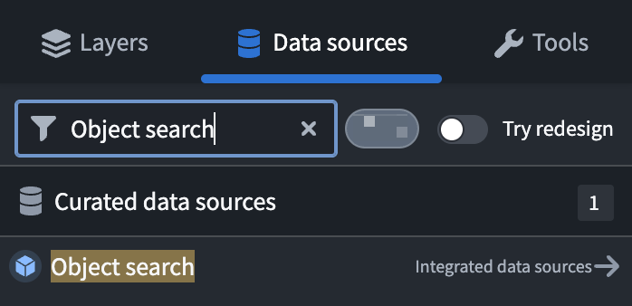
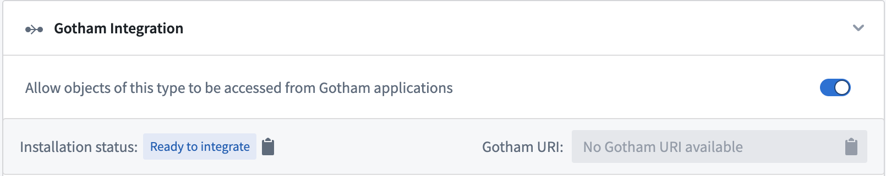
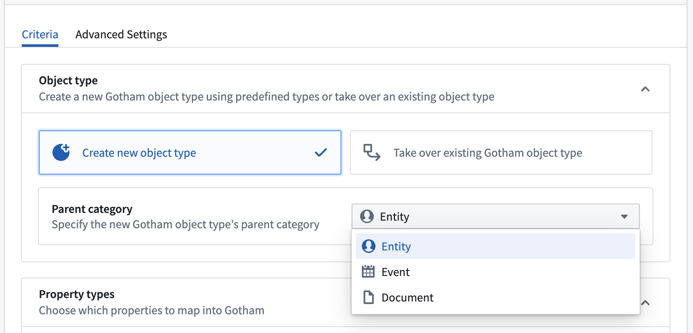

# Enable Gotham integration through type mapping通过类型映射实现哥谭集成

Note注释If your enrollment contains Map Rendering Service (MRS), then you do *not* need to complete the type mapping process to enable Gotham integration. You can [create new ontology objects from](/docs/foundry/object-link-types/create-ontology-objects-from-gaia/) or [add existing objects to](/docs/foundry/geospatial/add-ontology-data-to-gaia/) Gotham without additional configuration. Follow the instructions below to check if your enrollment contains MRS. 如果您的注册包含地图渲染服务（MRS），那么您无需完成类型映射流程即可启用 Gotham 集成。你可以从 Gotham 创建新的本体对象 ，或添加已有的对象， 无需额外配置。请按照以下说明检查您的报名是否包含 MRS。

 Contact Palantir Support with questions about MRS availability, installation, or its additional documentation present in Gotham.如有关于 MRS 的可用性、安装或其在哥谭市的附加文档问题，请联系 Palantir 客服。

## How to check if your enrollment contains MRS如何检查你的注册是否包含 MRS

1. Launch [Quicksearch](/docs/foundry/compass/quicksearch/) to search for and select **Gaia Home**.启动快速搜索以搜索并选择盖亚家园 。
2. Open an existing or create a new Gaia map.打开一个现有的或创建一个新的盖亚地图。
3. Select **Data sources** from the left panel.从左侧面板选择数据来源 。
4. Search for `Object search` in the **Find...** search bar.在“查找...... 搜索栏”中搜索 “物品搜索 。

If you are able to locate and select **Object search**, then your enrollment contains MRS.如果你能找到并选择对象搜索 ，那么你的注册包含了 MRS。

---

Type mapping enables a unified representation of an Ontology across Foundry and Gotham that users manage within Foundry's [Ontology Manager](/docs/foundry/ontology-manager/overview/) application. Users can create new Gotham types based on existing Foundry object types, property types, and shared property types which remain synchronized as an Ontology evolves over time. After completing the type mapping process, Gotham will be able to query Foundry object types and their metadata through the [Object Set Service](/docs/foundry/object-backend/overview/#object-set-service-oss) - a Foundry backend service which supports object data searching, filtering, aggregating, and loading.类型映射使用户在 Foundry 的 Ontology Manager 应用中能够统一表示跨 Foundry 和 Gotham 进行管理的本体。用户可以基于现有的 Foundry 对象类型、属性类型和共享属性类型创建新的 Gotham 类型，这些类型随着本体不断演进而保持同步。完成类型映射过程后，Gotham 可以通过 Object Set Service 查询 Foundry 对象类型及其元数据——这是支持 对象数据搜索、过滤、聚合和加载的 Foundry 后端服务。

Note注释Type mapping is only available for enrollments using both Foundry and Gotham and must be enabled by a platform administrator before use. Once enabled for a Foundry Ontology, type mapping cannot be disabled. Only one Foundry Ontology per Gotham install can have type mapping enabled. Contact Palantir Support for assistance with type mapping enablement.类型映射仅适用于使用 Foundry 和 Gotham 的注册，且必须由平台管理员启用后方可使用。一旦为 Foundry 本体启用，类型映射就无法被禁用。每个 Gotham 安装只能启用一个 Foundry 本体。请联系 Palantir 支持，如需类型映射启用的帮助。

## Toggle on type mapping in Foundry's Ontology Manager在 Foundry 的本体管理器中切换类型映射

To integrate data in your Foundry Ontology with Gotham, you will first need to toggle on type mapping for your object type of interest within Foundry's Ontology Manager by following the steps below:要将数据集成到 Foundry 本体中与 Gotham，首先你需要在 Foundry 的 Ontology Manager 中按照以下步骤切换你感兴趣对象类型的类型映射：

1. Launch Ontology Manager from your home screen.从主屏幕启动本体管理器。
2. Locate and select your object type to type map.找到并选择你的对象类型，以选择映射。
3. Select **Capabilities** within the object type's left-hand panel.在对象类型左侧面板中选择 “能力 ”。
4. Scroll down to the **Gotham Integration** panel and toggle on `Allow objects of this type to be accessed from Gotham applications`.向下滚动到哥谭整合面板并开启 Allow objects of this type to be accessed from Gotham applications 。

Note注释Type mapped objects must contain a `geopoint` property to display on a Gaia map. The property can be native to the object type's backing dataset(s) or derived from a latitude/longitude pair or `geopoint` using Pipeline Builder's [create Ontology geopoint](/docs/foundry/pb-functions-expression/createOntologyGeopointV1/) transform feature.类型映射对象必须包含地理点属性，才能在 Gaia 地图上显示。该属性可以原生于该对象类型的支持数据集，也可以通过使用 Pipeline Builder  的创建地理点变换功能，从纬度/经度对或地理点派生。

## Configure an object type's parent category and Gotham property types配置对象类型的父类别和 Gotham 属性类型

Once you toggle on **Gotham Integration**, you can follow the steps below to create a new Gotham object type derived from an existing Foundry object type, specify the object type's **Parent category**, and configure its **Property types**:一旦你打开了 Gotham 集成 ，就可以按照以下步骤创建一个新的 Gotham 对象类型，从现有的 Foundry 对象类型衍生，指定该对象类型的父类别 ，并配置其属性类型 ：

1. Select **Create a new object type** within the **Object type** section of **Gotham Integration** to create a new object type in Gotham from an existing Foundry object type.在 Gotham Integration 的 Object type 部分选择创建新对象类型 ，从现有的 Foundry 对象类型创建 Gotham 的新对象类型。
2. Identify the **Parent category** of the new object type in Gotham by selecting between `Entity` (such as a person, organization, or vehicle), `Event` (such as a flight, meeting, or concert), or `Document` (such as a PDF file, text document, or report) based on your use case.根据你的使用场景，在 Gotham 中选择实体（如个人、组织或车辆）、 事件 （如航班、会议或音乐会）或文档 （如 PDF 文件、文本文档或报告）来识别新对象类型的父类别 。
3. Use the **Property types** section to map Foundry object type properties to Gotham - a property can be shared or cloned into the Gotham ontology. You will see a blue `Mapped` tag next to the property's name once you complete that configuration on a given property.
使用属性类型部分将 Foundry 对象类型属性映射到 Gotham——属性可以共享或克隆到 Gotham 本体中。完成该配置后，你会在该物业名称旁看到一个蓝色的映射标签。- `Do not map property to Gotham` is the default option - Foundry properties you do not map will not propagate in the Gotham ontology.“不映射属性到 Gotham”是默认选项——你未映射的 Foundry 属性不会在 Gotham 本体中传播。
- `Assign to shared property` enables you to select an *existing* shared property to map against.分配到共享属性允许你选择一个已有的共享属性进行映射。
- `Promote to shared property` creates a *new* shared property for use by other objects.晋升为共享属性会创建一个新的共享属性供其他对象使用。
- `Create a local clone of the property in Gotham` creates a duplicate of the selected property in Gotham that is compatible with its applications.Create a local clone of the property in Gotham 在哥谭创建与其应用兼容的所选属性的副本。
  - `Do not map property to Gotham` is the default option - Foundry properties you do not map will not propagate in the Gotham ontology.“不映射属性到 Gotham”是默认选项——你未映射的 Foundry 属性不会在 Gotham 本体中传播。
  - `Assign to shared property` enables you to select an *existing* shared property to map against.分配到共享属性允许你选择一个已有的共享属性进行映射。
  - `Promote to shared property` creates a *new* shared property for use by other objects.晋升为共享属性会创建一个新的共享属性供其他对象使用。
  - `Create a local clone of the property in Gotham` creates a duplicate of the selected property in Gotham that is compatible with its applications.Create a local clone of the property in Gotham 在哥谭创建与其应用兼容的所选属性的副本。
  
  

Foundry automatically type maps all shared properties to make them available in Gotham.Foundry 会自动对所有共享属性进行类型映射，以便它们在哥谭市可用。

1. Select the green **Save** button on the right side of the top ribbon of your screen and review.选择屏幕顶部功能区右侧的绿色 “保存 ”按钮，进行评测。
2. Review the changes made to your object type and select **Save to ontology**.检查对对象类型的更改，选择保存到本体论 。

After you save your changes to the Ontology, scroll back up to the **Gotham Integration** section of the **Capabilities** page of your object type. You will now see a `Gotham URI` assigned to the object type and be able to view the `Installation status` reported by Gotham.在将更改保存到本体后，向上滚动到你对象类型功能页面的 Gotham Integration 部分。你现在会看到一个分配给对象类型的 Gotham URI，并能查看 Gotham 报告的安装状态 。

Foundry's Ontology Manager will display one of the following installation statuses:Foundry 的本体管理器将显示以下安装状态之一：

- `Ready to integrate`: An object type is ready for type mapping to enable Gotham integration.准备集成 ：对象类型已准备好进行类型映射以实现 Gotham 集成。
- `Installation in progress`: The object type's installation process is underway.安装进行中：该对象类型的安装过程正在进行中。
- `Installation complete`: The installation process is complete, so the object type is available for use in Gotham.安装完成 ：安装过程完成，因此该对象类型可在哥谭市使用。
- `Installation failed: {failureMessage}`: The object type's installation failed at least once and will be retried on the next installation run. The `{failureMessage}` outlines the reason for failure. Common installation failures include:
Installation failed: {failureMessage} ： 该对象类型的安装至少失败一次，将在下一次安装时重新尝试。{failureMessage} 概述了失败的原因。常见的安装故障包括：- *Live reindex*: If there is a live reindex running on Gotham, the ontology cannot be updated. Instead of staging changes during this time, the installation will fail and rerun automatically once the live reindex finishes.实时重新索引 ：如果 Gotham 上运行实时重新索引，本体无法更新。在此期间不会进行临时更改，安装会失败，并在实时重新索引完成后自动重启。
- *Required types are not installed*: For an object type's successful installation, all related property installations - or mappings - must be completed, including shared property types.未安装所需类型 ：要成功安装对象类型，所有相关的属性安装（或映射）必须完成，包括共享属性类型。
- *Other ontology updates*: If there are ontology updates running concurrently, then the type mapper will not be able to update the ontology and will rerun automatically.其他本体更新 ：如果同时运行本体更新，类型映射器将无法更新本体，会自动重运行。
  - *Live reindex*: If there is a live reindex running on Gotham, the ontology cannot be updated. Instead of staging changes during this time, the installation will fail and rerun automatically once the live reindex finishes.实时重新索引 ：如果 Gotham 上运行实时重新索引，本体无法更新。在此期间不会进行临时更改，安装会失败，并在实时重新索引完成后自动重启。
  - *Required types are not installed*: For an object type's successful installation, all related property installations - or mappings - must be completed, including shared property types.未安装所需类型 ：要成功安装对象类型，所有相关的属性安装（或映射）必须完成，包括共享属性类型。
  - *Other ontology updates*: If there are ontology updates running concurrently, then the type mapper will not be able to update the ontology and will rerun automatically.其他本体更新 ：如果同时运行本体更新，类型映射器将无法更新本体，会自动重运行。
  
  

Once your object type's installation status reads `Installation complete`, you will be able to search for and use your object type in Gotham's applications.一旦你的对象类型的安装状态显示为“安装完成 ”，你就可以在 Gotham 的应用程序中搜索并使用你的对象类型。

To deprecate a type mapped object type in Gotham, you can delete the object type in Foundry's Ontology Manager. Once deleted in Foundry, the corresponding object type and its property types will not be accessible in Gotham or available to its applications.要弃用 Gotham 中的映射对象类型，可以在 Foundry 的本体管理器中删除该对象类型。一旦在 Foundry 中删除，对应的对象类型及其属性类型将无法在 Gotham 访问或对其应用程序开放。

Gotham models Foundry dataset security and markings, meaning that Foundry data made available in Gotham through type mapping carries over the same access controls and classification.Gotham 建模 Foundry 数据集的安全性和标记，这意味着通过类型映射在 Gotham 提供的数据同样适用访问控制和分类。

