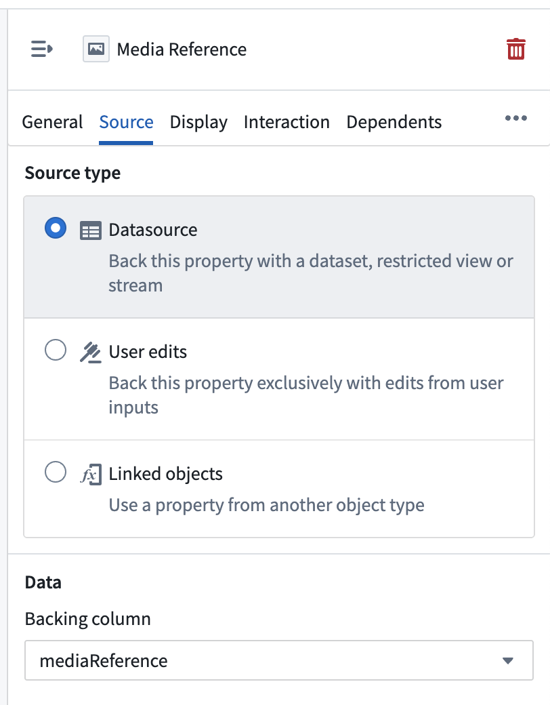
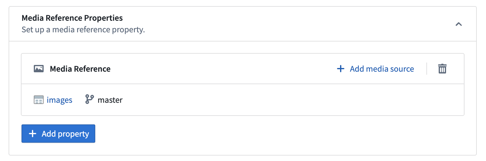

# [](#base-types)Base types基础类型


Property base types define the kind of data that can be stored in a property. For a complete reference of all supported property base types, see the [properties overview](/docs/foundry/object-link-types/properties-overview//#supported-property-types).属性基类型定义了可以存储在属性中的数据类型。有关所有支持的属性基类型的完整参考，请参见属性概述 。


**Base types** are used to define properties on objects. The base type of a property determines the set of operations available for that property in user applications. All field types are valid base types except for `Map`, `Decimal`, and `Binary` types.基类型用于定义对象的属性。属性的基础类型决定了该属性在用户应用程序中可用的作集合。除映射 、 十进制和二进制类型外，所有字段类型均为有效的基类型。


Base types also include the following advanced types:基础类型还包括以下高级类型：


- **Vector:** A type for storing [vectors](/docs/foundry/announcements/2023-11/#configure-a-vector-property-type) on objects for use in a semantic search.向量： 一种用于在语义搜索中使用的对象向量存储类型。
- **`Geopoint`:** A type for defining properties that represent geographic [points](/docs/foundry/geospatial/ontology/#points).Geopoint： 一种用于定义代表地理点的属性类型。
- **`Geoshape`:** A type for defining properties that represent geographic [shapes](/docs/foundry/geospatial/ontology/#polygons-and-lines).地理形状 ： 一种用于定义代表地理形状的属性类型。
- **Attachment:** A type for storing files on objects for use with [functions on objects](/docs/foundry/functions/attachments/).附件： 一种用于将文件存储在对象上以配合对象函数使用的类型。
- **Time series:** A type for defining a property as a [time series](/docs/foundry/time-series/time-series-overview/).时间序列： 一种将属性定义为时间序列的类型。
- **Media reference:** A type for defining a [reference to a media file](/docs/foundry/media-sets-advanced-formats/media-overview/#media-references).媒体参考： 一种用于定义媒体文件引用的类型。
- **Cipher text:** A type for storing a string value encoded with [Cipher](/docs/foundry/cipher/overview/).密文： 一种用于存储用密码编码的字符串值的类型。
- **Struct:** A type for defining schema-based properties with [multiple fields](/docs/foundry/object-link-types/structs-overview/).结构： 一种用于定义具有多个字段的基于模式属性的类型。


All base types may be used in arrays to represent multiple values for a property, excluding the `Vector` and `Time series` types.所有基础类型都可以在数组中用于表示属性的多个值，但不包括向量和时间序列类型。


## [](#complex-property-base-types)Complex property base types复杂属性基类型


Some property base types require additional configuration or have specific use cases. Refer to the sections below for information on the following property base types:某些物业基层类型需要额外的配置或具有特定的使用场景。请参阅以下章节，了解以下物业基础类型的信息：


- **[Media references](#media-references):** Reference media items stored in media sets.媒体参考 ： 存储在媒体集中的参考媒体项目。
- **[Struct types](#structs):** Complex structured data with multiple fields.结构类型 ： 复杂的结构化数据，包含多个字段。


### [](#media-references)Media references媒体引用


A **media reference** property type allows you to have media on your objects, such as images, videos, audio files, and documents. A [media reference](/docs/foundry/media-sets-advanced-formats/media-overview/#media-references) points to a specific media item within a [media set](/docs/foundry/data-integration/media-sets/). The media reference contains information about the media file, which means Foundry can display the media wherever the media reference is used.媒体参考属性类型允许您在物体上安装媒体，如图片、视频、音频文件和文档。 媒体引用指向媒体集中的特定媒体项目。媒体引用包含媒体文件的信息，这意味着 Foundry 可以在媒体引用使用的任何地方显示媒体。


#### [](#media-reference-format)Media reference format媒体参考格式


Below is an example media reference:以下是一个媒体引用示例：


```
Copied!`1{
2  "mimeType": "image/png",
3  "reference": {
4    "type": "mediaSetViewItem",
5    "mediaSetViewItem": {
6      "mediaSetRid": "ri.mio.main.media-set.00000000-0000-0000-0000-00000000000",
7      "mediaSetViewRid": "ri.mio.main.view.00000000-0000-0000-0000-00000000000",
8      "mediaItemRid": "ri.mio.main.media-item.00000000-0000-0000-0000-00000000000"
9    }
10  }
11}`
```


The media reference includes the following:媒体推荐包括以下内容：


- **`mimeType`:** The file's media type.mime 类型 ： 文件的媒体类型。
- **`reference`:** A reference containing the media set RID, view RID, and specific media item RID.参考资料 ： 包含媒体集 RID、视图 RID 和特定媒体项 RID 的参考。


#### [](#configure-media-reference-properties)Configure media reference properties配置媒体参考属性


Object types with media reference properties are backed by a dataset. The backing dataset must include a media reference column, which will map to the media reference property. This column type is specifically designed to store media reference values and ensures proper integration between your ontology objects and media sets.具有媒体参考属性的对象类型由数据集支持。支持数据集必须包含一个媒体参考列，该列将映射到媒体参考属性。该列类型专门设计用于存储媒体参考值，并确保你的本体对象与媒体集之间的正确集成。





Additionally, a media reference property must have a **media source**, which can be configured in the **Capabilities** tab of the object type. This media source should be the media set that the media references point to.此外，媒体引用属性必须包含媒体源 ，可以在对象类型的 “能力 ”标签页中配置。这个媒体来源应是媒体引用所指向的媒体集。





### [](#structs)Structs结构体


A **struct** is an ontology property base type that allows users to create schema-based properties with multiple fields. Struct properties are created from struct type dataset columns. To learn more about structs, refer to the complete [struct](/docs/foundry/object-link-types/structs-overview/) documentation.结构体是一种本体属性基类型，允许用户创建包含多个字段的基于模式的属性。结构体属性由结构体类型数据集列创建。想了解更多关于结构体的信息，请参阅完整的结构文档。

