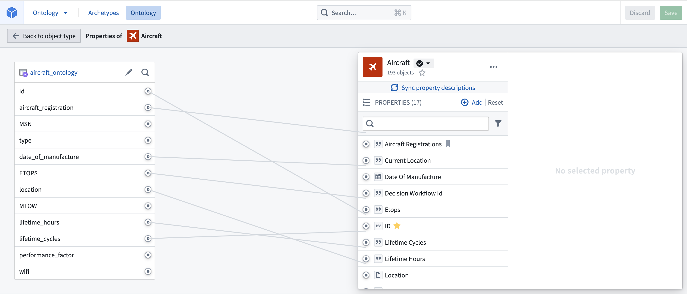
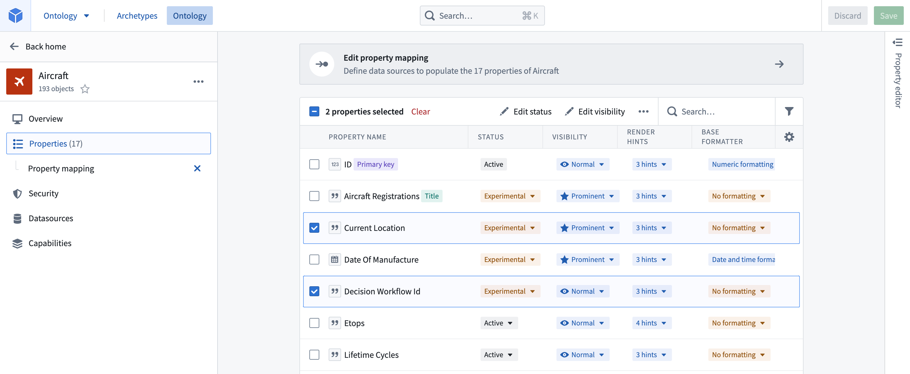

# Edit object type properties编辑对象类型属性

### Delete a property删除属性

From within the property editor, in the properties pane, hover over the property you want to delete and select **Delete property**.在属性编辑器中，在属性面板中，将鼠标悬停在你想删除的属性上，选择删除属性 。

- Note that the deletion of the property only takes effect after you save your changes, and will break any views or applications referencing the property.注意，删除该属性只有在保存更改后才生效，并且会破坏任何引用该属性的视图或应用程序。
- Properties with an `active` status **cannot** be deleted.
处于活跃状态的房产无法删除。- Read more about [statuses](/docs/foundry/object-link-types/metadata-statuses/).阅读更多关于状态的信息 。
  - Read more about [statuses](/docs/foundry/object-link-types/metadata-statuses/).阅读更多关于状态的信息 。
  
  

### Change the column backing a property更改房产背后的柱子

From within the property editor, in the properties pane, hover over the property you want to unmap and select **Unlink property**. To link the property to a new column, hover over the property and select **Map to a column**.在属性编辑器中的属性面板中，将鼠标悬停在你想要解映射的属性上，选择取消关联属性 。要将该属性链接到新列，请将鼠标悬停在该物业上，选择 “映射到某列 ”。

### Edit a property type’s metadata编辑属性类型的元数据

You can edit metadata for a property type by selecting the property type, as shown in the image below.您可以通过选择属性类型来编辑元数据，如下图所示。

The available options for editing property metadata are clustered into four different tabs which give access to the following configurations:编辑属性元数据的可用选项被聚集在四个不同的标签页中，这些标签页可访问以下配置：

1. **Display name and description:** Select into the existing display name or description to edit the text.显示名称与描述： 选择现有的显示名称或描述来编辑文本。
2. **Status:** Select the existing status to open a dropdown of available statuses. Choose from the `deprecated`, `experimental`, and `active` statuses.
状态： 选择现有状态以打开可用状态的下拉菜单。 可以选择弃用 、 实验和活跃状态。- Read more about [statuses](/docs/foundry/object-link-types/metadata-statuses/).阅读更多关于状态的信息 。
  - Read more about [statuses](/docs/foundry/object-link-types/metadata-statuses/).阅读更多关于状态的信息 。
  
  3. **API name:** Select into the existing API name to change its value.
API 名称： 选择进入现有的 API 名称以更改其值。- Note that you **cannot** change the API name for properties with an `active` status.
请注意，对于处于活跃状态的属性 ，你不能更改 API 名称。- Read more about [statuses](/docs/foundry/object-link-types/metadata-statuses/).阅读更多关于状态的信息 。
- Read more about [valid API names](/docs/foundry/object-link-types/create-object-type/#api-name).阅读更多关于有效 API 名称的信息。
  - Read more about [statuses](/docs/foundry/object-link-types/metadata-statuses/).阅读更多关于状态的信息 。
  - Read more about [valid API names](/docs/foundry/object-link-types/create-object-type/#api-name).阅读更多关于有效 API 名称的信息。
  - Note that you **cannot** change the API name for properties with an `active` status.
  请注意，对于处于活跃状态的属性 ，你不能更改 API 名称。- Read more about [statuses](/docs/foundry/object-link-types/metadata-statuses/).阅读更多关于状态的信息 。
  - Read more about [valid API names](/docs/foundry/object-link-types/create-object-type/#api-name).阅读更多关于有效 API 名称的信息。
    - Read more about [statuses](/docs/foundry/object-link-types/metadata-statuses/).阅读更多关于状态的信息 。
    - Read more about [valid API names](/docs/foundry/object-link-types/create-object-type/#api-name).阅读更多关于有效 API 名称的信息。
    
    
  4. **Keys:** Indicate whether a property is the object type’s title key or primary key.
注释： 表示属性是对象类型的标题键还是主键。- Note that you **cannot** change the primary key of an object type with an `active` status.
请注意，你不能更改处于激活状态的对象类型的主键。- Read more about [keys](/docs/foundry/object-link-types/create-object-type/#configure-the-primary-key-and-title-key) and about [statuses](/docs/foundry/object-link-types/metadata-statuses/).阅读更多关于密钥和状态的信息 。
  - Read more about [keys](/docs/foundry/object-link-types/create-object-type/#configure-the-primary-key-and-title-key) and about [statuses](/docs/foundry/object-link-types/metadata-statuses/).阅读更多关于密钥和状态的信息 。
  - Note that you **cannot** change the primary key of an object type with an `active` status.
  请注意，你不能更改处于激活状态的对象类型的主键。- Read more about [keys](/docs/foundry/object-link-types/create-object-type/#configure-the-primary-key-and-title-key) and about [statuses](/docs/foundry/object-link-types/metadata-statuses/).阅读更多关于密钥和状态的信息 。
    - Read more about [keys](/docs/foundry/object-link-types/create-object-type/#configure-the-primary-key-and-title-key) and about [statuses](/docs/foundry/object-link-types/metadata-statuses/).阅读更多关于密钥和状态的信息 。
    
    
  5. **Value formatting:** Apply a special formatter to the values of a property to make them more readable in applications.
价值格式： 对属性的值应用特殊的格式化器，使其在应用程序中更易读。- Read more about [value formatters](/docs/foundry/object-link-types/value-formatting/).阅读更多关于值格式化工具的信息。
  - Read more about [value formatters](/docs/foundry/object-link-types/value-formatting/).阅读更多关于值格式化工具的信息。
  
  6. **Conditional formatting:** Apply rules to a property that dictate how it will be rendered in applications.
条件格式： 对属性应用规则，决定其在应用中的呈现方式。- Read more about [conditional formatting](/docs/foundry/object-link-types/conditional-formatting/).阅读更多关于条件格式的信息 。
  - Read more about [conditional formatting](/docs/foundry/object-link-types/conditional-formatting/).阅读更多关于条件格式的信息 。
  
  7. **Property base type:** Select the property’s base type from the dropdown. The type of the property constrains the possible set of operations that can be done on the property’s values.
房产基底类型： 从下拉菜单中选择该房产的基础类型。属性的类型限制了对该属性值可执行的作集合。- For example, a property with base type `timestamp` can be shown in a timeline widget in Object Explorer.例如，带有基础类型时间戳的属性可以在对象浏览器中的时间线控件中显示。
- You will receive an error if the type of a property is not compatible with the type of its backing column.如果某物业的类型与其背衬柱的类型不兼容，你会收到错误。
  - For example, a property with base type `timestamp` can be shown in a timeline widget in Object Explorer.例如，带有基础类型时间戳的属性可以在对象浏览器中的时间线控件中显示。
  - You will receive an error if the type of a property is not compatible with the type of its backing column.如果某物业的类型与其背衬柱的类型不兼容，你会收到错误。
  
  

If you make a change to object property types, you must also update the type expected by Actions that interact with property on that object. To do this, open the Action in Ontology Manager and edit the expected type.如果你对对象属性类型做了更改，你还必须更新与该对象属性交互的动作所期望的类型。为此，在本体管理器中打开动作并编辑预期类型。

1. **Type classes:** Apply type classes as additional metadata that can be interpreted by applications.
类型类别： 应用类型类作为应用程序可以解释的额外元数据。- See the [type classes documentation](/docs/foundry/object-link-types/metadata-typeclasses/) for a list of available type classes.请参阅类型类文档 ，查看可用的类型类列表。
  - See the [type classes documentation](/docs/foundry/object-link-types/metadata-typeclasses/) for a list of available type classes.请参阅类型类文档 ，查看可用的类型类列表。
  
  2. **Render hints:** Select render hints from the supplied checklist that you want applied to a property in order to improve how a property value is rendered and indexed into Object Storage V1 (Phonograph).
渲染提示： 从提供的检查列表中选择你希望应用到属性上的渲染提示，以改善属性值在对象存储 V1（留声机）中被渲染和索引的方式。- See the [render hints documentation](/docs/foundry/object-link-types/metadata-render-hints/) for descriptions of the available render hints.请参阅渲染提示文档 ，了解可用的渲染提示。
  - See the [render hints documentation](/docs/foundry/object-link-types/metadata-render-hints/) for descriptions of the available render hints.请参阅渲染提示文档 ，了解可用的渲染提示。
  
  3. **Visibility:** Select the existing visibility to open a dropdown of available visibilities. A `prominent` property will lead applications to show this property first to users. A `hidden` property will not appear in user applications.能见度： 选择现有可见性，打开可用可见性下拉菜单。 显著的房产会促使申请优先向用户展示该房产。 隐藏属性不会出现在用户应用程序中。

After making a change to property metadata, initiate a re-index of the affected object to update the Ontology.在对属性元数据进行更改后，启动受影响对象的重新索引以更新本体。

### Bulk edit multiple properties批量编辑多个属性

You can select multiple properties in the property editor by holding the **Cmd/Ctrl** key while selecting properties. Once multiple properties are selected, the following bulk editing actions become available:你可以在属性编辑器中按住 Cmd/Ctrl 键同时选择属性，同时选择多个属性。一旦选择了多个属性，以下批量编辑作将可用：

- Changing base type.更换基质类型。
- Adding/removing of type classes.类型类的添加/移除。
- Changing render hints.更改渲染提示。
- Changing visibility.改变能见度。
- Adding/removing value formatting.添加/移除值格式化。

You can also bulk edit some of the above fields from outside of the property editor, by selecting the **Properties** page from the sidebar of an object type view. Simply select the checkboxes next to the properties you want to edit and a new row will appear at the top of the table with options for bulk editing.你也可以在属性编辑器之外批量编辑上述字段，方法是从对象类型视图的侧边栏选择属性页面。只需选择你想编辑属性旁的复选框，表格顶部会出现一行新行，并有批量编辑选项。

