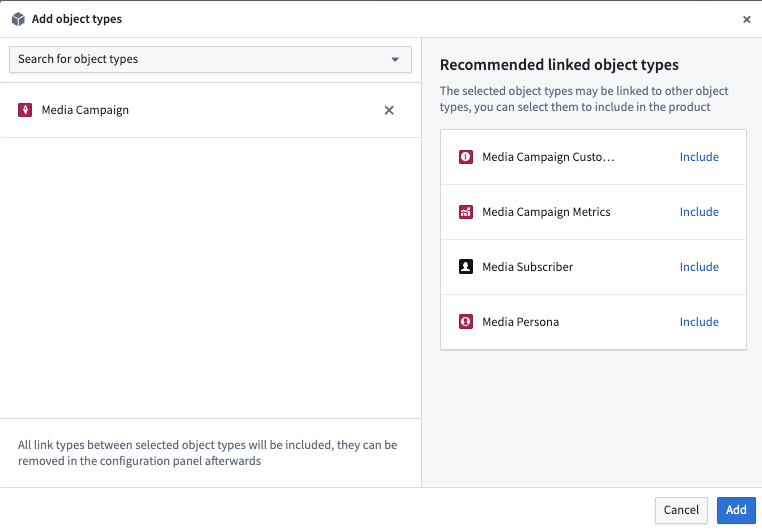
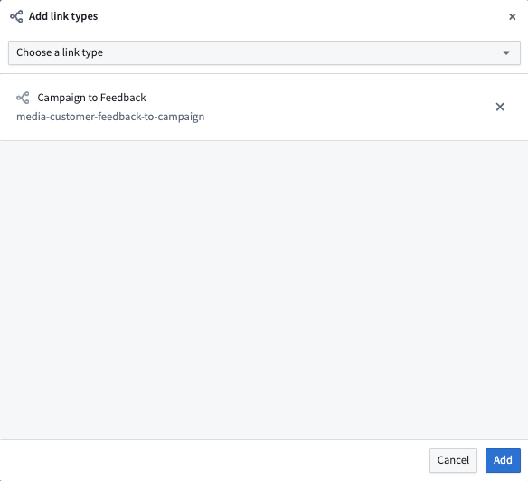
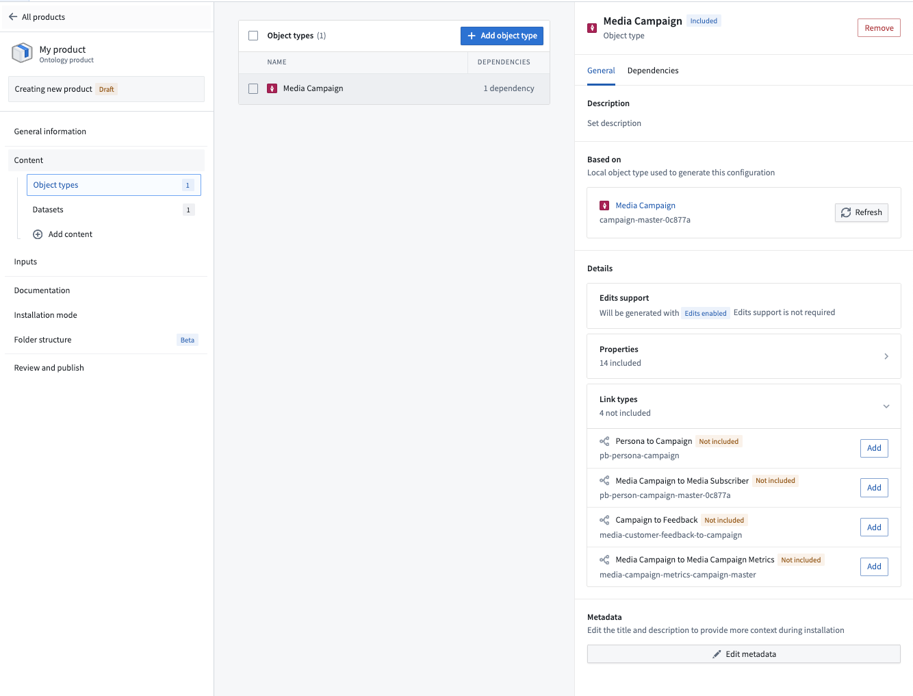
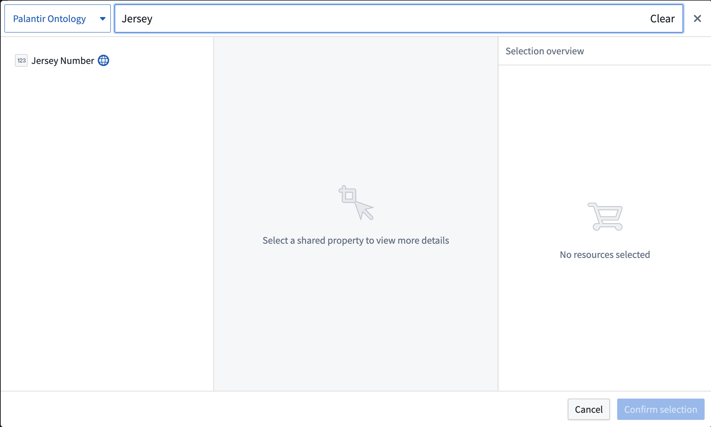
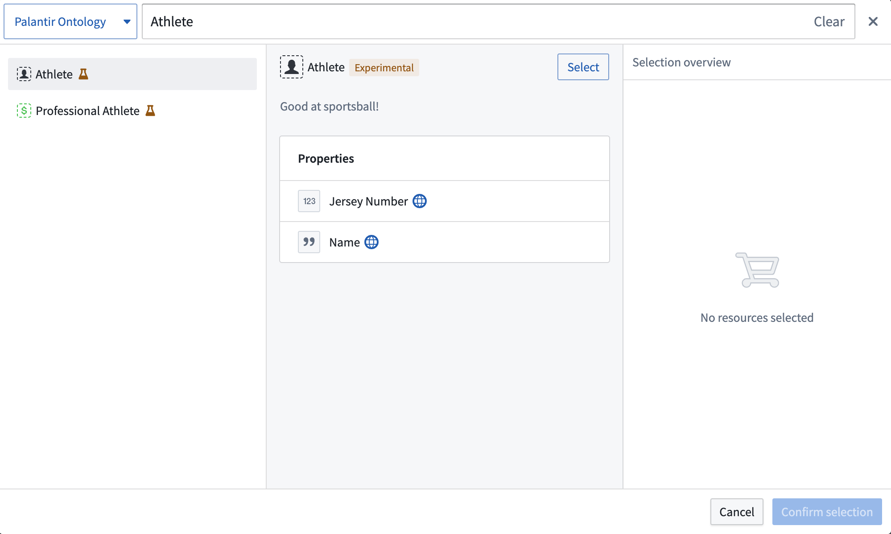

# Add object and link types to a Marketplace product向市场产品添加对象和链接类型

Use [Foundry DevOps](/docs/foundry/devops/overview/) to include your object and link types in [Marketplace products](/docs/foundry/devops/core-concepts/#product) for other users to install and reuse. [Learn how to create your first product.](/docs/foundry/foundry-devops/create-products/)使用 Foundry DevOps 在 Marketplace 产品中包含你的对象和链接类型，供其他用户安装和重用。 学习如何制作你的第一个产品。

## Unsupported features不支持的功能

Most [object property types](/docs/foundry/object-link-types/properties-overview/) are supported in Marketplace products, but the following are not yet available:大多数对象属性类型在市场产品中都支持，但以下属性尚未可用：

- [Cipher密码](/docs/foundry/cipher/overview/)
- Geo time几何时间
- Vector向量

Marketplace products do not yet support the following:市场产品目前尚未支持以下内容：

- Object types with streaming datasources带有流数据源的对象类型
- Object types with no datasource无数据源的对象类型

Note that objects themselves cannot be packaged with Marketplace. This means that, for example, object edits made by Actions cannot be packaged into a Marketplace product. However, datasets and object types can be packaged in order to create new objects after installation of a Marketplace product.注意，对象本身不能被市场打包。这意味着，例如，Actions 进行的对象编辑不能打包进市场产品中。然而，数据集和对象类型可以打包，以便在安装市场产品后创建新对象。

If you require support for any of the above, contact your Palantir representative.如果您需要上述任何支持，请联系您的 Palantir 代表。

## Add object types to products向产品添加对象类型

To add an object type to a product, first [create a product](/docs/foundry/foundry-devops/create-products/). [Add outputs](/docs/foundry/foundry-devops/create-products/#add-outputs) and then select the **Add ontology entities** option.要向产品添加对象类型，首先创建一个产品 。 添加输出 ，然后选择添加本体实体选项。

You will then be prompted to choose an object type. After selecting an object type, you will see recommendations for linked object types that you may want to add to your product.然后系统会提示你选择一种对象类型。选择对象类型后，你会看到关于链接对象类型的推荐，可能想添加到你的产品中。

## Add link types to products为产品添加链接类型

To add a link type to a product, first [create a product](/docs/foundry/foundry-devops/create-products/) and then select the **Link type** content type.要向产品添加链接类型，首先创建产品 ，然后选择链接类型内容类型。

You will then be prompted to choose a link type as below.随后，系统会提示您选择如下链接类型。

While you can select link types directly, we recommend first adding your object types and then selecting relevant links via the [information panel](/docs/foundry/foundry-devops/create-products/#add-outputs) as below.虽然你可以直接选择链接类型，但我们建议先添加你的对象类型，然后通过信息面板选择相关链接，如下所示。

## Add shared properties to products为产品添加共享属性

To add a shared property type to a product, first [create a product](/docs/foundry/foundry-devops/create-products/). Then, select the **Shared property** content type as shown below.要向产品添加共享属性类型，首先创建一个产品 。然后，选择如下所示的共享属性内容类型。

You will then be prompted to choose a shared property.随后系统会提示您选择共享物业。

## Add interface types to products为产品添加接口类型

To add an interface type to a product, first [create a product](/docs/foundry/foundry-devops/create-products/). Then, select the **Interface** content type as shown below.要为产品添加接口类型，首先创建一个产品 。然后，选择如下所示的接口内容类型。

You will then be prompted to choose an interface.随后系统会提示你选择一个界面。

