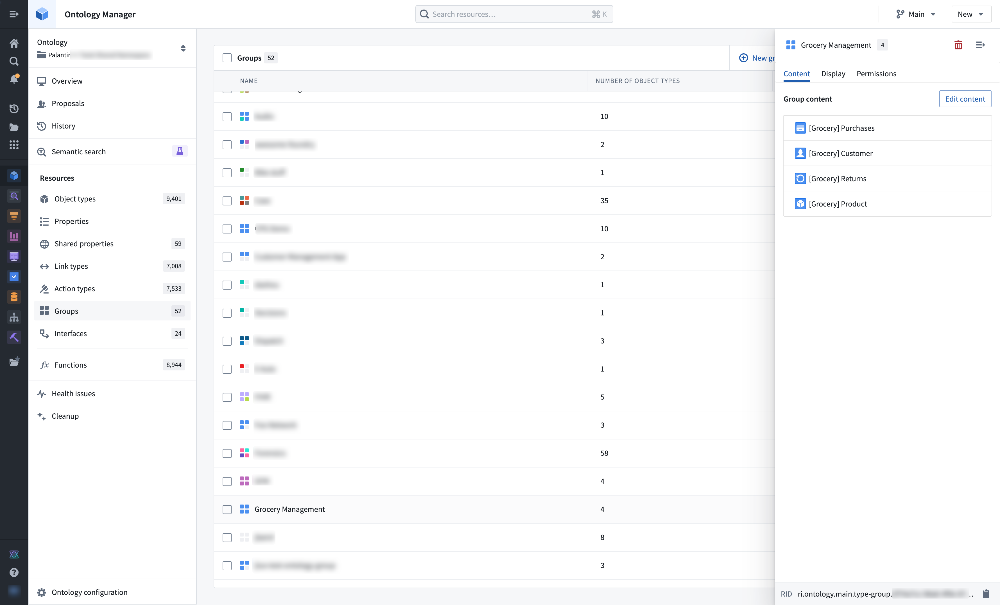
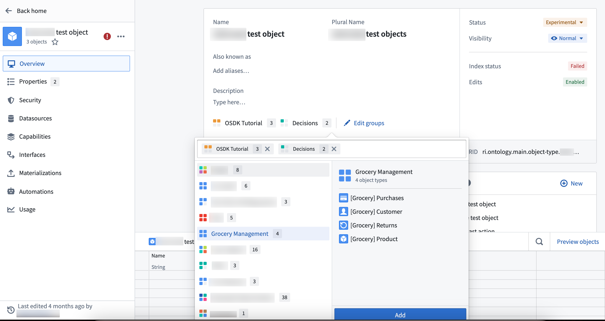
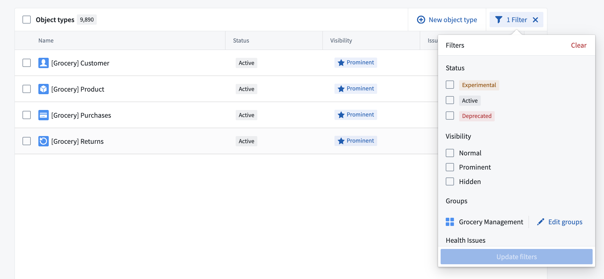

# Object type groups对象类型组

Object type groups are a classification primitive that help users better search and explore their ontology. Groups are created and managed using Ontology Manager, generally by ontology [owners and editors](/docs/foundry/object-link-types/type-groups/#group-permissions).对象类型组是一种分类原语，帮助用户更好地搜索和探索其本体。组通常由本体所有者和编辑者使用 Ontology Manager 创建和管理。

## Group configuration组别配置

Groups are created and managed via the groups menu, accessible in the Ontology Manager sidebar.组通过组菜单创建和管理，该菜单可在本体管理器侧栏访问。

Groups can also be added directly to object types by selecting **Edit groups** in the object type overview page.也可以通过在对象类型概览页面选择 “编辑组 ”，直接添加组到对象类型中。

## Group search and discovery群体搜索与发现

Groups are searchable in [Ontology Manager's **Search** bar and **Search** bar dialog](/docs/foundry/ontology-manager/navigation/#header-search-bar). The table of object types in Ontology Manager supports displaying and filtering by group. Groups are also displayed on the [Object Explorer home page](/docs/foundry/object-explorer/getting-started/#group-exploration-b-c-d).组可以在 Ontology Manager 的搜索栏和搜索栏对话框中搜索。Ontology Manager 中的对象类型表支持按组显示和过滤。分组也会显示在对象浏览器主页上。

## Group permissions组权限

To view object type groups, users must have **viewer** permission on the project that the object type group is in.要查看对象类型组，用户必须拥有该对象类型组所在项目的浏览权限。

## Legacy group migration遗产组迁移

As of May 22, 2024, the *group* primitive described on this page has replaced the tag-based system of legacy groups.截至 2024 年 5 月 22 日，本页描述的原始群已取代基于标签的遗留组系统。

In most cases, legacy groups were automatically migrated to object type groups at this time. Ontology owners were notified via an Upgrade Assistant intervention if manual action was necessary.在大多数情况下，遗留组此时会自动迁移到对象类型组。如果需要手动作，本体所有者会通过升级助手介入被通知。

### Group name visibility组名可见性

Previously, if all object types inside a group were non-discoverable to a certain user (for example, due to access controls on backing datasets), the group was also non-discoverable to the user. As mentioned in the section above on [group permissions](/docs/foundry/object-link-types/type-groups/#group-permissions), all groups will now be discoverable to any user that can view the ontology. This change aligns group visibility with other [ontology primitives](/docs/foundry/object-permissioning/ontology-permissions-legacy/#ontology-roles) to increase clarity and transparency in governance.此前，如果某个用户无法发现某个组内的所有对象类型（例如，由于对支持数据集的访问控制），那么该组对用户来说也不可被发现。如上文关于组权限的部分所述，所有组现在都将被任何能够查看本体论的用户发现。这一变化使群体可见性与其他本体原语保持一致，以提升治理的清晰性和透明度。

### Migration of partially visible groups部分可见群体的迁移

Legacy groups that were not discoverable to one or more users were not eligible for automatic migration. In these cases, ontology owners were notified via an Upgrade Assistant intervention that manual action was necessary.无法被一个或多个用户发现的遗留组不符合自动迁移资格。在这些情况下，本体所有者通过升级助手介入被通知需要手动作。

On May 22 2024, legacy groups that could not be safely migrated were hidden from operational users across all applications such as Workshop and Object Explorer. To provide backward compatibility, the names of legacy groups remain stored as [type class metadata](/docs/foundry/object-link-types/metadata-typeclasses/) on object types.2024 年 5 月 22 日，无法安全迁移的遗留组在所有应用程序（如 Workshop 和对象浏览器）中被隐藏，不被运营用户看到。为了向后兼容，遗留组的名称仍作为类型类元数据存储在对象类型上。

Ontology owners may continue to manually migrate these hidden, legacy groups using Ontology Manager. To do this, navigate to the **Ontology Configuration** menu in the bottom left corner and select **Approve all Groups for migration**.本体所有者可以继续手动迁移这些隐藏的遗留分组，使用 Ontology Manager。作方法是进入左下角的本体配置菜单，选择 “批准所有组进行迁移 ”。

