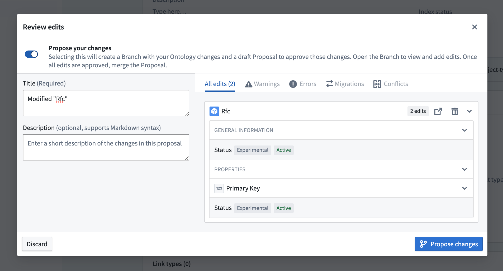
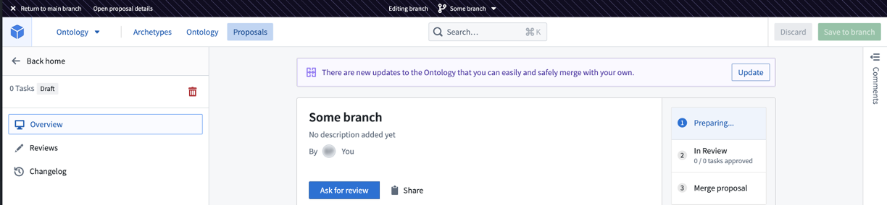

# Ontology proposals [Legacy]本体提案 [遗产]

Ontology branches (formerly known as ontology proposals) are being sunset. On enrollments with Foundry branching enabled, you can no longer create ontology branches. Instead, use [Foundry branches](/docs/foundry/ontologies/test-changes-in-ontology/) to modify the ontology and access expanded capabilities including branching datasources, testing changes downstream in supported applications, and managing both data and ontology modifications within a unified workflow.本体分支（前称本体提案）正在被淘汰。在启用 Foundry 分支的注册中，你无法再创建本体分支。相反，使用 Foundry 分支修改本体，访问扩展能力，包括分支数据源、测试支持应用的下游变更，以及在统一工作流中管理数据和本体修改。

Ontology branches allow you to make changes to an Ontology on a branch, which is based on the `Main` version of that ontology. This process ensures that all modifications are reviewed and approved before being incorporated into the main Ontology.本体分支允许你对基于该本体主版本的分支进行修改。该流程确保所有修改在纳入主本体论前都经过审查和批准。

To create a branch, you need editor permission on the project containing the resources.要创建分支，你需要对包含资源的项目拥有编辑器权限。

## Definitions定义

- **Branch:** A *branch* on the Ontology is a separate version of that Ontology, derived from the main version, designed to enable experimentation and changes without impacting the main branch. This allows users to test and refine adjustments to the Ontology in an isolated environment before merging them back into the main branch.分支： 本体上的分支是该本体的独立版本，源自主版本，旨在允许实验和修改而不影响主分支。这允许用户在隔离环境中测试和优化本体的调整，然后再合并回主分支。
- **Proposal:** A *proposal* is analogous to a Pull Request in a version control system, specifically tailored for Ontology branches. A proposal is automatically created alongside a branch and contains metadata such as reviews, name, and descriptions of the changes being merged into the main branch. Proposals serve as a mechanism for reviewing and approving changes made in a separate branch before they are integrated into the main Ontology.提案： 提案类似于版本控制系统中的拉取请求，专门针对本体分支设计。提案会自动与分支一起创建，包含诸如审查、名称和合并到主分支的变更描述等元数据。提案作为一种机制，用于在独立分支中审查和批准在被整合进主本体之前所做的变更。

## Ontology branching workflow本体分支工作流程

The general ontology branching workflow has five steps:一般的本体分支工作流程包含五个步骤：

1. [Create your branch创建你的分支](#1-create-your-branch)
2. [Prepare your proposal for review准备您的提案进行审查](#2-prepare-your-proposal-for-review)
3. [Request a review请求复审](#3-request-a-review)
4. [Review the proposal审查提案](#4-review-the-proposal)
5. [Release the proposal发布提案](#5-release-the-proposal)

Each step is outlined in the following sections.每个步骤将在后续章节中概述。

### 1. Create your branch1. 创建你的分支

You can create a branch by selecting **Create Branch** to open a dialog where you can choose a title and description for your proposal.您可以通过选择 “创建分支 ”来创建分支，打开对话框，选择提案的标题和描述。

Alternatively, if you already have changes to the Ontology that you would like to include in your proposal, you can select save and toggle **Propose your changes** from the save dialog.或者，如果你已经有想在提案中包含的本体变更，可以选择保存并从保存对话框中切换“ 提案你的更改 ”。

If you are on the main branch of your Ontology, and you have no changes, you can also create a branch by choosing the branch select component and typing a name for the new branch.如果你在本体的主分支上，且没有更改，你也可以通过选择分支选择组件并输入新分支的名称来创建分支。

Proposal branches can only be created on the main Ontology configuration. You cannot create a new branch based on another proposal.提案分支只能在主本体配置上创建。你不能基于其他提案创建新分支。

While on a branch, a branch navigation top bar located above the workspace interface reflects your current branch.在分支上，位于工作区界面上方的分支导航顶部栏会显示你当前的分支。

### 2. Prepare your proposal for review2. 准备你的提案供审阅

At this point, depending on how you created your proposal, you may already have some changes on your branch. While on your branch, you can continue making changes to Ontological resources, including creation and deletion.此时，根据你如何创建提案，你的分支可能已经有一些变动。在你的分支中，你可以继续对本体资源进行修改，包括创建和删除。

Every modified Ontological entity will constitute a separate **Task** in your proposal and made available for review.每个修改后的本体实体都将构成你提案中的独立任务 ，供审查使用。

For resources that have migrated to use [Ontology roles](/docs/foundry/object-permissioning/ontology-permissions-legacy/#ontology-roles), viewers can make changes to resources in a proposal. If the resource is on datasource derived permissions, only editors or owners can make changes to them on a proposal.对于已迁移到本体角色的资源，观察者可以在提案中对资源进行修改。如果资源基于数据源衍生权限，只有编辑者或所有者才能对提案进行修改。

On a branch, you may edit resources when holding editor or owner permissions.在分支中，持有编辑者或所有者权限时可以编辑资源。

### 3. Request a review3. 请求复审

After making changes to the branch, you may add reviewers to your proposal. To do so, navigate to your [Proposal view](#2-prepare-your-proposal-for-review), by selecting **Open proposal details** located in the top bar.在对分支进行修改后，你可以在提案中添加审核员。要作，请在顶部栏选择 “开放提案详情 ”，进入您的提案视图 。

If you exited your branch, you can go to your proposal overview either by navigating to the **Proposals** tab and selecting your proposal, or by using the branch select component.如果您退出了分支，可以通过“ 提案 ”标签页选择您的提案，或使用分支选择组件进入提案总览。

From there, assign reviewers from the **Reviewers** section.然后，从审核员部分分配审核员。

Reviewers are not notified until the proposal is in the `In review` stage.评审员直到提案进入审核阶段后才会收到通知。

You may also leave comments on the various tasks in your proposal to give context about the changes proposed. Access the **Comments** section of your tasks by choosing the **Reviews** tab, and then selecting the **Comments** sidebar on the far right.你也可以对提案中的各个任务发表评论，以提供关于拟议变更的背景。通过选择“ 评论 ”标签，然后选择右侧的 “评论 ”侧边栏，访问任务中的评论部分。

### 4. Review the proposal4. 审查提案

Reviewers may approve or reject individual tasks in the **Reviews** tab, and may add comments to support their review.审核员可以在审核标签中批准或拒绝单个任务，并可添加支持审核的评论。

Reviewers must have owner or edit permissions to be able to approve a change.审核人员必须拥有所有者或编辑权限才能批准更改。

Users without permissions may still review the task, for example, to convey their opinions on the change, but this will not affect the approved status of the task.例如，未获授权的用户仍可审查任务以表达对变更的意见，但这不会影响任务的批准状态。

If the creator of the proposal has owner or editor permissions on all the edited resources, they will be able to approve their own changes.如果提案创建者拥有所有编辑资源的所有者或编辑权限，他们可以批准自己的修改。

Even if an editor or owner is not explicitly added as a reviewer, they can still approve your proposals. We recommend using the reviewers list as a way to keep track of who should review changes, but not as a way of safeguarding the Ontology. Instead, protect the Ontology by carefully assigning roles and permissions.即使编辑或所有者没有被明确添加为审稿人，他们仍然可以批准你的提案。我们建议使用审核员名单来跟踪谁应该审查变更，但不应作为保护本体的方式。相反，应通过谨慎分配角色和权限来保护本体。

### 5. Release the proposal5. 发布提案

Once your changes have been reviewed and approved, the proposal can be merged into the Ontology.一旦你的更改被审核并批准，提案就可以合并到本体论中。

Merging changes into the Ontology does not require special permissions. After a proposal is approved, anyone who can edit the branch can merge the proposal into the Ontology.将变更合并到本体中不需要特殊权限。提案获批后，任何能编辑分支的人都可以将提案合并到本体中。

After a proposal is merged, it is moved from the **In Review** section to the **Merged** section in the sidebar.提案合并后，会从 “审核中 ”部分移至侧边栏的 “合并 ”部分。

At any point of time before you merge the proposal, you can close the proposal by selecting **delete** from the sidebar.在合并提案前的任何时候，你都可以从侧边栏选择删除来关闭提案。

Proposals can only be merged into the main ontology configuration.提案只能合并到主本体配置中。

Proposals cannot be reverted automatically. To undo a proposal, you must undo the different changes within it.提案不能自动撤销。要撤销提案，必须撤销其中的不同更改。

Once a proposal is closed, it cannot be reopened.一旦提案关闭，就无法重新开放。

