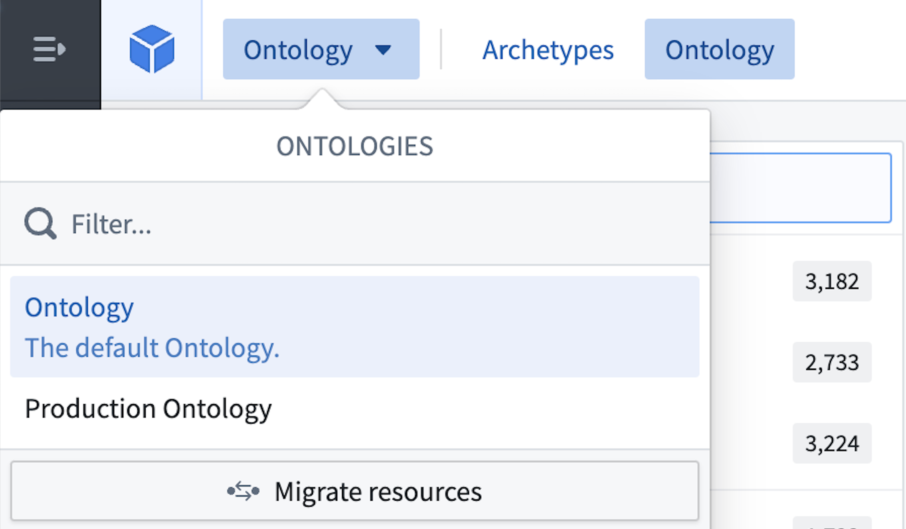
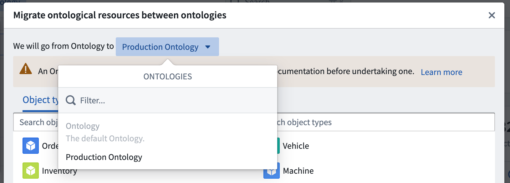
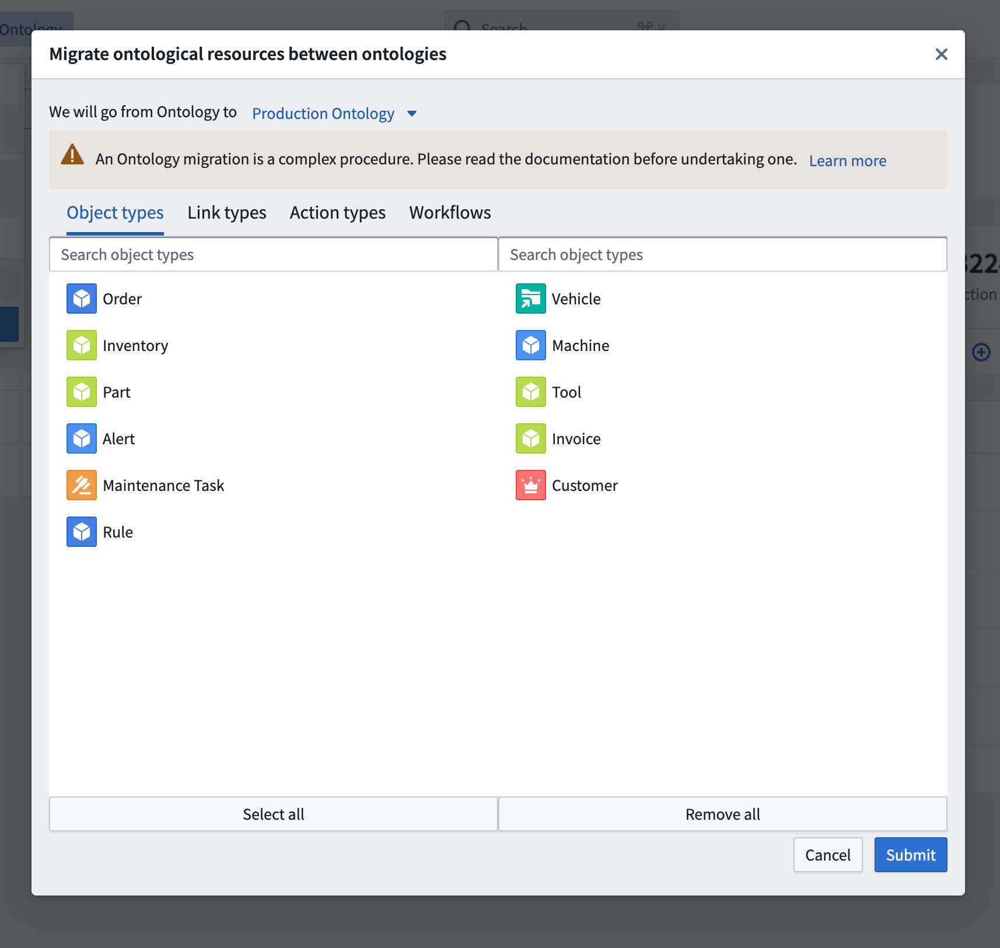

# Migrate ontological resource between Ontologies本体论资源在不同本体论之间迁移

Every ontology resource is automatically linked to the ontology it is created in. After their creation, resources can be moved between ontologies. Migrating resources between ontologies also changes the permissions on the resources, however, it does not impact the permissions on the underlying data and the input datasources. When migrating objects between Ontologies all edits will be preserved by default.每个本体资源都会自动关联到其创建的本体。资源创建后，可以在不同本体论之间移动。在本体间迁移资源也会改变资源的权限，但不会影响底层数据和输入数据源的权限。在本体间迁移对象时，所有编辑默认都会被保留。

To migrate resources from one ontology to another, do the following:要将资源从一个本体迁移到另一个本体，请执行以下作：

1. Navigate to the ontology that owns the resource via the Ontology switcher located in the top right corner in the **Ontology Manager**. 通过位于本体管理器右上角的本体切换器，导航到拥有该资源的本体。

2. Select **Migrate resources** in the same ontology to start the migration process. Then, select the target ontology in the top row using the ontology selection dropdown menu. 选择同一本体中的 “迁移资源 ”以开始迁移过程。然后，通过本体选择下拉菜单选择顶排的目标本体。

3. Select the object types, link types, action types, and workflows to migrate. A preview of the selection of resources to be migrated are shown in their current ontology (left) and in the target ontology (right). Note that it is impossible to migrate object types from a private ontology to the default ontology unless the object type was originally created in the default ontology. 选择迁移的对象类型、链接类型、动作类型和工作流。当前本体（左）和目标本体（右）展示了资源迁移选择的预览。注意，除非对象类型最初是在默认本体中创建的，否则不可能将对象类型从私有本体迁移到默认本体。

Migrating to default ontology迁移到默认本体论Make sure that you are migrating connected resources together. The migration fails if related ontological resources are missing in the selection.确保你正在迁移连接的资源。如果选择中缺少相关的本体资源，迁移将失败。

1. After completing the selection, select **Submit** to migrate the resources.完成选择后，选择提交以迁移资源。

