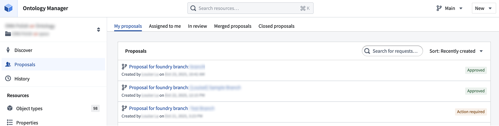
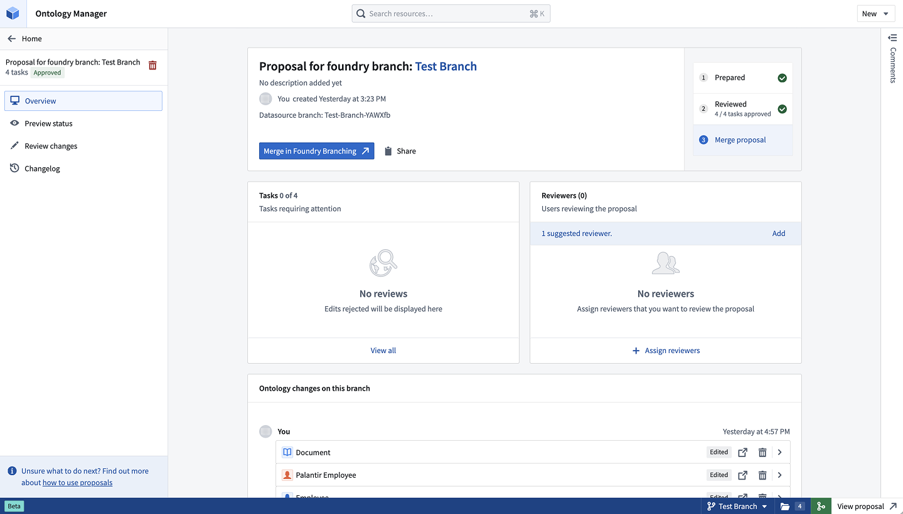
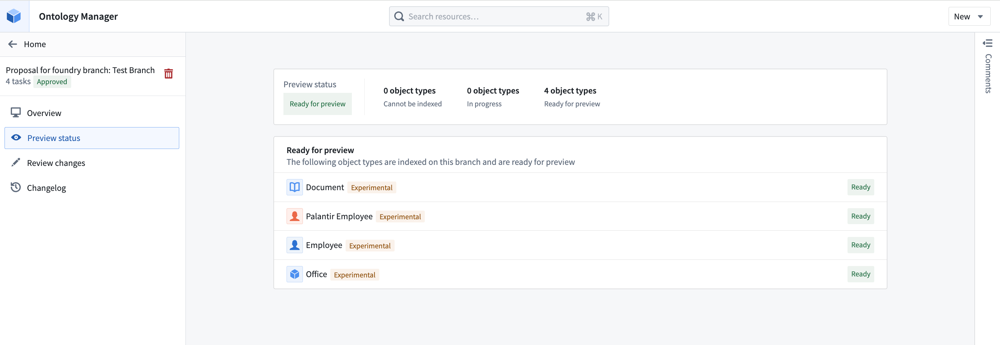
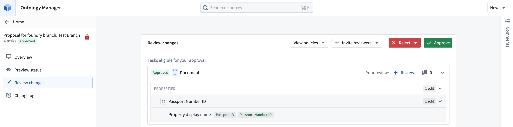
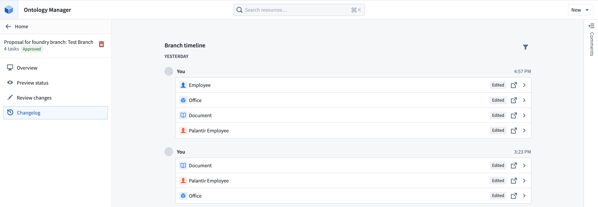

# Review ontology proposals审查本体提案

An ontology proposal is analogous to a Pull Request in a version control system. Proposals serve as a mechanism for reviewing and approving changes made in a separate branch before they are integrated into `Main`.本体提案类似于版本控制系统中的拉取请求。提案作为审查和批准独立分支中变更的机制，之后才将其整合进主分支 。

For Foundry branches, an ontology proposal is automatically created when a [Foundry branching proposal](/docs/foundry/foundry-branching/core-concepts/#proposal) is created and contains metadata such as reviews, name, and descriptions of the changes being merged into `Main`. For legacy ontology branches, an ontology proposal is created when the branch is created.对于 Foundry 分支，当创建分支提案时，本体提案会自动生成，包含诸如审查、名称和合并到主分支的变更描述等元数据。对于遗留本体分支，分支创建时会创建本体提案。

This page explains how to review ontology proposals, including checking resource statuses, reviewing tasks, and viewing the changes made on a branch.本页解释了如何审查本体提案，包括检查资源状态、审核任务以及查看分支上的更改。

## Proposals tab提案标签页

Navigate to the **Proposals** page through the side tab, where you can choose to view all ontology proposals. The proposals are grouped into the following tabs:通过侧边标签页进入提案页面，您可以选择查看所有本体提案。这些提案被归入以下标签页：

- **My proposals:** Proposals authored by you.我的提案： 提案是你起草的。
- **Assigned to me:** Proposals where you have been assigned as a reviewer.分配给我的： 你被指派为评审员的提案。
- **In review:** Proposals that are in progress or approved.回顾： 正在进行或已批准的提案。
- **Merged proposals:** Proposals that have been merged to `Main` ontology.合并提案： 已合并到主本体论的提案。
- **Closed proposals:** Proposals that have been closed out, and were not merged.已关闭提案： 那些提案已经关闭，也没有合并。

## Proposal view提案视图

Access the **Proposal overview**, **Preview status**, **Review changes**, and **Changelog** tabs for more information about your individual proposal.访问提案概览 、 预览状态 、 审核变更和变更日志标签页，获取关于您个人提案的更多信息。

### Proposal overview page提案概览页面

To access an individual proposal while on a Foundry branch, choose any ontology resource from the branch taskbar and select **View ontology proposal**. If you are on `Main`, navigate to the **Proposals** tab and select the proposal you wish to view. If you are on an ontology branch, select **Open proposal details** from the navigation top bar to access the proposal directly.要在 Foundry 分支访问单个提案，请从分支任务栏中选择任一本体资源，并选择 “查看本体提案 ”。如果你在主界面 ，请进入“ 提案” 标签，选择你想查看的提案。如果你在本体分支，请从导航顶部栏选择 “开放提案详情 ”以直接访问提案。

Within a proposal, you will see the **Proposal overview**, **Preview status**, **Review changes**, and **Changelog** tabs for more information.在提案中，您将看到提案概览 、 预览状态 、 审核更改和变更日志标签页，了解更多信息。

The proposal overview page centralizes your proposal's stage, changes, tasks requiring review, and selected reviewers.提案概览页面集中显示提案的阶段、变更、需审核任务及选定的审核人员。

- **View changes on your branch:** Edits are displayed at the bottom of the overview page. Edits are categorized by author and by task, where a task corresponds to an ontology resource. You may view the change, navigate to the resource, or remove the changes from the branch. The history of changes is also accessible through the **Changelog** tab, where the exact timings of changes are also displayed.查看您所在分支的变更： 编辑内容显示在概览页面底部。编辑按作者和任务分类，任务对应本体资源。您可以查看变更，导航到资源页面，或从分支中删除更改。变更历史也可以通过变更日志标签页访问，那里还显示变更的具体时间。
- **View and add reviewers:** Assign specific colleagues to review your proposal.查看并添加审核员： 指定特定的同事来审查你的提案。
- **View tasks that require attention:** This section will display all rejected tasks in the Review stage.查看需要关注的任务： 本部分将显示审核阶段中所有被拒绝的任务。
- Copy the proposal link by using the **Share** option.通过 “分享 ”选项复制提案链接。

### Preview status预览状态

The **Preview status** tab shows which object types have been indexed, are in progress, or cannot be indexed on your branch. Once an object type is indexed, it will be ready for preview, meaning its data is available on your branch for viewing and testing.预览状态标签显示哪些对象类型已被索引、正在进行中，或无法在你的分支上索引。一旦对象类型被索引，它就可以预览，这意味着其数据可以在你的分支中查看和测试。

### Review changes评论变更

The **Review changes** tab shows all tasks in the proposal. From here, you can perform the following actions:“审核更改 ”标签显示提案中的所有任务。从这里，你可以执行以下作：

- Invite additional reviewers邀请更多评审者
- View the approval policies of resources that have migrated to projects查看已迁移到项目的资源审批政策
- Approve or reject each task individually or in bulk for all eligible tasks针对所有符合条件的任务，单独或批量批准或拒绝每个任务
- Leave comments at the level of a task, and collaborate with your colleagues在任务层面留下评论，并与同事协作

### Changelog更新日志

The Changelog tab shows a detailed history of changes on a branch. Tasks can be expanded to reveal edits made by a certain user at a given point in time. You may also directly navigate to the relevant ontology resource.更新日志标签页显示分支变更的详细历史。任务可以扩展，以揭示特定用户在特定时间点所做的编辑。你也可以直接访问相关的本体资源。

## Proposal permissions提案许可

- **Viewing a proposal:** A proposal's title and description are discoverable by everyone who has access to the ontology. Any user with at least `Viewer` access to some resources in the proposal can see the changes related to those resources.查看提案： 提案的标题和描述对所有有本体访问权的人都能发现。任何至少拥有 Viewer 访问权限的用户都能看到与这些资源相关的更改。
- **Modifying Ontology resources:** Users with edit permissions on a resource can edit it on a branch. For resources using [ontology roles](/docs/foundry/object-permissioning/ontology-permissions-legacy/) (rather than [project permissions](/docs/foundry/object-permissioning/ontology-permissions/)), viewers can suggest changes on a branch.修改本体资源： 拥有编辑权限的用户可以在分支上编辑资源。对于使用本体角色 （而非项目权限 ）的资源，观察者可以在分支上提出修改建议。
- **Accepting or rejecting tasks in a proposal:** For a task to be approved, the approver must be either an editor or owner of the underlying resource by default. If the resource has been migrated to a project and is protected, the approver must have approval rights based on the project policies instead.提案中的任务接受或拒绝： 任务要被批准，批准者必须默认是底层资源的编辑者或所有者。如果资源已被迁移到项目并受到保护，则审批人必须根据项目政策拥有审批权。
- **Merging an Ontology proposal:** Ontology proposals are merged through merging a Foundry branching proposal. However, for legacy ontology branches, anyone who can view the branch can merge the proposal as long as all the required approvals are obtained.合并本体提案： 本体提案通过合并 Foundry 分支提案实现合并。然而，对于遗留本体分支，只要获得所有必要批准，任何能查看分支的人都可以合并提案。

