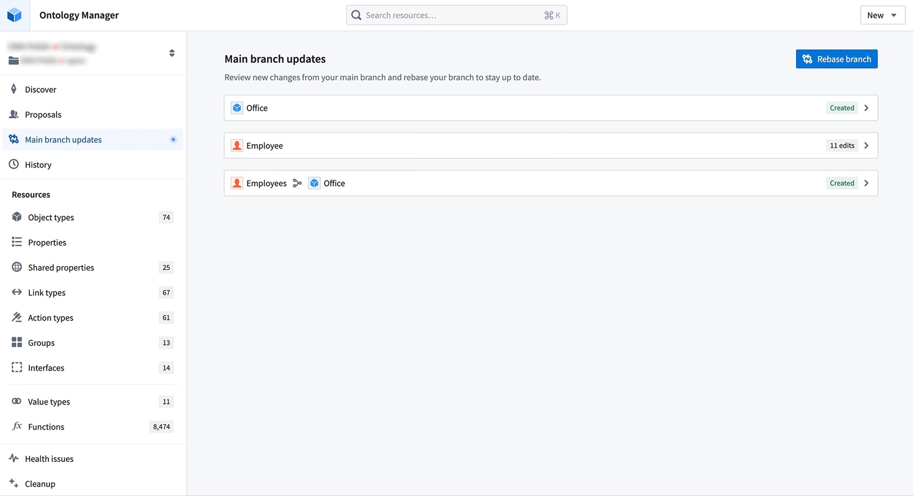
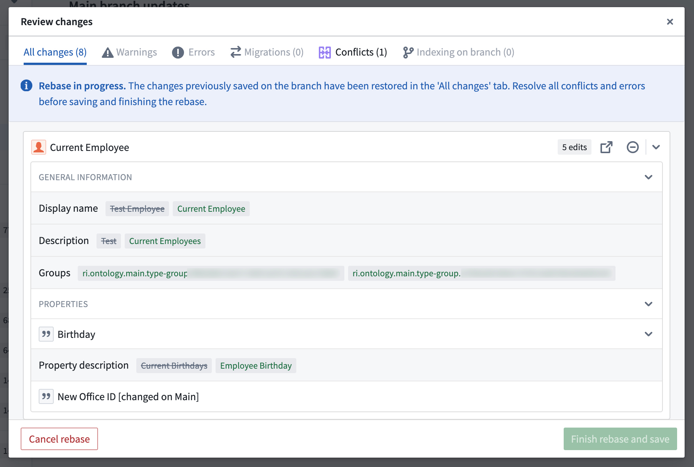
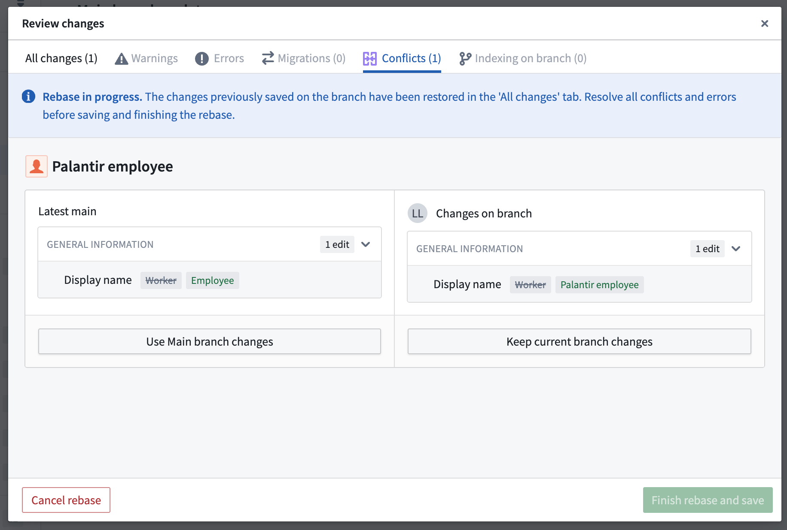
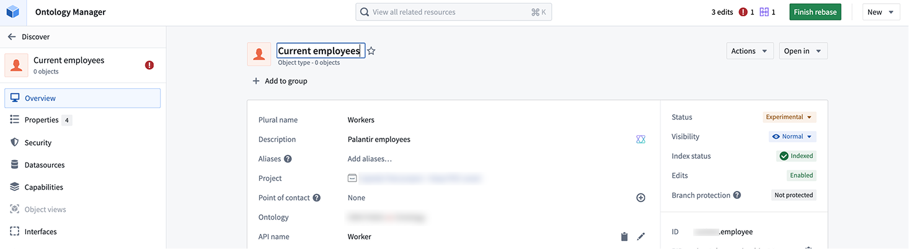
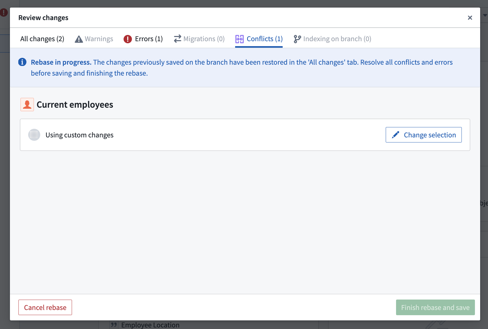
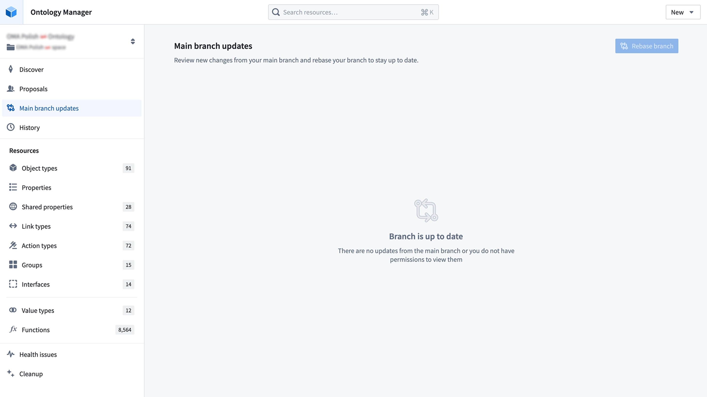
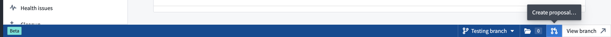
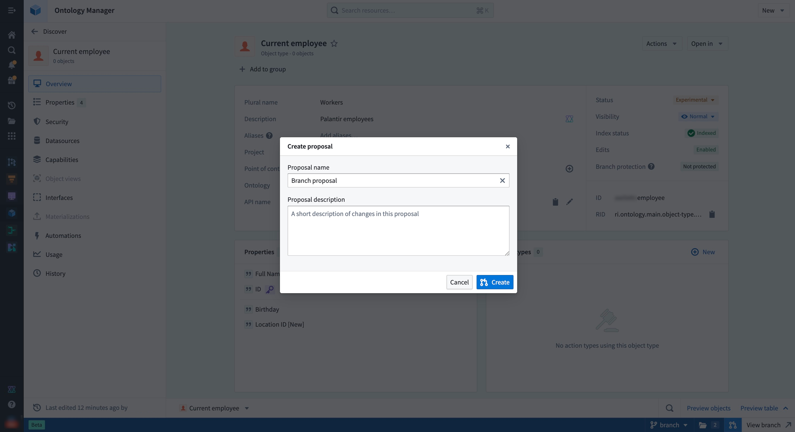
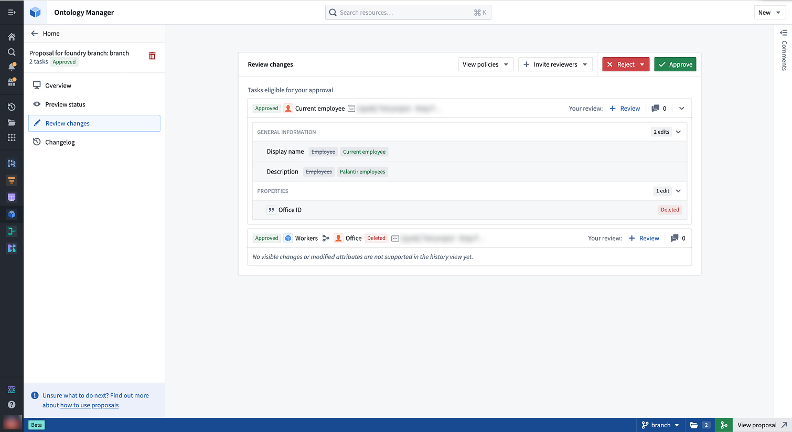
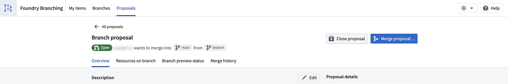

# Test changes in the ontology本体中的测试变更

[Foundry branching](/docs/foundry/foundry-branching/overview/) allows you to test changes to the ontology without disrupting your live production environment. On your Foundry branch, you can modify ontology resources based on branched datasource changes, and test these modifications downstream in [supported applications](/docs/foundry/foundry-branching/supported-functionality/).Foundry 分支允许你测试本体的变更而不中断你的实时生产环境。在你的 Foundry 分支中，你可以根据分支数据源的变更修改本体资源，并在支持的应用中测试这些修改。

The following sections describe the Foundry branching workflow for testing changes in the ontology.以下章节介绍了 Foundry 用于测试本体变更的分支工作流程。

### Definitions定义

- **Branch:** A branch is an environment derived from the main version, designed to enable experimentation and changes without impacting the `Main` branch. This allows users to test and refine adjustments in an isolated environment before merging them back into `Main`.分支： 分支是源自主版本的环境，旨在允许实验和修改而不影响主分支。这允许用户在独立环境中测试和优化调整，然后再合并回主版本 。
- **Proposal:** When you create a [Foundry branching proposal](/docs/foundry/foundry-branching/core-concepts/#proposal), an ontology proposal is automatically created as a subset to track ontology-specific changes. The ontology proposal contains metadata such as reviews, name, and descriptions of the ontology changes being merged into `Main`. Proposals serve as a mechanism for reviewing and approving changes made in a separate branch before they are integrated into `Main`.提案： 当你创建 Foundry 分支提案时，会自动创建一个本体提案作为子集，用于跟踪本体特定的变更。本体提案包含元数据，如审查、名称和合并到主本体变更的描述。提案作为审查和批准独立分支中变更的机制，之后才将其整合进主分支 。
- **Rebasing:** Incorporate the latest changes from `Main` into your current branch to keep your current branch up-to-date.重新定位： 将主部门的最新变更整合到当前分支中，以保持当前分支的更新。

### Branching lifecycle分支生命周期

The general branching workflow has four steps:一般的分支工作流程包括四个步骤：

1. [Modify resources on a branch修改分支上的资源](#1-modify-resources-on-a-branch)
2. [Rebase your branch and resolve merge conflicts重新按分支基础，解决合并冲突](#2-rebase-your-branch-and-resolve-merge-conflicts)
3. [Prepare your branch for review准备您的分支进行审查](#3-prepare-your-branch-for-review)
4. [Merge your branch合并你的分支](#4-merge-your-branch)

## 1. Modify resources on a branch1. 修改分支上的资源

To modify the ontology on a branch, you can either create a new branch in Ontology Manager, or access an existing branch using the branch selector.要修改分支上的本体，你可以在 Ontology Manager 中创建新分支，或者通过分支选择器访问已有分支。

To create a branch, open the branch selector and choose **Create new branch** to open a dialog where you can add a title and description for your branch.要创建分支，打开分支选择器并选择 “创建新分支 ”，打开一个对话框，添加分支的标题和描述。

If you already have changes to the ontology that you would like to include in a branch, you can select **Save to new branch** from the save dialog to create a separate branch with those changes. Note that if you make changes to any [protected ontology resources](/docs/foundry/foundry-branching/protecting-resources/), you will be required to save to a new branch.如果你已经有想包含在分支中的本体变更，可以在保存对话框中选择“ 保存到新分支 ”，以创建包含这些更改的独立分支。请注意，如果您对任何受保护的本体资源进行更改，将需要保存到新的分支。

You can only branch from the main ontology, also known as `Main` branch.你只能从主本体分支分支，也称为主分支。

While on a branch, a [branch task bar](/docs/foundry/foundry-branching/branch-taskbar/) at the bottom of the interface will display your current branch name and additional metadata.在分支上，界面底部的分支任务栏会显示当前分支名称和额外元数据。

## 2. Rebase your branch and resolve merge conflicts2. 重新按分行并解决合并冲突

Known limitations已知的局限性Consider these [known limitations](#known-limitations) related to rebasing and merging your branch.请考虑这些与分行重新定位和合并相关的已知限制 。

While you are introducing changes on your branch, `Main` can also update with new changes made by others. Rebasing incorporates the latest changes from `Main` into your current branch to keep your current branch up to date.在你为分支引入变更时，Main 也可以根据他人的新变更进行更新。重新分类将主网的最新变更整合到当前分支中，以保持当前分支的更新。

Automatic rebasing自动重新基座If your Foundry branch does not contain changes to the ontology, rebasing occurs automatically. Once you introduce ontology changes to your branch, including indexing an object type, you will need to manually rebase to keep your branch up to date with `main`.如果你的 Foundry 分支没有对本体进行更改，重新基址会自动进行。一旦你对分支引入本体变更，包括索引对象类型，你需要手动重基以保持分支与 main 的更新。

### Rebase a branch重新按分行

When there are new changes from `Main`, a blue indicator appears on the **Main branch updates** tab in the sidebar to prompt you to review these changes.当主分支有新变化时，侧边栏的主分支更新标签会显示蓝色指示，提示你审查这些更改。

Navigate to `Main` branch updates page to view incoming changes since your last rebase — or since branch creation, if this is your first manual rebase. Select **Rebase branch** to update your branch with the latest version of `Main`.请前往主分支更新页面，查看自上次重基以来的变更——或者如果这是你第一次手动重基，则自分支创建以来。选择 Rebase 分支以更新你的分支，使用最新版本的 Main。

If there are no conflicts or errors, the rebase will complete automatically, and your branch will be up-to-date.如果没有冲突或错误，重定基会自动完成，你的分支机构也会保持最新状态。

### Resolve merge conflicts解决合并冲突

If there are conflicts, your rebase will remain in progress, and you will be redirected to the **Conflicts tab** to resolve any conflicting changes between your branch and `Main`. If there are only errors, you will be redirected to the **Errors tab** instead.如果存在冲突，你的重构将继续进行中，并会被重定向到冲突标签页，以解决分支与主分支之间的冲突变更。如果只有错误，你将被重定向到错误标签页。

During rebasing, changes from `Main` are loaded onto your branch, while any previously saved changes from your current branch are reloaded back into the working state, which you can see in the **All changes** tab.在重基时， 主分支的更改会加载到你的分支上，而之前保存的当前分支更改会重新加载回工作状态，你可以在 “全部更改 ”标签页看到。

This state allows you to view and access changes from both `Main` and your branch. When an ontology resource has changes from both branches, it will display your branch version by default.该状态允许您查看并访问主分支和分支的变更。当本体资源同时有两个分支的变更时，它会默认显示你的分支版本。

To resolve conflicts, you can choose to **Use Main branch changes** or **Keep current branch changes** for each resource. Alternatively, you can navigate directly to that resource and apply **custom changes** to resolve its conflicts.要解决冲突，你可以选择使用主分支更改或保留当前分支更改 。或者，你也可以直接访问该资源，并应用自定义更改来解决冲突。

In this example, the `Palantir employee` object type has a conflict in which the display name has been changed on both `Main` branch and your branch. To resolve this conflict, choose which version of this object type to keep.在这个例子中，Palantir 员工对象类型存在冲突， 主分支和你的分支的显示名称都被更改了。为了解决此冲突，选择保留该对象类型的哪个版本。

You can also resolve this conflict by making a custom change. In the example, you can navigate to the object type and change its display name from “Palantir employee” to "Current employee". The conflict will now be resolved due to this custom change.你也可以通过自定义更改来解决这个冲突。在示例中，你可以导航到对象类型，并将其显示名称从“Palantir employee”改为“Current employee”。由于这一自定义变更，冲突将得到解决。

After resolving all conflicts, ensure any errors are addressed before finishing your rebase.解决所有冲突后，确保在完成基底改造前解决所有错误。

### Finish rebase表面重基

Once all errors and conflicts have been resolved, you can select **Finish rebase and save**, and your branch will be up to date.解决所有错误和冲突后，你可以选择完成重基并保存 ，你的分支就会是最新的。

You can continue working on your branch and rebasing regularly to keep your branch current with the latest version of `Main` branch.你可以继续维护你的分支，并定期重新按基，保持分支更新到主分支的最新版本。

### Known limitations已知的局限性

These are the known limitations that we are tracking and in the process of resolving:以下是我们正在跟踪并正在解决的已知限制：

- **Schema migrations:** In the case where there are schema migrations on both your branch and the `Main` branch that affect the same object type, rebasing or merging your branch will most likely fail. For now, we suggest discarding the object type changes on your branch or alternatively, you can contact Palantir support.模式迁移： 如果分支和主分支都存在影响相同对象类型的模式迁移，重基或合并分支很可能失败。目前，我们建议你丢弃分支上的对象类型更改，或者你可以联系 Palantir 客服。
- **Datasource replacement:** When a conflict occurs on an object type where a backing datasource has been replaced or removed on `Main` branch, choosing to keep your branch changes will lead to a merge failure. In this case, we suggest choosing `Main` branch changes.数据源替换： 当主分支的后备数据源被替换或移除的对象类型发生冲突时，选择保留分支更改会导致合并失败。在这种情况下，我们建议选择主分支更改。

## 3. Prepare your branch for review3. 准备您的分支进行审查

When you are ready to merge your branch into `Main` branch after making your changes, you can create a proposal by selecting the **Create proposal** icon in the branch task bar. Add a name and description to set up your proposal.当你准备好在修改后将分支合并到主分支时，可以通过分支任务栏中的创建提案图标来创建提案。添加姓名和描述以确定你的提案。

When a proposal is created, **merged checks** will run to verify whether the resources on a Foundry branch are able to merge into `Main` branch. Failed checks can include conflicts between your branch and `Main` branch, which would require you to rebase your branch.当提案创建时，会运行合并检查以验证 Foundry 分支上的资源是否能够合并到主分支。检定失败可能包括你的分支和主分支之间的冲突，这就需要你重新按分支的基础。

### Request a review请求复审

You can add reviewers to your proposal through the branch task bar, the Foundry branching proposal page, or the ontology proposal page.你可以通过分支任务栏、Foundry 分支提案页面或本体提案页面添加审核员到你的提案中。

On the ontology proposal page, go to **Review changes** and select **Invite reviewers** to add reviewers to your proposal.在本体提案页面，进入 “审核更改 ”，选择邀请审核员以添加审核员到您的提案中。

For ontology resources that have migrated to projects, select **View policies** to see which reviewers are required to review a resource based on the associated project policies.对于已迁移到项目的本体资源，选择查看政策，查看哪些审核员根据相关项目策略需要审核该资源。

Each ontology resource is considered an individual task. The status tag next to the resource name indicates the overall approval status, while the **Your review** section on the right allows you to submit a review.每个本体资源都被视为一个独立任务。资源名称旁的状态标签显示整体批准状态，右侧的“ 您的审核 ”部分允许你提交审核。

Leaving comments留言You may also leave comments on the various tasks in your proposal to give context about the changes proposed. Access the Comments section of your tasks by selecting the Comments sidebar on the far right.你也可以对提案中的各个任务发表评论，以提供关于拟议变更的背景。通过选择右侧最侧边栏的“评论”栏，访问任务的“评论”部分。

### Review the proposal审查提案

In the **Review changes** tab, reviewers may approve or reject individual tasks. Users without permissions may still review the task, for example, to convey their opinions on the change, but this will not affect the approved status of the task.在审核更改标签中，审核员可以批准或拒绝单个任务。例如，未获授权的用户仍可审查任务以表达对变更的意见，但这不会影响任务的批准状态。

Approval rights审批权Users with approval rights can approve proposals even if not added as reviewers. Use the reviewers list to track who should review changes, not to restrict approvals.拥有审批权的用户即使未被添加为审稿人，也可以批准提案。使用审核员名单来跟踪谁应该审核变更，而不是限制批准。

## 4. Merge your branch4. 合并你的分支

When you are ready to merge your changes to `Main`, you must merge your Foundry branching proposal. This will automatically kick off the merge process for the ontology.当你准备将更改合并到主版本时，必须合并你的 Foundry 分支提案。这会自动启动本体的合并过程。

To do so, select the merge icon in the branch task bar, or navigate to your proposal page in Foundry branching and select **Merge proposal**.要做到这一点，可以在分支任务栏中选择合并图标，或在 Foundry 分支中导航到你的提案页面，选择合并提案 。

