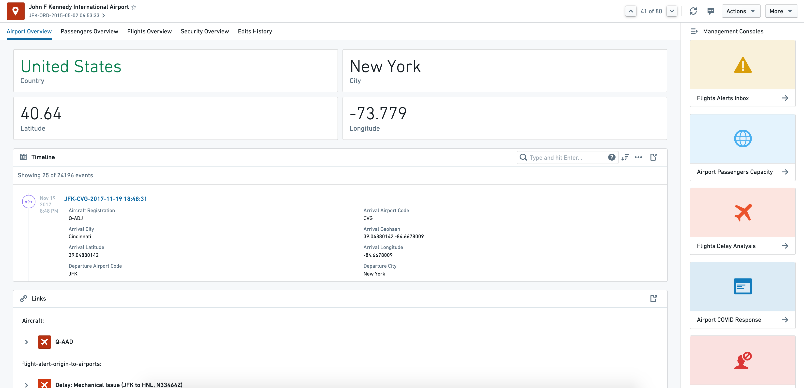
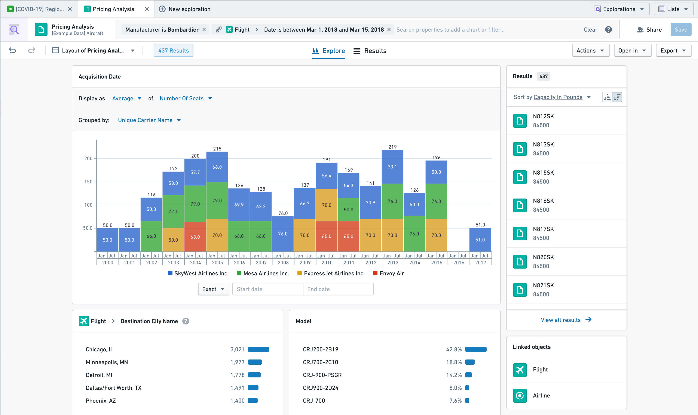
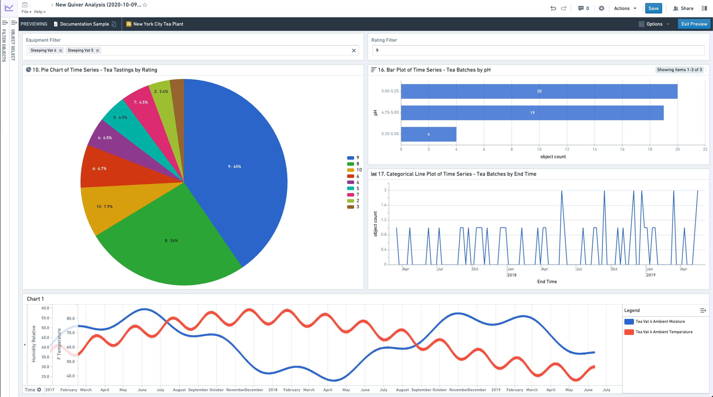
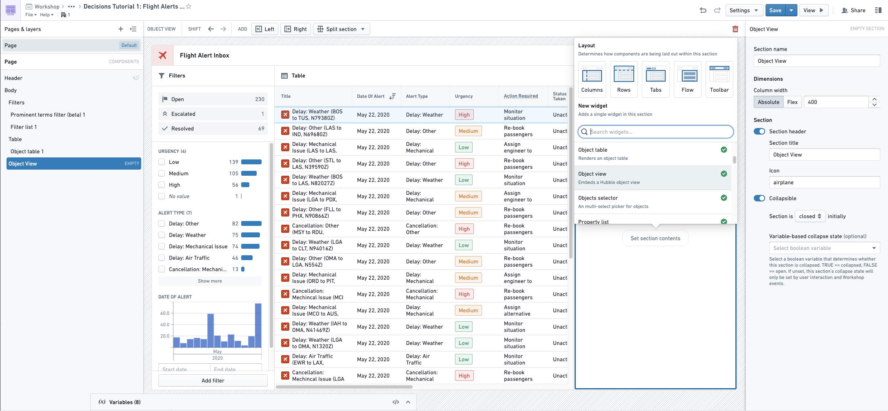
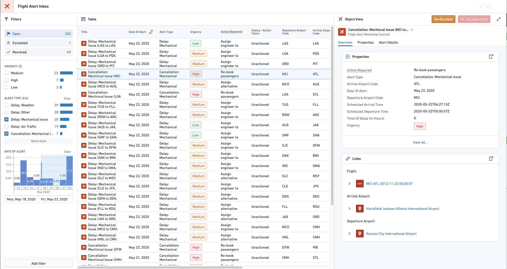
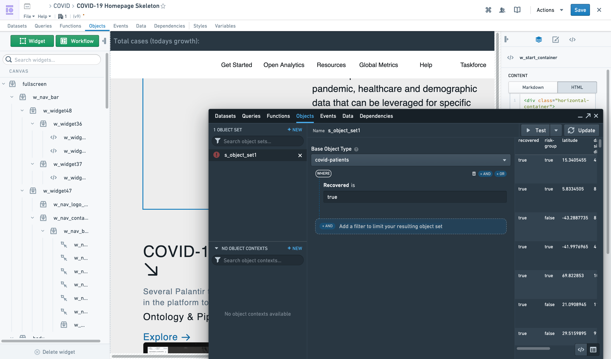
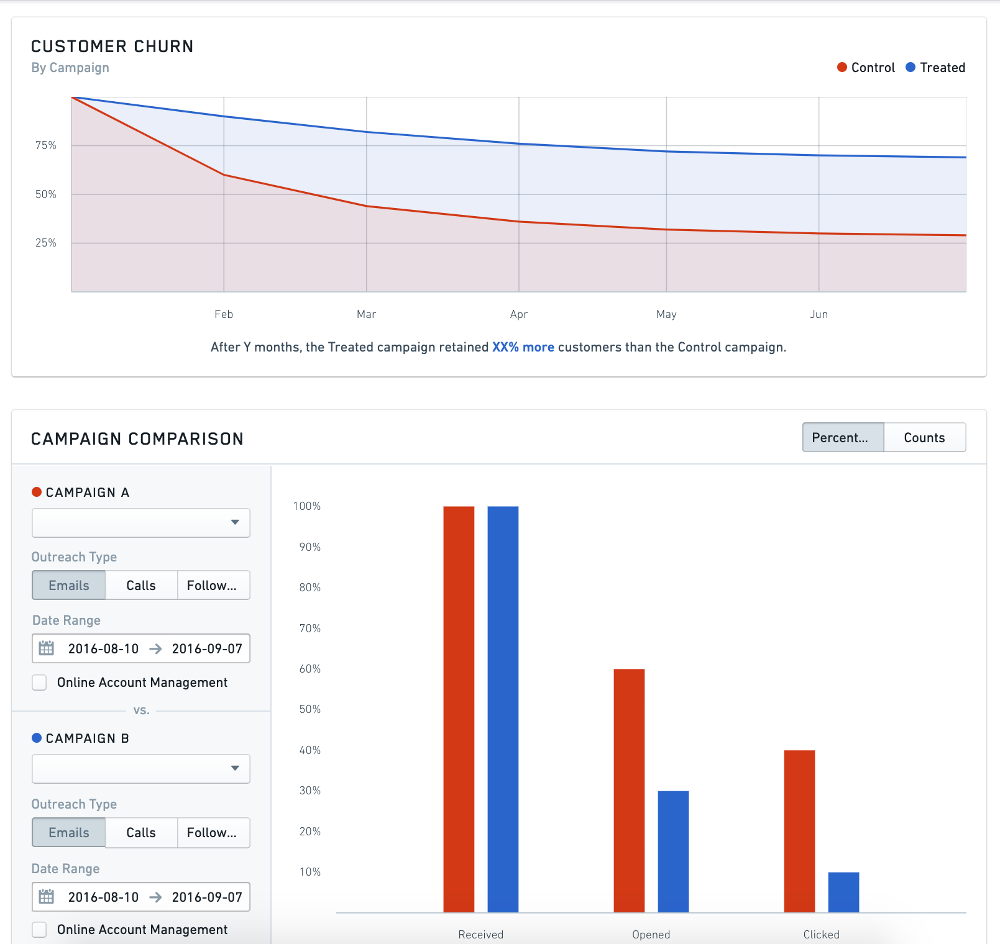
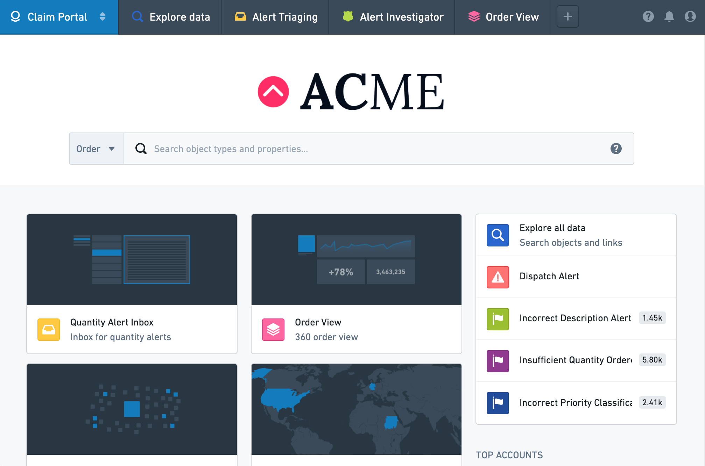
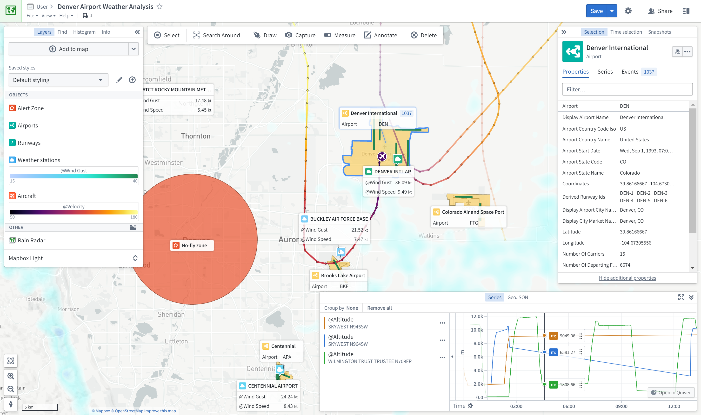

# Ontology-aware applications本体感知应用

Foundry contains a number of applications developed to operate natively on top of the Ontology. Together, these object-aware applications deliver a powerful analytical and operational platform that supports a range of use cases and user profiles.Foundry 包含多个应用程序，这些应用程序是为本体论而开发的。这些对象感知应用共同提供了强大的分析和运营平台，支持多种用例和用户配置文件。

To learn more about why setting up an Ontology and using object-aware applications is valuable, see [this page](/docs/foundry/ontology/why-ontology/).想了解更多关于为何建立本体论和使用对象感知应用的价值，请参见此页面 。

This page provides a reference to the available applications, and explains when you should use each:本页提供了可用应用程序的参考，并说明何时应使用每种应用：

- [Application reference](#application-reference)
- [Application comparison](#application-comparison)

## Application reference应用参考

### Object Views对象视图

[**Object Views**](/docs/foundry/object-views/overview/) are a central hub for all information and workflows related to a particular object. This includes key "biographical data" about an object, any linked objects, key related metrics, and links to (or embedding of) key analyses, dashboards, and applications related to the object.对象视图是与特定对象相关的所有信息和工作流程的中心枢纽。这包括关于对象的关键“传记数据”、任何关联对象、关键相关指标，以及指向（或嵌入）与对象相关的关键分析、仪表盘和应用程序的链接。

For example, the `Airport` object type object view might provide the following information for each `Airport` object:例如，Airport 对象类型对象视图可能为每个 Airport 对象提供以下信息：

- Biographical data such as `country`, `city`, `longitude`, `latitude`, etc.传记资料，如国家 、 城市 、 经度 、 纬度等。
- 360-degree view of all `Aircraft` objects and `Flight` objects linked to the `Airport`所有与机场相关的飞机和飞行物体的 360 度全景
- Embedded `Airport Covid Response` workflow嵌入式机场新冠响应工作流程
- Link to a `Root-Cause Analysis` of a `Flight delay` event related to the `Airport`与机场相关的航班延误事件根因分析链接

### Object Explorer对象浏览器

[**Object Explorer**](/docs/foundry/object-explorer/overview/) is a search and analysis tool for answering questions about anything in the Ontology layer. Users can visually compose search queries ranging from simple filters to Search Arounds to find objects of interest. From there, they can explore the resulting object sets using the exploration view or view them as a table of results. Additionally, users can compare and contrast object sets and take bulk Actions (for example, writeback) on the object set. Then, users can export the object sets or open them in compatible applications, such as Workshop.对象探索器是一款用于回答本体层中任何问题的搜索和分析工具。用户可以可视化地构建从简单筛选到搜索环绕搜索的搜索查询，以寻找感兴趣的对象。之后，他们可以使用探索视图来探索所得的对象集，或者将它们视为结果表。此外，用户可以比较和对比对象集，并对对象集进行批量作（例如写回）。然后，用户可以导出对象集或在兼容的应用程序中打开，如 Workshop。

The exploration view is a set of preset and configurable visualizations (such as charts or maps) that the user can further leverage to drill-down into specific subsets of objects. Object Explorer requires no pre-configuration and is geared towards less technical users.探索视图是一组预设且可配置的可视化工具（如图表或地图），用户可以进一步利用它们深入分析特定对象子集。对象浏览器无需预先配置，面向技术较低的用户。

### Quiver箭袋

[**Quiver**](/docs/foundry/quiver/overview/) enables advanced analytical workflows in the Ontology layer through a visual point-and-click interface and a powerful charting library. Quiver can be used to support anything from simple linear drill-down analyses to highly-branched and complex analyses with aggregations and statistical functions. Quiver also supports native time series analysis. Quiver analyses can be templatized into read-only dashboards for broader consumption.Quiver 通过可视化的点选界面和强大的图表库，支持本体层的高级分析工作流。Quiver 可用于支持从简单的线性钻探分析到带有聚合和统计函数的高度分支复杂分析。Quiver 还支持原生时间序列分析。Quiver 分析可以被模板化为只读仪表盘，供更广泛的使用。

### Workshop车间

[**Workshop**](/docs/foundry/workshop/overview/) enables point-and-click code-less application-building natively on the Ontology layer. Applications built in Workshop are more dynamic and interactive than typical dashboards created in other point-and-click tools.Workshop 支持本体层的点选无代码应用构建。Workshop 中构建的应用程序比其他点击工具中创建的典型仪表盘更具动态性和交互性。

By leveraging high-quality [Layouts](/docs/foundry/workshop/concepts-layouts/) and an easy-to-use but sophisticated [Events system](/docs/foundry/workshop/concepts-events/), Workshop applications aim to be as user-friendly and high-quality as custom React applications.通过利用高质量的布局和易于使用但复杂的事件系统 ，Workshop 应用力求与自定义 React 应用一样用户友好且高质量。

*Workshop Editor View研讨会编辑器视图*

*Final Workshop Module最终工作坊模块*

### Slate板岩

[**Slate**](/docs/foundry/slate/overview/) is a flexible application builder for Foundry that requires more technical configuration and code than Workshop. Slate applications interact with the Ontology layer, but can also interact directly with Foundry datasets. Slate enables significant visual customization based on web development paradigms and has a wide range of available features, but also requires more technical knowledge to build and maintain applications than Workshop.Slate 是一个灵活的 Foundry 应用构建器，需要比 Workshop 更多的技术配置和代码。Slate 应用与本体层交互，但也可以直接与 Foundry 数据集交互。Slate 支持基于网页开发范式的显著视觉定制，并拥有丰富的可用功能，但构建和维护应用程序所需的技术知识也比 Workshop 更多。

*Slate Editor ViewSlate 编辑器视图*

*Slate Application View*

### Carbon碳

[**Carbon**](/docs/foundry/carbon/overview/) enables combining multiple resources or applications in Foundry to create highly curated *workspaces* for operational users. By allowing you to combine analytical results such as dashboards, applications built in Workshop or Slate, and out-of-the-box capabilities such as Object Views and Object Explorer, Carbon enables workflow builders to perform the "last mile" of customization to create a highly tailored and usable experience for end users.Carbon 使 Foundry 能够将多个资源或应用结合起来，为运营用户打造高度定制的工作空间 。通过允许你结合分析结果，如仪表盘、Workshop 或 Slate 中构建的应用程序，以及开箱即用的功能，如对象视图和对象浏览器，Carbon 使工作流构建者能够完成“最后一公里”的定制化，为最终用户打造高度定制且可用的体验。

### Map地图

The [**Map**](/docs/foundry/map/overview/) application allows you to bring together and analyze objects and other data in a geospatial context.地图应用允许您在地理空间环境中整合和分析物体及其他数据。

## Application comparison应用比较

Each object-aware application varies on a few dimensions. Three particularly important dimensions are:每个对象感知应用在几个维度上有所不同。三个特别重要的维度是：

- the [primary use case(s)](#use-cases),主要使用场景 ，
- the [workflow style](#workflow-style), and工作流程风格 ，以及
- the [configuration model](#configuration-model) of the application.应用程序的配置模型 。

| Foundry Application铸造应用 | [Primary use case主要使用场景](#use-cases) | [Workflow Style工作流程风格](#workflow-style) | [Configuration Model配置模型](#configuration-model) | Objects or Datasets对象或数据集 |
| --- | --- | --- | --- | --- |
| [Object Views对象视图](#object-views) | Discovery发现 | Workflow-specific工作流程专用 | Walk-up usable步入式可穿戴设备 | Objects物品 |
| [Object Explorer对象浏览器](#object-explorer) | Discovery & Analysis发现与分析 | Exploratory探索 | Walk-up usable步入式可穿戴设备 | Objects物品 |
| [Quiver箭袋](#quiver) | Analysis & Dashboards分析与仪表盘 | Exploratory (for Analytical mode); workflow-specific (for Dashboard mode)探索性（分析模式）;工作流专用（适用于仪表盘模式） | Walk-up usable (for Analytical mode); customizable (for Dashboard mode)可步行使用（用于分析模式）;可自定义（用于仪表盘模式） | Objects物品 |
| [Workshop车间](#workshop) | Applications & Dashboards应用与仪表盘 | Workflow-specific工作流程专用 | Customizable可定制 | Objects物品 |
| [Slate板岩](#slate) | Applications & Dashboards (complex)应用与仪表盘（复杂） | Workflow-specific工作流程专用 | Customizable可定制 | Objects (recommended) and Datasets对象（推荐）和数据集 |
| [Map地图](#map) | Geospatial地理空间 | Exploratory or Workflow-specific探索性或特定工作流程 | Walk-up usable步入式可穿戴设备 | Objects物品 |

### Use cases使用场景

The main use cases supported by object-aware applications are **Discovery**, **Analysis**, **Dashboards**, and **Applications**.对象感知应用支持的主要用例包括发现 、 分析 、 仪表盘和应用程序 。

- **Discovery** enables users to find the right information or workflow. Discovery is primarily enabled through two core features: curated content hubs and search. Curated content hubs (sometimes called landing pages or "360 views") range from a comprehensive standard view for any user to targeted views for a specific set of users or use case. Search functionality supports discovery through free-text search of key words as well as more iterative search through link traversals or drill-downs.
- **Analysis** enables users to answer a broad range of questions. These range from the simple (*what is the average customer retention for a given product?*) to the very complex (*how do three different customer cohorts compare in terms of retention and overall revenue over time, across all products and for each individual product?*). The analytical path is exploratory, meaning that it is defined by the end user themselves and is often highly iterative; as the initial questions are answered, new questions are developed and incorporated into the analysis path.
- **Dashboards** are sets of pre-configured visualizations consumed primarily in a read-only fashion by a broader set of consumer users. Dashboards are often used to turn meaningful *Analyses* into recurring reporting or operational monitoring. Dashboards are characterized by a large number of charts and other visualizations, but are not as customizable or interactive as *Applications* (see below). Dashboards are often parameterized such that users can filter down the visualizations to different subsets of data.
- **Applications** are interactive custom operational interfaces intended for a specific user group to solve a specific problem. Applications are often more complex than dashboards and are oriented at enabling users to follow a specific and on-rails workflow. While the application may contain some curated analytical content (e.g. statistics, charts, graphs, etc.) required to perform a decision, it also typically has several workflow elements and often captures user input (for example, writeback).

### Workflow style

Object-aware applications are optimized for primary workflow styles.

- **Exploratory applications** do not need to be pre-configured by a "builder" user and are used out-of-the-box by end users as soon as data has been modeled into the Ontology. In exploratory applications, the end-user defines their analytical path, and can answer a wide range of questions that are not pre-determined. Exploratory applications typically contain a set of search, visualization, and transformation features to enable this. Object-aware applications that are primarily exploratory include Object Explorer and Quiver.
- **Workflow-specific applications** require pre-configuration by a "builder" user before an end user can actually use them. This is typical of Dashboards or Applications that have two primary user groups: (1) the builder group configuring the specific dashboard or application and (2) the downstream end users for whom the applications are built. Workshop and Slate modules both need to be pre-configured by a "Builder" user in edit mode.

Certain applications like Quiver accommodate both workflow styles because while their primary mode is exploratory, the outputs can be configured into a more broadly consumed workflow-specific artifact. While Quiver Analyses are highly exploratory, they can be published as Quiver Dashboards that are pre-configured analytical views accessible to a broader audience.

### Configuration model

The configuration model describes the extent to which the user interface must be configured before it can be leveraged by an end user.

- **Walk-up usable** applications can be employed effectively and immediately by users, with little to no configuration requirement or maintenance burden. For example, Object Explorer has minimal-to-no configuration requirement, making it immediately usable for end users once an Ontology is defined.
- **Customizable** applications require an upfront investment (often by a separate "builder" user) to implement an interface that solves a particular problem for an end user. It also implies a higher ongoing maintenance cost. However, the resulting application is typically a fit-for-purpose interface that exactly meets the need of the specific workflow. Workshop and Slate are examples of this type of customization.

