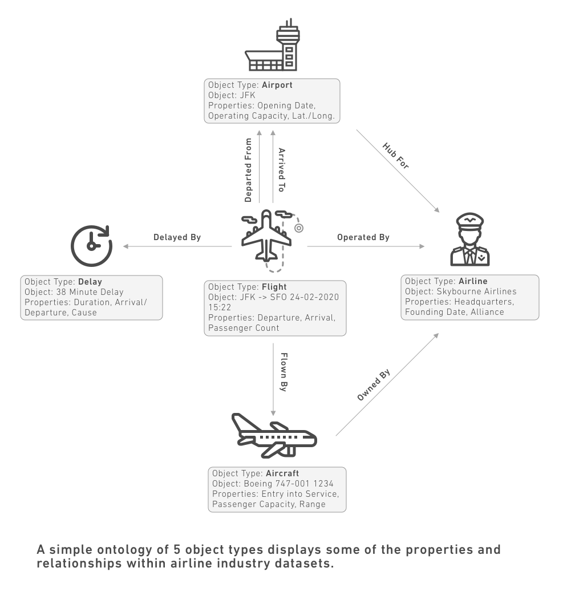

# Core concepts核心概念

This page describes major concepts related to the Ontology in Foundry.本页介绍了与 Foundry 本体论相关的主要概念。

## Ontology本体论

An Ontology is a categorization of the world. In Foundry, the Ontology is the digital twin of an organization, a rich semantic layer that sits on top of the digital assets (datasets and models) integrated into Foundry. The Foundry Ontology creates a complete picture of an organization’s world by mapping datasets and models to object types, properties, link types, and action types.本体论是对世界的分类。在 Foundry 中，本体是组织的数字孪生，是一层丰富的语义层，位于集成于 Foundry 中的数字资产（数据集和模型）之上。Foundry 本体通过将数据集和模型映射到对象类型、属性、链接类型和动作类型，构建组织世界的完整图景。

- An [object type](#object-type) defines an entity or event in an organization.对象类型定义了组织中的实体或事件。
- A [property](#property) defines the object type’s characteristics.属性定义了对象类型的特征。
- A [link type](#link-type) defines the relationship between two object types.链接类型定义了两个对象类型之间的关系。
- An [action type](#action-type) defines how an object type can be modified.动作类型定义了对象类型如何被修改。

The concepts that comprise the Ontology have parallels in the structure of a dataset. You can think of each object type as analogous to a dataset; an object is an instance of an object type, just as a row is one entry in a dataset. The columns in a dataset are analogous to properties of an object, as they provide additional information for a given row. The value in a dataset field (like a cell in a spreadsheet) is akin to the property value of an object. And just as datasets can be joined together in various ways, objects can have links between them based on property values. The table below summarizes this comparison:构成本体论的概念在数据集的结构上有相似之处。你可以把每种对象类型看作一个数据集;对象是对象类型的实例，就像行是数据集中的一个条目一样。数据集中的列类似于对象的属性，因为它们为给定行提供了额外信息。数据集字段中的值（比如电子表格中的单元格）类似于对象的属性值。正如数据集可以通过多种方式连接，对象也可以基于属性值在它们之间建立链接。下表总结了这一比较：

| Datasets数据集 | Ontology本体论 |
| --- | --- |
| Dataset数据集 | Object type对象类型 |
| Row划船 | Object目标 |
| Column柱状结构 | Property财产 |
| Field场地 | Property value房产价值 |
| Join加入 | Link type链接类型 |

The diagram below demonstrates how these concepts can come together to create an Ontology. The content below continues to define the different components of the Ontology in more depth.下图展示了这些概念如何结合起来形成本体论。以下内容将继续更深入地定义本体论的不同组成部分。

## Object type对象类型

An **object type** is the schema definition of a real-world entity or event. An **object** refers to a single instance of an object type; an object corresponds to a single real-world entity or event. An **object set** refers to a collection of multiple object instances; that is, an object set represents a group of real-world entities or events.对象类型是现实世界实体或事件的模式定义。 对象指的是对象类型的单个实例;一个对象对应于一个现实世界的单一实体或事件。 对象集指的是多个对象实例的集合;也就是说，一个对象集代表一组现实世界的实体或事件。

[Learn more about object types.了解更多关于对象类型的信息。](/docs/foundry/object-link-types/object-types-overview/)

## Property财产

A **property** of an object type is the schema definition of a characteristic of a real-world entity or event. A **property value** refers to the value of a property on an object, or a single instance of that real world entity or event.对象类型的属性是对现实世界实体或事件特征的模式定义。 属性值指的是属性在对象或该现实世界实体或事件的单个实例上的价值。

[Learn more about properties.了解更多关于房产的信息。](/docs/foundry/object-link-types/properties-overview/)

## Shared property共享财产

A **shared property** is a property that can be used on multiple object types in your ontology. Shared properties allow for consistent data modeling across object types and centralized management of property metadata.共享属性是指可以在本体论中用于多个对象类型的属性。共享属性允许跨对象类型实现一致的数据建模和属性元数据的集中管理。

[Learn more about shared properties.了解更多关于共享物业的信息。](/docs/foundry/object-link-types/shared-property-overview/)

## Link type链接类型

A **link type** is the schema definition of a relationship between two object types. A **link** refers to a single instance of that relationship between two objects.链接类型是两种对象类型之间关系的模式定义。 链接指的是两个对象之间这种关系的单一实例。

[Learn more about link types.了解更多关于链接类型的信息。](/docs/foundry/object-link-types/link-types-overview/)

## Action type动作类型

An **action type** is the schema definition of a set of changes or edits to objects, property values, and links that a user can take at once. It also includes the side effect behaviors that occur with action submission. Once an action type is configured in the Ontology, end users can make changes to objects by applying actions.动作类型是对对象、属性值和链接进行一组修改或编辑的模式定义，用户可以一次性处理这些内容。它还包括与行动服从相关的副作用行为。一旦在本体中配置了动作类型，终端用户可以通过应用动作对对象进行修改。

[Learn more about action types.了解更多关于动作类型的了解。](/docs/foundry/action-types/overview/)

## Roles角色

**Roles** are the central permissioning model in the Ontology. Similar to roles in the Foundry filesystem, Ontology roles grant access to ontological resources. Roles can be granted on the Ontology level or the individual resource level.角色是本体论中的核心许可模型。类似于 Foundry 文件系统中的角色，本体角色授予访问本体资源的权限。角色可以在本体层面或个人资源层面授予。

Learn more about [Ontology roles](/docs/foundry/object-permissioning/ontology-permissions/) and how they are used for object types, link types, and action types.了解更多关于本体角色及其在对象类型、链接类型和动作类型中的应用。

## Functions职能

A **function** is a piece of code-based logic that takes in input parameters and returns an output. Functions are natively integrated with the Ontology: they can take objects and object sets as input, read property values of objects, and be used across action types and applications that build on the Ontology.函数是一种基于代码的逻辑，接收输入参数并返回输出。函数与本体本身集成：它们可以将对象和对象集作为输入，读取对象的属性值，并可在基于本体构建的动作类型和应用程序间使用。

[Learn more about Functions in general](/docs/foundry/functions/overview/), or [learn more about Ontology-based Functions](/docs/foundry/functions/functions-on-objects/).了解更多关于函数的一般知识 ，或了解更多基于本体论的函数 。

## Interfaces接口

An **interface** is an Ontology type that describes the shape of an object type and its capabilities. Interfaces provide object type polymorphism, allowing for consistent modeling of and interaction with object types that share a common shape.接口是一种本体类型，用于描述对象类型的形状及其功能。接口提供对象类型多态性，使得对共享相同形状的对象类型进行一致建模和交互。

Learn more about [interfaces](/docs/foundry/interfaces/interface-overview/).了解更多关于接口的信息 。

## Object Views对象视图

**Object Views** are a central hub for all information and workflows related to a particular object. This includes key information about an object, any linked objects, and related metrics, as well as analyses, dashboards, and applications related to the object.对象视图是与特定对象相关的所有信息和工作流程的中心枢纽。这包括关于对象的关键信息、任何关联对象及相关指标，以及与该对象相关的分析、仪表盘和应用程序。

[Learn more about Object Views.了解更多关于对象视图的信息。](/docs/foundry/object-views/overview/)

