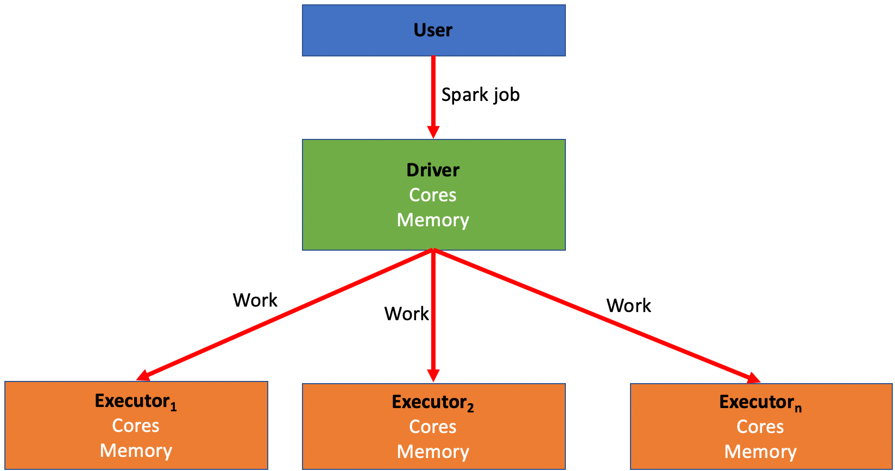
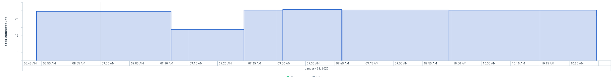

# Spark concepts火花概念

## Introduction to SparkSpark 介绍

**What is Spark?什么是 Spark？**

Spark is a distributed computing system that is used within Foundry to run data transformations at scale. It was originally created by a team of researchers at UC Berkeley and was subsequently donated to the Apache Foundation in the late 2000s. Foundry allows you to run SQL, Python, Java, and Mesa transformations (Mesa is a proprietary Java-based DSL) on large amounts of data using Spark as the foundational computation layer.Spark 是一个分布式计算系统，用于在 Foundry 内部大规模运行数据转换。它最初由加州大学伯克利分校的研究团队创建，随后于 2000 年代末捐赠给了阿帕奇基金会。Foundry 允许你使用 Spark 作为基础计算层，在大量数据上运行 SQL、Python、Java 和 Mesa（Mesa 是一个基于 Java 的专有 DSL）转换。

**How does Spark work?Spark 是如何运作的？**

Spark relies on distributing jobs across many computers at once to process data. This process allows for simultaneous jobs to run quickly across users and projects with a method known as MapReduce. These computers are divided into drivers and executors.Spark 依赖于同时在多台计算机上分配作业来处理数据。该过程允许同时在用户和项目间同时运行作业，采用称为 MapReduce 的方法。这些计算机分为驱动程序和执行者。

- A **driver** is like the “conductor” for your Spark job. The driver is responsible for distributing the work of a job to the executors.司机就像你 Spark 工作的“指挥员”。司机负责将工作分配给执行人。
- An **executor** is like a “worker bee” for your Spark job. An executor is responsible for performing the computation for the portion of the job allocated to it by the driver. This work is split into a number of “partitions”, and each executor is given some partitions to run your code against. Once the executor completes this task, it will go back to the driver and ask for more work until the job has been completed.执行人就像你 Spark 工作的“工蜂”。执行者负责执行驱动程序分配给其的部分作业的计算。这项工作被划分为若干“分区”，每个执行者都会获得一些分区来运行你的代码。执行者完成此任务后，会返回驱动，要求更多工作直到完成。
- Every Spark job has a number of variables associated with it that can be manipulated in order to create a Spark profile best suited to run the transform.
每个 Spark 作业都关联多个变量，可以作以创建最适合运行变换的 Spark 配置文件。
  - There is a balance that needs to be struck within every Spark job between quickly and easily executing a job and the cost and resources associated with running that job.每个 Spark 作业都需要在快速轻松执行任务与运行该任务的成本和资源之间取得平衡。
  - As a rule of thumb, more executors and more memory should decrease running time while also increasing cost.经验法则是，更多的执行器和更多的内存应该能减少运行时间，同时增加成本。
  - Based on the characteristics of the job, some combinations and configurations of drivers and executors perform better than the others. This is discussed in more detail in the section on [tuning Spark profiles](#tuning-spark-profiles).根据作业的特性，某些驱动程序和执行器的组合和配置表现优于其他配置。这部分在调优火花配置文件部分有更详细的讨论。
  - A Spark profile is the configuration that Foundry will use to configure said distributed compute resources (drivers and executors) with the appropriate amount of CPU cores and memory.Spark 配置文件是 Foundry 用来配置分布式计算资源（驱动程序和执行器）的配置，配置中拥有相应数量的 CPU 核心和内存。

- Five configurable variables are associated with every Spark job:
每个 Spark 作业关联五个可配置变量：
  - **Driver cores:** Controls how many CPU cores are assigned to a Spark driver.驱动核心： 控制分配给 Spark 驱动的 CPU 核心数量。
  - **Driver memory:** Controls how much memory is assigned to the Spark driver.
驱动内存： 控制分配给 Spark 驱动的内存量。
    - Only the JVM memory is controlled. This does not include “off-heap” memory that’s needed for external non-Spark tasks (such as calls to Python libraries)只有 JVM 内存被控制。这不包括用于外部非 Spark 任务（如调用 Python 库）所需的“堆外”内存

  - **Executor cores:** Controls how many CPU cores are assigned to each Spark executor, which in turn controls how many tasks are run concurrently in each executor.执行者核心： 控制每个 Spark 执行器分配的 CPU 核心数，进而控制每个执行器同时执行的任务数量。
  - **Executor memory:** Controls how much memory is assigned to each Spark executor.
执行者存储器： 控制分配给每个 Spark 执行者的内存量。
    - This memory is shared between all tasks running on the executor.该内存在执行程序上的所有任务之间共享。

  - **Number of executors:** Controls how many executors are requested to run the job.执行人人数： 控制执行者数量被请求执行任务。

- A list of all built-in Spark Profiles can be found in the [Spark Profile Reference](/docs/foundry/optimizing-pipelines/spark-profiles-reference/).所有内置火花配置文件的列表可在火花配置文件参考中找到。

## Tuning Spark profiles调谐火花配置文件

- You may encounter issues running transforms which will require you to adjust Spark profiles to create a custom, non-default configuration that enables your specific job. For example:
你可能会遇到运行变换时遇到问题，需要调整 Spark 配置文件，创建自定义的非默认配置，以支持你的具体任务。例如：
  - Your job may require more memory.你的工作可能需要更多内存。
  - Your job may run slower than what is needed for the use case.你的工作可能比实际需求慢。
  - You may encounter errors that cause a job to fail entirely.你可能会遇到导致工作完全失败的错误。

- To use a non-default Spark profile in Code Repositories, the profile first needs to be imported into the repository containing your transform. This process is described in the documentation on [Spark profile usage](/docs/foundry/code-repositories/spark-profiles/).
要在代码仓库中使用非默认的 Spark 配置文件，首先需要将配置文件导入包含你变换的仓库。该过程在 Spark 配置文件使用文档中有描述。
  - Once imported, a Spark profile can be assigned to a specific transform following the guidance in the [Apply Transforms Profiles](/docs/foundry/optimizing-pipelines/apply-spark-profiles/) documentation.导入后，可以按照《 应用变换配置文件 》文档中的指导，将火花配置文件分配给特定的变换。

- The Spark profiles used in Pipeline Builder batch pipelines are controlled via the pipeline's [build settings](/docs/foundry/pipeline-builder/management-build-settings/#batch-compute-profiles).管道构建器批处理管道中使用的火花配置文件通过管道的构建设置进行控制。

### When to modify your Spark profile from the default何时从默认状态修改你的 Spark 配置文件

- As a rule of thumb when editing a Spark profile, only increase one variable at a time and only bump up by one level each time.
作为经验法则，编辑 Spark 配置文件时，每次只增加一个变量，且每次只增加一个等级。
  - For example, start by only adjusting executor memory and bumping it from `EXECUTOR_MEMORY_SMALL` to `EXECUTOR_MEMORY_MEDIUM`, then run the job again before adjusting anything else. This helps prevent incurring unnecessary costs by over-allocating resources to your job.例如，先只调整执行者内存，并从 EXECUTOR_MEMORY_SMALL 提升到 EXECUTOR_MEMORY_MEDIUM，然后再运行作业，再调整其他内容。这有助于避免因过度分配资源而产生不必要的成本。

- While backend defaults do not always map to specific Spark profiles, they are typically approximated by the built-in profiles labelled `SMALL`.
虽然后端默认不总是对应到特定的 Spark 配置文件，但通常通过内置标有 SMALL 的配置文件来近似。
  - The right defaults (for non-Python Transforms) are `EXECUTOR_CORES_SMALL`, `EXECUTOR_MEMORY_SMALL`, `DRIVER_CORES_SMALL`, `DRIVER_MEMORY_SMALL`, `NUM_EXECUTORS_2`.非 Python 变换的正确默认值是 EXECUTOR_CORES_SMALL、EXECUTOR_MEMORY_SMALL、DRIVER_CORES_SMALL、DRIVER_MEMORY_SMALL、NUM_EXECUTORS_2。
  - Python may need more non-JVM overhead memory when it makes calls to Python libraries that run outside the JVM.当 Python 调用运行在 JVM 外部的 Python 库时，可能需要更多的非 JVM 开销内存。

- If you are experiencing any problems with your Spark job, the first step is to optimize your code.
如果你在 Spark 作业中遇到任何问题，第一步是优化你的代码。
  - If you have optimized as much as possible and are still having problems, read on for specific recommendations.如果你已经尽可能优化了但仍然遇到问题，请继续阅读具体建议。

- If your job succeeds but is running slower than needed for your use case:
如果你的工作成功了，但运行速度低于你的用例需求：
  - Try increasing executor count; increasing executor count increases the number of tasks that can run in parallel, therefore increasing performance (provided the job is parallel enough) while also increasing cost with the use of more resources.
尝试增加执行人数量;执行子数量增加，可以并行运行的任务数量增加，从而提升性能（前提是作业足够并行），同时也会增加资源消耗带来的成本。
    - You can view the Builds application page for a given build for a chart that will help you identify if increasing the executor count can help improve the speed of your job. If the task concurrency does not get close to the executor count, increasing the number of executors is most likely not going to help improve run time.你可以查看某个构建的 Builds 应用页面，里面有一张图表，帮助你判断增加执行者数量是否能提升工作速度。如果任务并发率未接近执行者数量，增加执行者数量很可能无法改善运行时间。
    - 

  - If doubling the executor count does not reduce run time by more than 1/3, then you probably have inefficient code (for instance, reading a lot from Catalog or writing a lot to Catalog).
如果执行者数量翻倍也无法减少超过三分之一的运行时间，那么你的代码可能效率不高（比如大量从 Catalog 读取或大量写入 Catalog）。
    - For example, if you double the executor count for the transform generating a 6 minute job, the job should run in 4 minutes or less.例如，如果你将生成6分钟作业的执行者数量加倍，该作业应该能在4分钟内完成。
    - If halving your executor count slows your job down by less than 50% (for example, 4 minutes to 6 minutes), you should drop down to the lower executor count to save money unless runtime is critical.如果将执行人数量减半导致工作速度减慢不到50%（例如4分钟到6分钟），除非运行时间非常关键，否则应降至较低执行人数量以节省成本。

  - Limits can be imposed on large profiles (such as 128 or more executors) in order to ensure only approved use cases can use significant resources. If you reach a limit and need to go higher, contact your Palantir representative.对于大型配置文件（如 128 个或更多执行者）可以施加限制，以确保只有经过批准的用例才能使用大量资源。如果达到上限需要更高，请联系你的 Palantir 代表。
  - Executors tend to accrue to a driver at a rate of around 10 per minute during start-up. This means that short jobs with high executor counts should probably use lower executor counts to reduce thrashing in the system. For example, any 64-executor job that takes less than 10 minutes should probably be dropped to 32 executors, as by the time the job has acquired all its computing resources, it is almost finished.执行人在启动期间通常以每分钟约10个的速度积累给司机。这意味着执行者数量较多的短作业可能应使用较低的执行者数量以减少系统中的抖动。例如，任何一个64个执行者任务如果耗时少于10分钟，通常应该减少到32个执行者，因为当作业获得所有计算资源时，几乎已经完成了。

- If your job is failing and you’re receiving OOM (out of memory) errors or a “Shuffle stage failed” error which is not linked to a code-logic-based failure cause:
如果你的作业失败，并且你收到了内存不足（OOM）错误或“洗牌阶段失败”错误，这些错误与基于代码逻辑的失败无关：
  - Try increasing executor memory from `SMALL` to `MEDIUM`. This should help if you are processing large amounts of data.
试着把执行程序内存从小增加到中等。如果你处理大量数据，这应该很有帮助。
    - If you think you need to adjust from `MEDIUM` to `LARGE`, consult an expert for help. Consider simplifying your transform if possible, as described in the [troubleshooting guide](/docs/foundry/optimizing-pipelines/troubleshoot-ooms/).如果你觉得需要从中等调整到大号，建议咨询专家帮助。如果可能的话，考虑简化你的变换过程，正如故障排除指南中描述的那样。

- If collecting large amounts of data back to the driver or performing large broadcast joins:
如果收集大量数据回驱动或进行大规模广播连接：
  - Try increasing driver memory.试着增加驱动内存。

- If you see errors like “Spark module stopped responding” and the input dataset has many files:
如果你看到“Spark 模块停止响应”这样的错误，且输入数据集中有很多文件：
  - Try increasing the driver memory first.先试着增加驱动内存。
  - If the error persists after increasing driver memory, increase the number of driver cores to 2.如果增加驱动内存后错误依旧，则将驱动核心数增加到2个。

- If you have transforms that read many files and run into GC (Garbage Collection) problems:
如果你的变换读取大量文件并遇到 GC（垃圾回收）问题：
  - Try increasing driver cores to 2.试着把驱动核心增加到2个。

## Recommended best practices推荐的最佳实践

### For administrators对于管理者

- When a use case ends, delete all custom profiles that were created for this use case.
当一个用例结束时，删除所有为该用例创建的自定义配置文件。
  - This reduces clutter and avoids creating too many custom profiles that lead to confusion.这样可以减少杂乱，避免创建过多导致混淆的自定义配置文件。

- Set up permissions such that resource-intensive profiles are accessible only after an administrator grants explicit permission.
设置权限，使资源密集型配置文件只有在管理员明确授权后才能访问。
  - For example, `NUM_EXECUTORS_32` and `EXECUTOR_MEMORY_LARGE` (and above) should be available only upon request and approval of that request.例如，NUM_EXECUTORS_32 和 EXECUTOR_MEMORY_LARGE（及以上）应仅在请求并批准该请求时提供。
  - All executor core values except `EXECUTOR_CORES_SMALL` should be heavily controlled (because this is a "stealth" way to increase computing power and it is preferable to funnel users to `NUM_EXECUTORS` profiles in almost all cases).除了 EXECUTOR_CORES_SMALL，所有执行者核心值都应受到严格控制（因为这是一种“隐形”的方式来提升计算能力，几乎所有情况下都更倾向于引导用户使用 NUM_EXECUTORS 配置文件）。

### For adjusting Spark profiles用于调整火花配置文件

- Try to use the default profile (that is, no profile) when possible.
尽量使用默认配置文件（也就是不使用配置文件）。
  - This will reduce costs and clutter.这将降低成本和杂乱。

- If you cannot use the default profile, try to use the built-in profiles.如果你不能使用默认配置文件，试着使用内置配置文件。
- When setting up a new profile configuration, save it with your name or use case’s name.
在设置新的配置文件配置时，请用你的姓名或用例名称保存。
  - This will improve organization and also ensure that this profile is not used by other users or projects without your knowledge.这将改善组织性，并确保该配置文件不会在您不知情的情况下被其他用户或项目使用。
  - Otherwise, you can get a list of too many profiles with no idea which profile was set up for which use.否则，你可能会得到一堆过多的个人资料，却不知道哪个账户是为哪个用途设置的。

- When increasing memory, anything that goes beyond 8:1 resources (indicated by a combination of `EXECUTOR_CORES_SMALL` and `EXECUTOR_MEMORY_MEDIUM`) should be approved by an administrator. Block off `EXECUTOR_CORES_EXTRA_SMALL` and `EXECUTOR_MEMORY_LARGE`. If a user is asking for these, it usually indicates either subpar optimization or a critical workflow.在增加内存时，任何超过 8：1 资源比例（由 EXECUTOR_CORES_SMALL 和 EXECUTOR_MEMORY_MEDIUM 组合表示）都应由管理员批准。封锁 EXECUTOR_CORES_EXTRA_SMALL 和 EXECUTOR_MEMORY_LARGE。如果用户要求这些，通常说明优化不佳或工作流程存在关键。
- Profiles should be separable. Each profile should affect only one Spark variable (or one logical combination of Spark variables).
配置文件应该是可分开的。每个配置文件应只影响一个火花变量（或一个火花变量的逻辑组合）。
  - For example, in creating a new profile, only change the executor count and then try that out without also changing other variables like executor memory or driver memory.例如，在创建新配置文件时，只需更改执行器数量，然后尝试此项，而不同时更改执行器内存或驱动程序内存等其他变量。

- Except in special cases when many Spark jobs are running concurrently in the same Spark module, the default configuration for driver cores should not be overridden.除非有特殊情况下，多个 Spark 作业同时在同一 Spark 模块中运行，否则驱动核心的默认配置不应被覆盖。
- The default executor cores configuration should rarely be overridden.默认执行核心配置很少被覆盖。
- Any job that takes less than 15 minutes to run should not use 64 executors.
任何完成时间少于15分钟的工作都不应使用64个执行者。
  - This many executors will spend most of that time simply ramping up.这么多遗嘱执行人大部分时间都会花在增加资金。

- Whenever creating a custom profile and running it, check the performance after the fact in [Spark details](/docs/foundry/optimizing-pipelines/understand-spark-details/).
每次创建自定义配置文件并运行时，务必在 Spark 详情中检查性能。
  - Spark details will track how quickly a job performs and details the concurrent jobs.Spark 详情将跟踪作业的执行速度，并详细说明并发作业。

